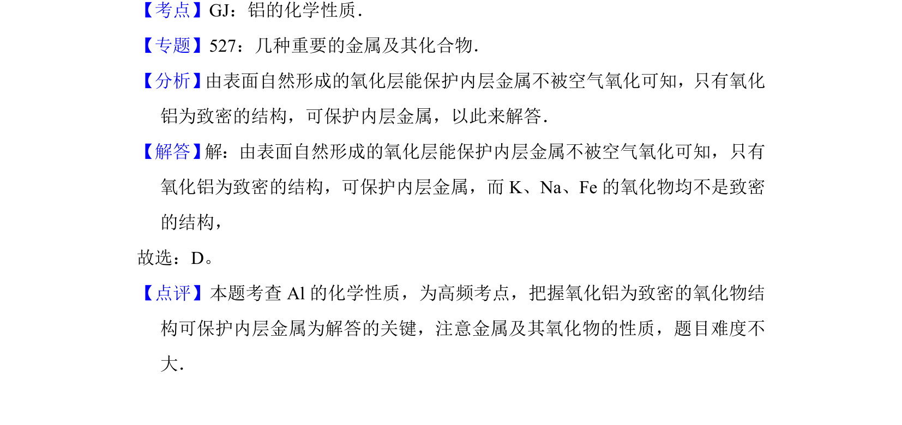

## 题面

## 摘要

考查铝表面致密氧化膜的防护作用，区别于钾、钠、铁的疏松氧化物。

## 关联考点

- [[987-铝的化学性质|铝的化学性质]]
- [[氧化铝结构]]
- [[金属腐蚀与防护]]

## 答案与解析

> 📄 原 PDF 第 2 页：`素材/真题/北京/2008-2024·（北京）化学高考真题/2014年高考化学试卷（北京）（解析卷）.pdf`

<!-- 题干文本-start -->
## 题干文本
2．（6分）下列金属中，表面自然形成的氧化层能保护内层金属不被空气氧化
的是（　　）
A．K B．Na C．Fe D．Al
<!-- 题干文本-end -->

<!-- 解析文本-start -->
## 解析文本
【考点】GJ：铝的化学性质．菁优网版权所有
【专题】527：几种重要的金属及其化合物．
【分析】 由表面自然形成的氧化层能保护内层金属不被空气氧化可知，只有氧化
铝为致密的结构，可保护内层金属，以此来解答．
【解答】 解：由表面自然形成的氧化层能保护内层金属不被空气氧化可知，只有
氧化铝为致密的结构，可保护内层金属，而K、Na、Fe的氧化物均不是致密
的结构，
故选：D。
【点评】本题考查Al的化学性质，为高频考点，把握氧化铝为致密的氧化物结
构可保护内层金属为解答的关键，注意金属及其氧化物的性质，题目难度不
大．
<!-- 解析文本-end -->
