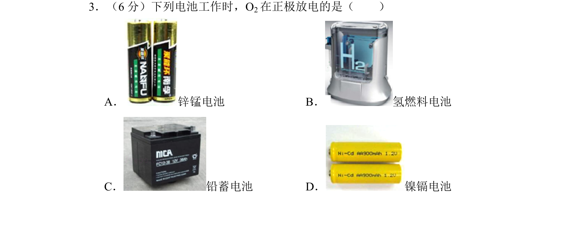
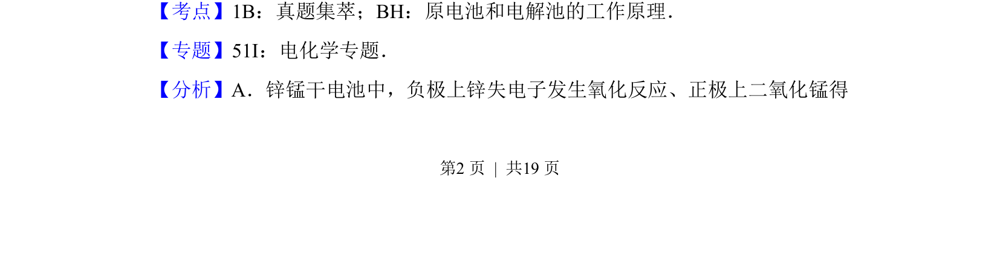
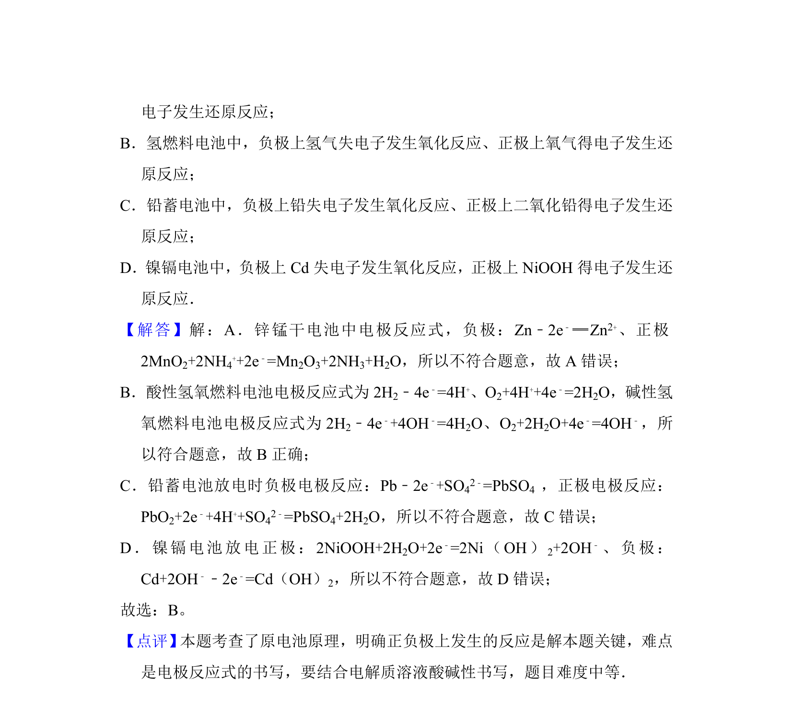

## 题面

## 摘要

考查不同电池中正极放电物质，要求判断O2在正极参与的电池类型

## 关联考点

- [[642-原电池工作原理|原电池工作原理]]
- [[366-燃料电池|燃料电池]]
- [[793-电极反应|电极反应]]

## 答案与解析

> 📄 原 PDF 第 2 页：`素材/真题/北京/2008-2024·（北京）化学高考真题/2014年高考化学试卷（北京）（解析卷）.pdf`
