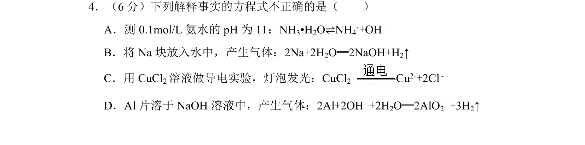
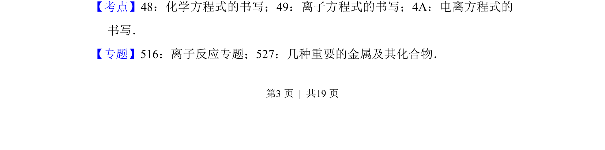
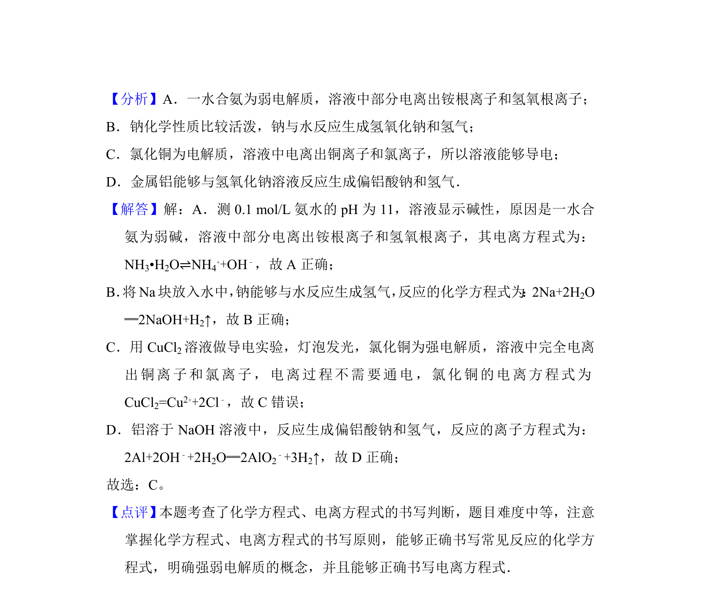

## 题面

## 摘要

本题通过判断四个解释事实的化学或离子方程式的正误，考查方程式书写的规范性。

## 关联考点

- [[化学方程式的书写]]
- [[807-离子方程式的书写|离子方程式的书写]]
- [[电离方程式的书写]]

## 答案与解析

> 📄 原 PDF 第 3 页：`素材/真题/北京/2008-2024·（北京）化学高考真题/2014年高考化学试卷（北京）（解析卷）.pdf`
