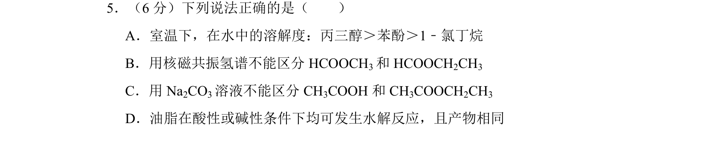
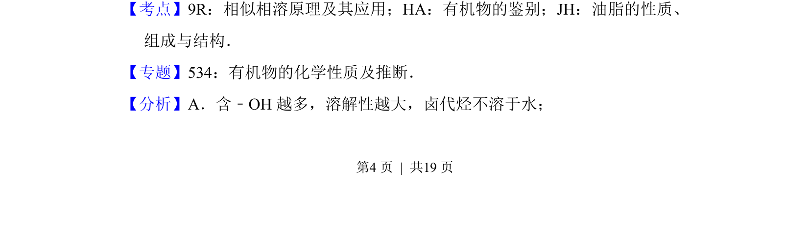
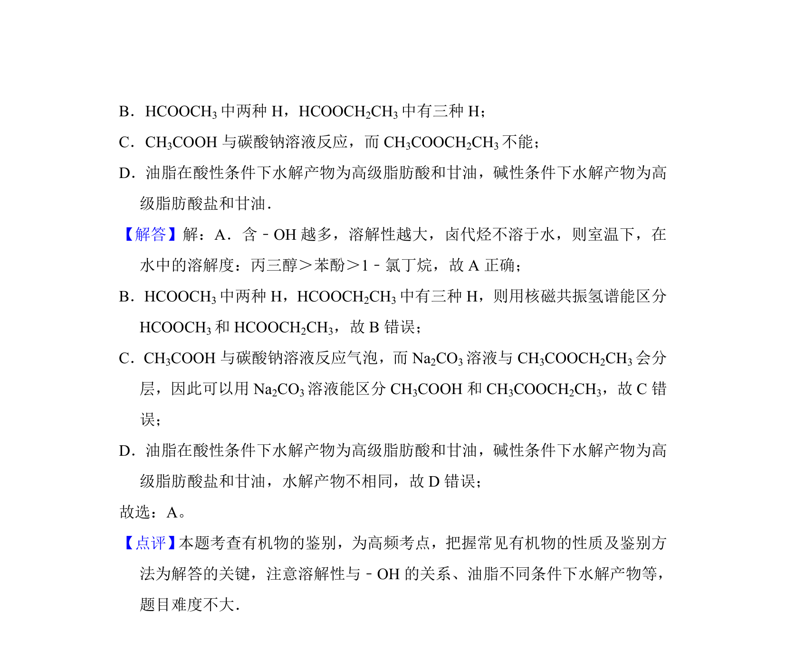

## 题面

## 摘要

考查有机物溶解性、核磁共振氢谱鉴别、碳酸钠鉴别及油脂水解

## 关联考点

- [[950-相似相溶原理|相似相溶原理]]
- [[有机物的鉴别]]
- [[油脂的水解]]

## 答案与解析

> 📄 原 PDF 第 4 页：`素材/真题/北京/2008-2024·（北京）化学高考真题/2014年高考化学试卷（北京）（解析卷）.pdf`

<!-- 题干文本-start -->
## 题干文本
5．（6分）下列说法正确的是（　　）
A．室温下，在水中的溶解度：丙三醇＞苯酚＞1﹣氯丁烷
B．用核磁共振氢谱不能区分HCOOCH 3和HCOOCH 2CH3
C．用Na 2CO3溶液不能区分CH 3COOH和CH 3COOCH2CH3
D．油脂在酸性或碱性条件下均可发生水解反应，且产物相同
<!-- 题干文本-end -->

<!-- 解析文本-start -->
## 解析文本
【考点】9R：相似相溶原理及其应用；HA：有机物的鉴别；JH：油脂的性质、
组成与结构．菁优网版权所有
【专题】534：有机物的化学性质及推断．
【分析】A．含﹣OH越多，溶解性越大，卤代烃不溶于水；
<!-- 解析文本-end -->
