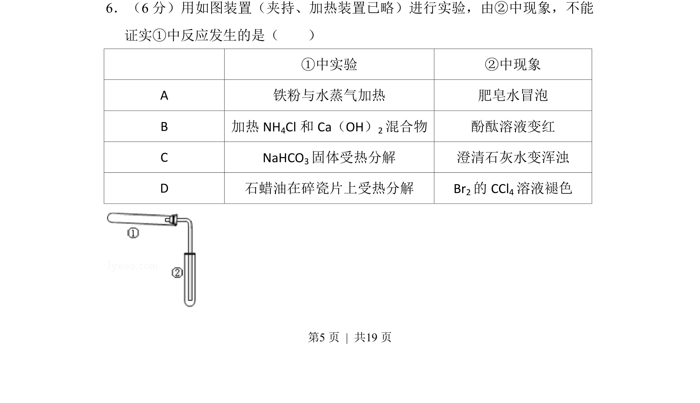
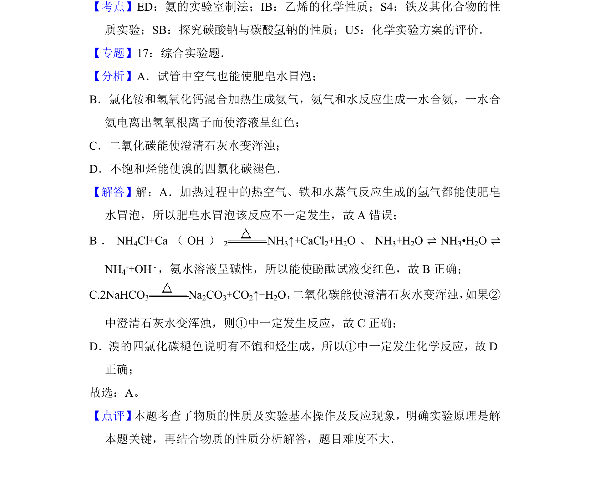

## 题面

## 摘要

铁与水蒸气反应产氢验证、铵盐与碱反应制氨、碳酸氢钠分解、石蜡油裂解，分析现象与反应发生的逻辑关系

## 关联考点

- [[铁与水蒸气反应]]
- [[氨的检验]]
- [[碳酸氢钠分解]]
- [[石蜡油裂解]]

## 答案与解析

> 📄 原 PDF 第 5 页：`素材/真题/北京/2008-2024·（北京）化学高考真题/2014年高考化学试卷（北京）（解析卷）.pdf`
