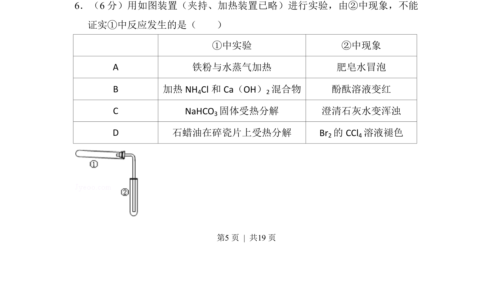
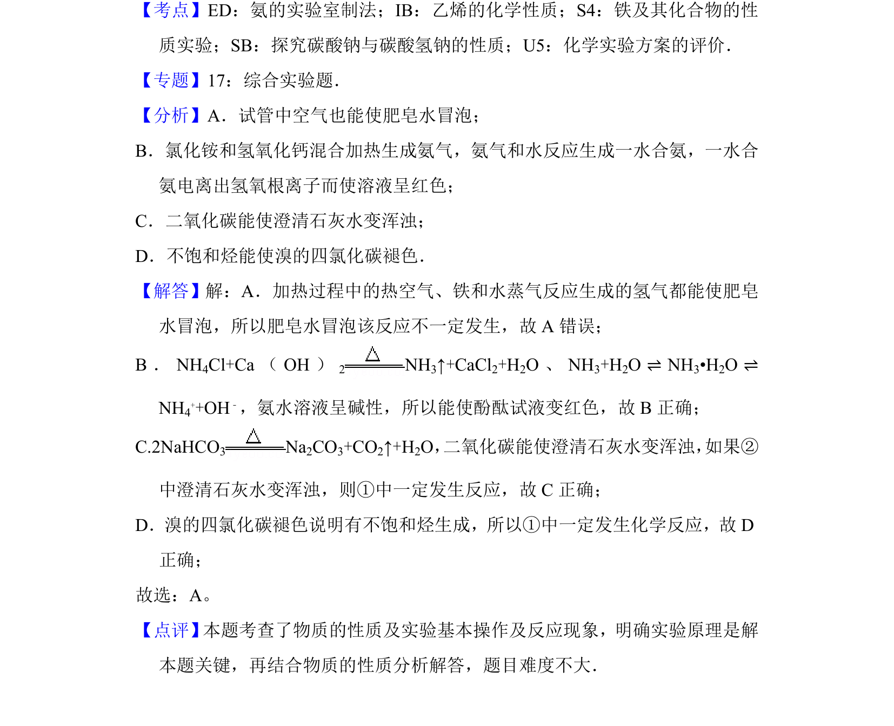

## 题面

## 摘要

铁与水蒸气反应产氢验证、铵盐与碱反应制氨、碳酸氢钠分解、石蜡油裂解，分析现象与反应发生的逻辑关系

## 关联考点

- [[铁与水蒸气反应]]
- [[氨的检验]]
- [[碳酸氢钠分解]]
- [[石蜡油裂解]]

## 答案与解析

> 📄 原 PDF 第 5 页：`素材/真题/北京/2008-2024·（北京）化学高考真题/2014年高考化学试卷（北京）（解析卷）.pdf`

<!-- 题干文本-start -->
## 题干文本
6．（6分）用如图装置（夹持、加热装置已略）进行实验，由②中现象，不能
证实①中反应发生的是（　　）
①中实验 ②中现象
A 铁粉与水蒸气加热 肥皂水冒泡
B 加热NH 4Cl和Ca（OH） 2混合物 酚酞溶液变红
C NaHCO3固体受热分解 澄清石灰水变浑浊
D 石蜡油在碎瓷片上受热分解 Br2的CCl 4溶液褪色
<!-- 题干文本-end -->

<!-- 解析文本-start -->
## 解析文本

<!-- 解析文本-end -->
