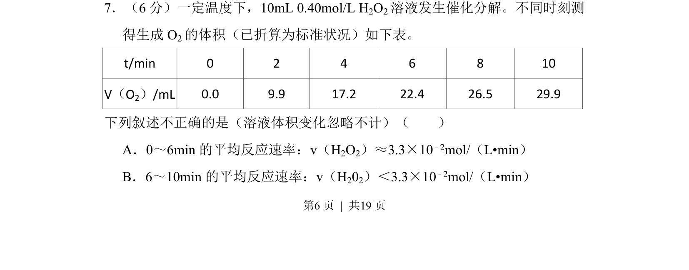
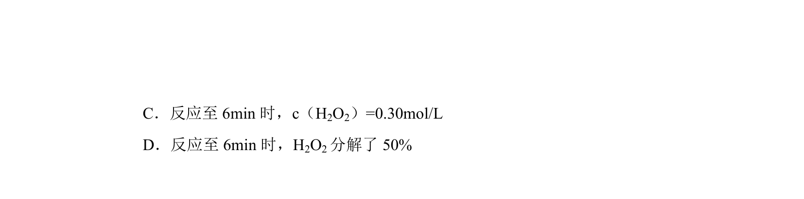
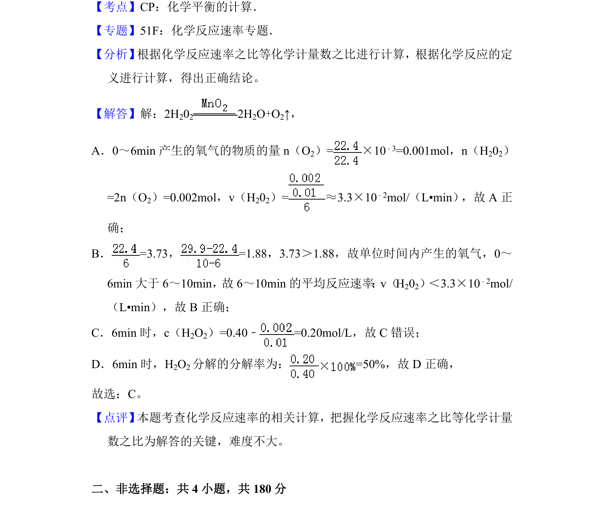

## 题面

## 摘要

考查根据生成气体体积计算反应物平均反应速率，涉及数据表格分析和速率公式应用。

## 关联考点

- [[283-化学反应速率|化学反应速率]]
- [[平均反应速率]]
- [[反应速率计算]]
- [[化学计量数关系]]

## 答案与解析

> 📄 原 PDF 第 6 页：`素材/真题/北京/2008-2024·（北京）化学高考真题/2014年高考化学试卷（北京）（解析卷）.pdf`
