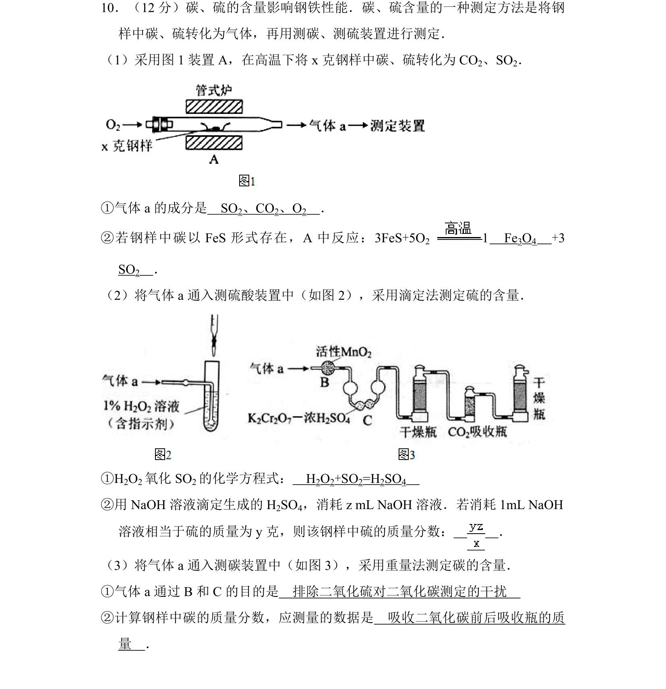
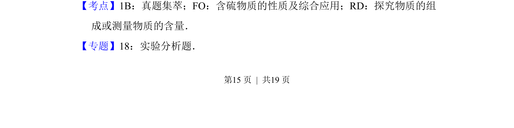
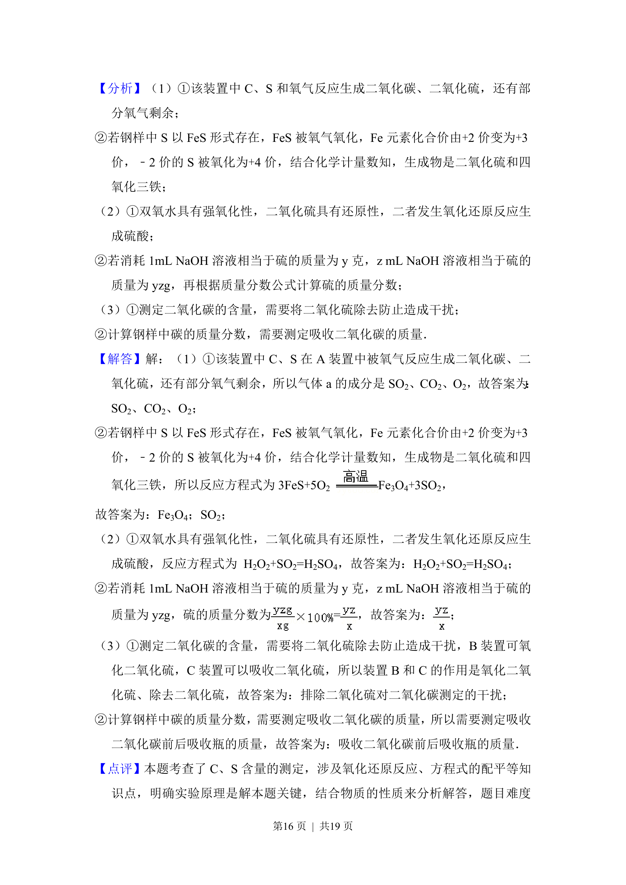

## 题面

## 摘要

测定钢样中碳、硫含量，将碳硫转化为气体并用滴定法和重量法分别测定硫和碳。

## 关联考点

- [[含硫物质的性质及综合应用]]
- [[探究物质的组成或测量物质的含量]]
- [[滴定法]]
- [[重量法]]

## 答案与解析

> 📄 原 PDF 第 15 页：`素材/真题/北京/2008-2024·（北京）化学高考真题/2014年高考化学试卷（北京）（解析卷）.pdf`
