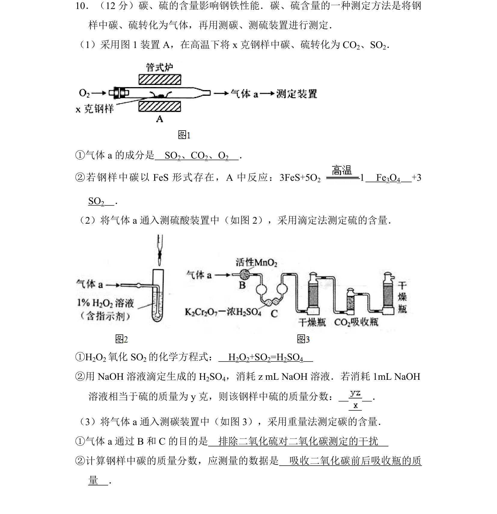
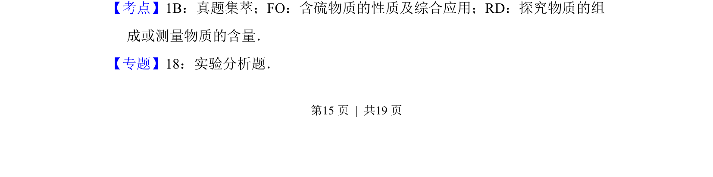
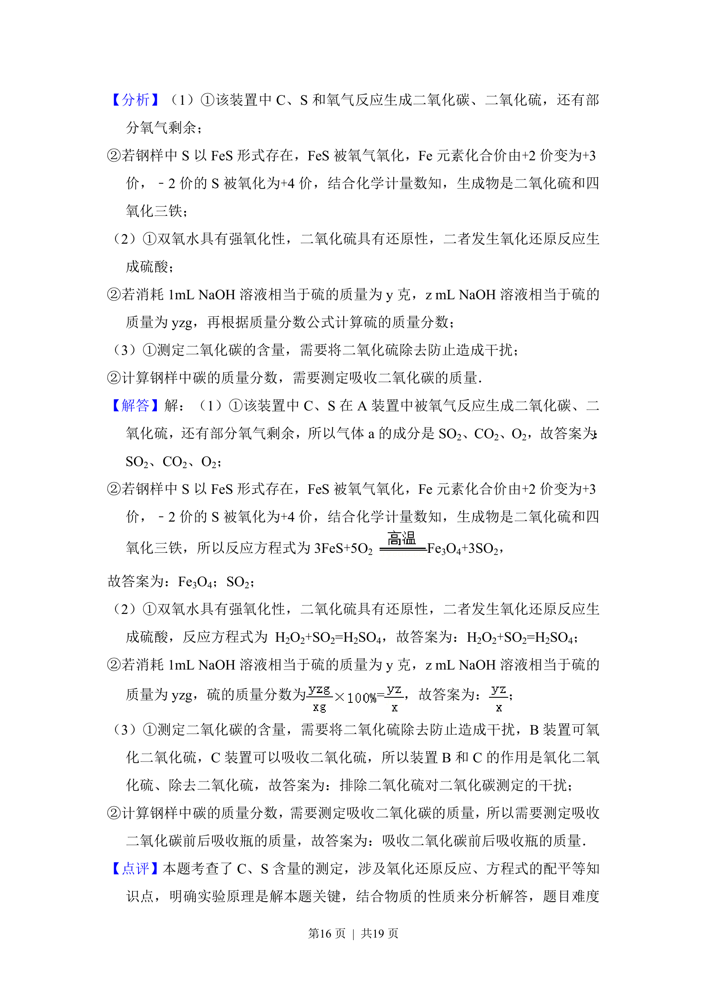

## 题面

## 摘要

测定钢样中碳、硫含量，将碳硫转化为气体并用滴定法和重量法分别测定硫和碳。

## 关联考点

- [[含硫物质的性质及综合应用]]
- [[探究物质的组成或测量物质的含量]]
- [[滴定法]]
- [[重量法]]

## 答案与解析

> 📄 原 PDF 第 15 页：`素材/真题/北京/2008-2024·（北京）化学高考真题/2014年高考化学试卷（北京）（解析卷）.pdf`

<!-- 题干文本-start -->
## 题干文本
10．（12分）碳、硫的含量影响钢铁性能．碳、硫含量的一种测定方法是将钢
样中碳、硫转化为气体，再用测碳、测硫装置进行测定．
（1）采用图1装置A，在高温下将x克钢样中碳、硫转化为CO 2、SO2．
①气体a的成分是　SO 2、CO2、O2　．
②若钢样中碳以FeS形式存在，A中反应：3FeS+5O 2 1　Fe 3O4　+3　
SO2　．
（2）将气体a通入测硫酸装置中（如图2），采用滴定法测定硫的含量．
①H2O2氧化SO 2的化学方程式：　H2O2+SO2=H2SO4　
②用NaOH溶液滴定生成的H 2SO4，消耗z mL NaOH溶液．若消耗1mL NaOH
溶液相当于硫的质量为y克，则该钢样中硫的质量分数：　 　．
（3）将气体a通入测碳装置中（如图3），采用重量法测定碳的含量．
①气体a通过B和C的目的是　排除二氧化硫对二氧化碳测定的干扰　
②计算钢样中碳的质量分数，应测量的数据是　吸收二氧化碳前后吸收瓶的质
量　．
<!-- 题干文本-end -->

<!-- 解析文本-start -->
## 解析文本
【考点】1B：真题集萃；FO：含硫物质的性质及综合应用；RD：探究物质的组
成或测量物质的含量．菁优网版权所有
【专题】18：实验分析题．
<!-- 解析文本-end -->
