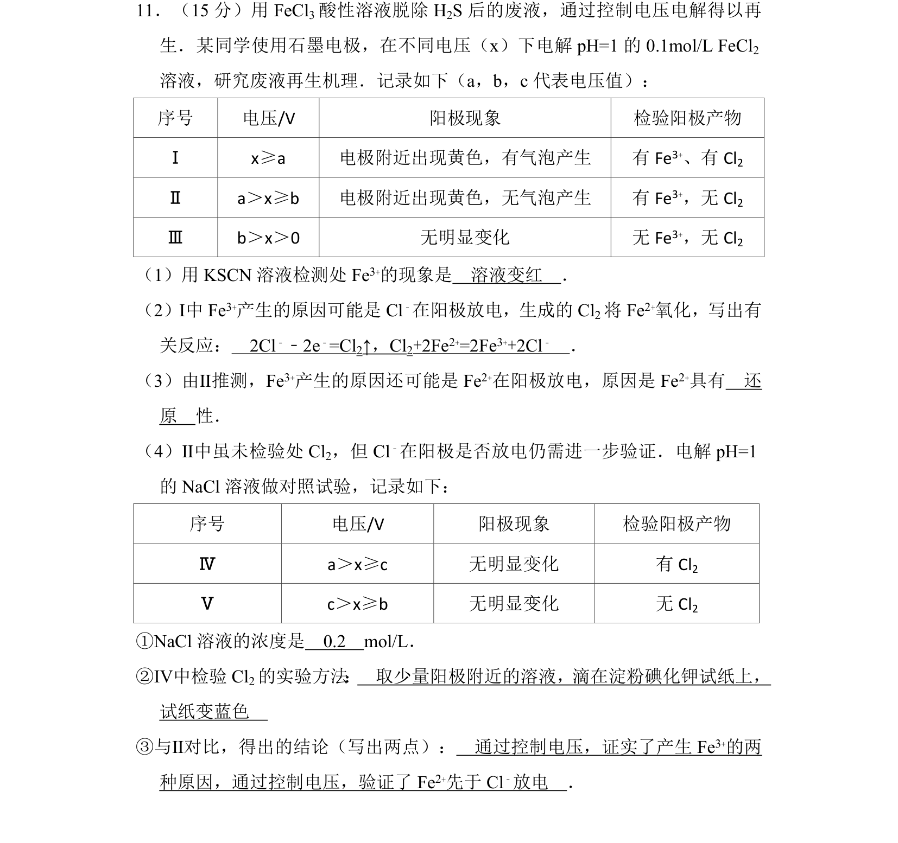
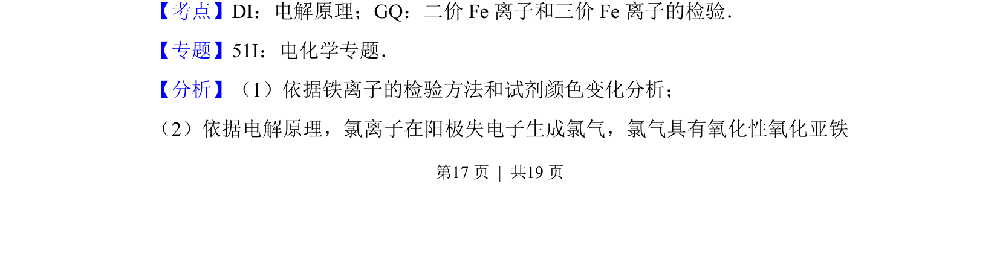
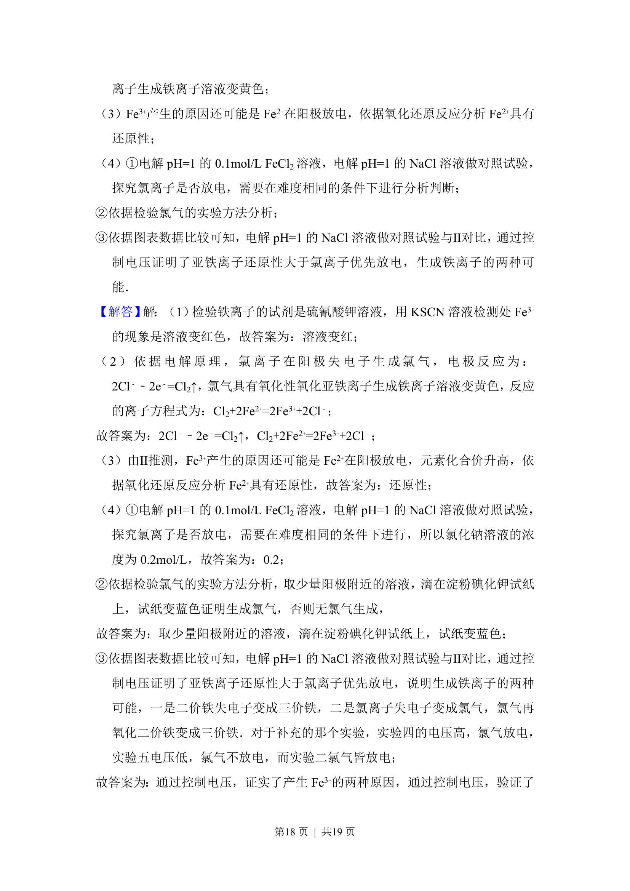
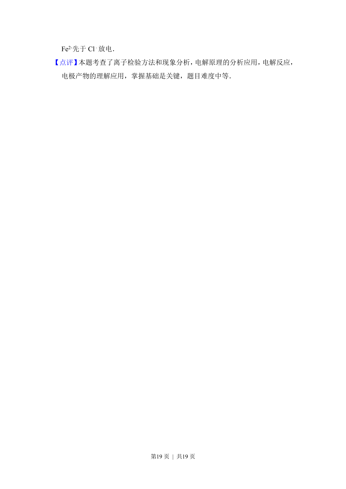

## 题面

## 摘要

本题通过控制电压电解FeCl₂溶液研究废液再生机理，涉及电极反应与离子检验。

## 关联考点

- [[367-电解原理|电解原理]]
- [[177-Fe离子检验|Fe³⁺检验]]
- [[阳极放电]]
- [[485-对照实验|对照实验]]

## 答案与解析

> 📄 原 PDF 第 17 页：`素材/真题/北京/2008-2024·（北京）化学高考真题/2014年高考化学试卷（北京）（解析卷）.pdf`
