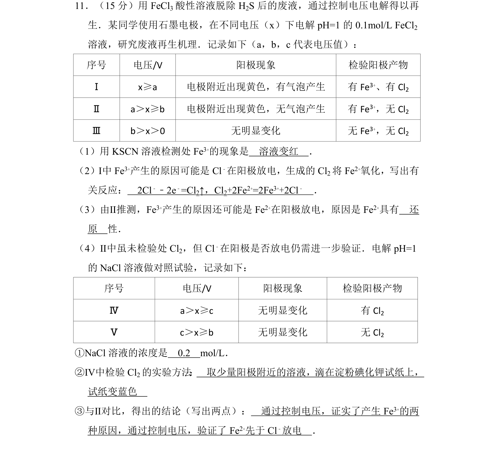
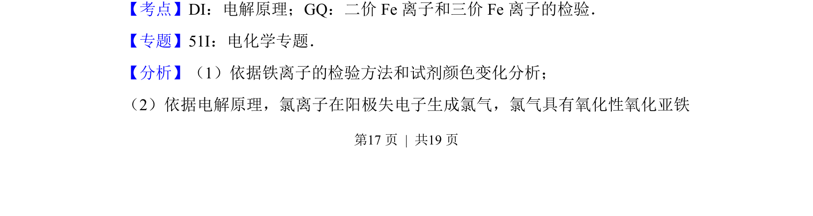
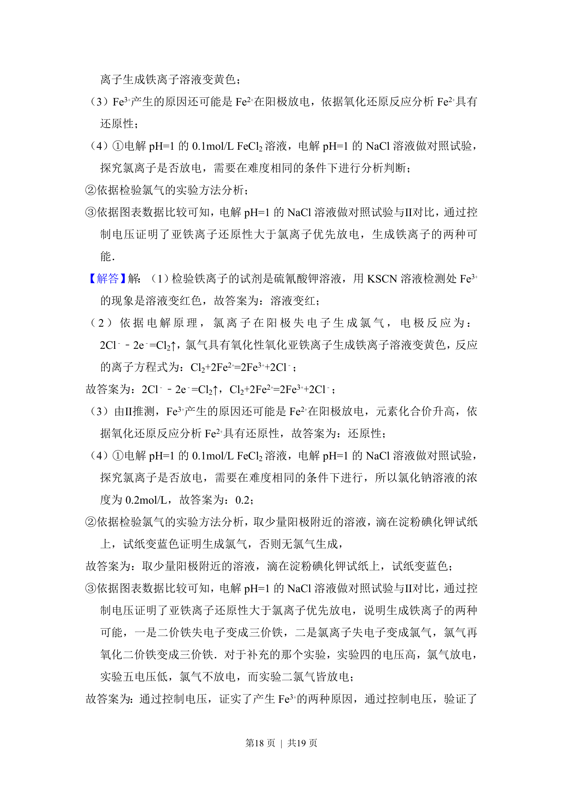
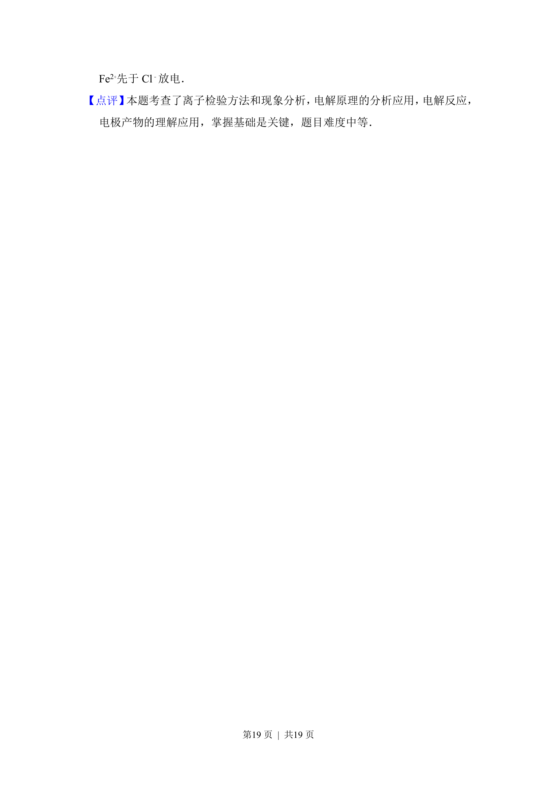

## 题面

## 摘要

本题通过控制电压电解FeCl₂溶液研究废液再生机理，涉及电极反应与离子检验。

## 关联考点

- [[367-电解原理|电解原理]]
- [[177-Fe离子检验|Fe³⁺检验]]
- [[阳极放电]]
- [[485-对照实验|对照实验]]

## 答案与解析

> 📄 原 PDF 第 17 页：`素材/真题/北京/2008-2024·（北京）化学高考真题/2014年高考化学试卷（北京）（解析卷）.pdf`

<!-- 题干文本-start -->
## 题干文本
11．（15分）用FeCl 3酸性溶液脱除H 2S后的废液，通过控制电压电解得以再
生．某同学使用石墨电极，在不同电压（x）下电解pH=1的0.1mol/L FeCl 2
溶液，研究废液再生机理．记录如下（a，b，c代表电压值）：
序号 电压/V 阳极现象 检验阳极产物
Ⅰ x≥a 电极附近出现黄色，有气泡产生 有Fe 3+、有Cl 2
Ⅱ a＞x≥b 电极附近出现黄色，无气泡产生 有Fe 3+，无Cl 2
Ⅲ b＞x＞0 无明显变化 无Fe 3+，无Cl 2
（1）用KSCN溶液检测处Fe 3+的现象是　溶液变红　．
（2）Ⅰ中Fe 3+产生的原因可能是Cl ﹣在阳极放电，生成的Cl 2将Fe 2+氧化，写出有
关反应：　2Cl﹣﹣2e﹣=Cl2↑，Cl2+2Fe2+=2Fe3++2Cl﹣　．
（3）由Ⅱ推测，Fe3+产生的原因还可能是Fe 2+在阳极放电，原因是Fe 2+具有　还
原　性．
（4）Ⅱ中虽未检验处Cl 2，但Cl ﹣在阳极是否放电仍需进一步验证．电解pH=1
的NaCl溶液做对照试验，记录如下：
序号 电压/V 阳极现象 检验阳极产物
Ⅳ a＞x≥c 无明显变化 有Cl 2
Ⅴ c＞x≥b 无明显变化 无Cl 2
①NaCl溶液的浓度是　0.2　mol/L．
②Ⅳ中检验Cl 2的实验方法 ： 　取少量阳极附近的溶液，滴在淀粉碘化钾试纸上，
试纸变蓝色　
③与Ⅱ对比，得出的结论（写出两点）：　通过控制电压，证实了产生Fe 3+的两
种原因，通过控制电压，验证了Fe 2+先于Cl ﹣放电　．
<!-- 题干文本-end -->

<!-- 解析文本-start -->
## 解析文本
【考点】DI：电解原理；GQ：二价Fe离子和三价Fe离子的检验．菁优网版权所有
【专题】51I：电化学专题．
【分析】（1）依据铁离子的检验方法和试剂颜色变化分析；
（2）依据电解原理，氯离子在阳极失电子生成氯气，氯气具有氧化性氧化亚铁
<!-- 解析文本-end -->
