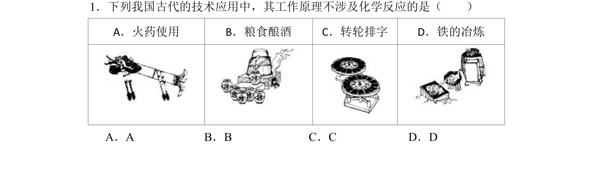
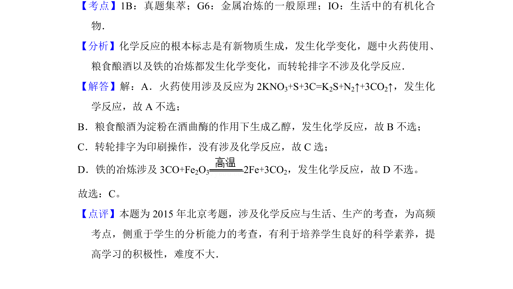

## 题面

## 摘要

通过对古代技术应用的实例判断是否发生化学反应，考查物理变化与化学变化的本质区别。

## 关联考点

- [[975-化学变化与物理变化|化学变化与物理变化]]
- [[化学反应的本质]]

## 答案与解析

> 📄 原 PDF 第 1 页：`素材/真题/北京/2008-2024·（北京）化学高考真题/2015年高考化学试卷（北京）（解析卷）.pdf`

<!-- 题干文本-start -->
## 题干文本
1．下列我国古代的技术应用中，其工作原理不涉及化学反应的是（　　）
A．火药使用 B．粮食酿酒 C．转轮排字 D．铁的冶炼
A．A B．B C．C D．D
<!-- 题干文本-end -->

<!-- 解析文本-start -->
## 解析文本
【考点】1B：真题集萃；G6：金属冶炼的一般原理；IO：生活中的有机化合
物．菁优网版权所有
【分析】化学反应的根本标志是有新物质生成，发生化学变化，题中火药使用、
粮食酿酒以及铁的冶炼都发生化学变化，而转轮排字不涉及化学反应．
【解答】解：A．火药使用涉及反应为2KNO 3+S+3C=K2S+N2↑+3CO2↑，发生化
学反应，故A不选；
B．粮食酿酒为淀粉在酒曲酶的作用下生成乙醇，发生化学反应，故B不选；
C．转轮排字为印刷操作，没有涉及化学反应，故C选；
D．铁的冶炼涉及3CO+Fe 2O3 2Fe+3CO2，发生化学反应，故D不选。
故选：C。
【点评】本题为2015年北京考题，涉及化学反应与生活、生产的考查，为高频
考点，侧重于学生的分析能力的考查，有利于培养学生良好的科学素养，提
高学习的积极性，难度不大．
<!-- 解析文本-end -->
