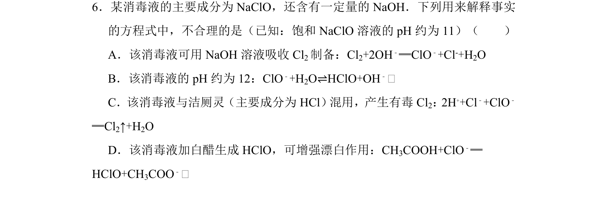
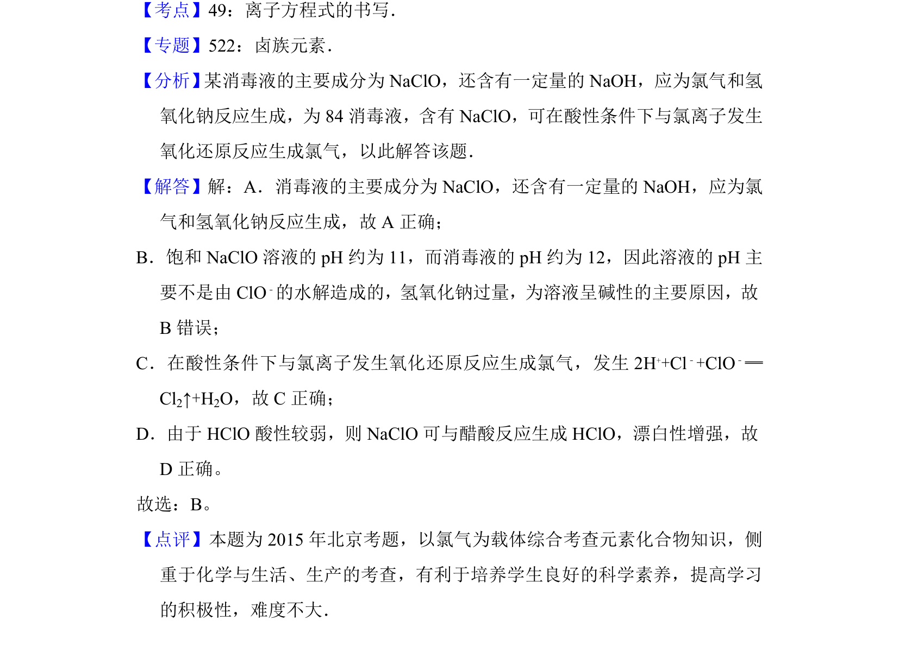

## 题面

## 摘要

该题通过消毒液成分NaClO和NaOH，判断相关离子方程式的正误，涉及氯及其化合物的性质与应用。

## 关联考点

- [[806-离子方程式书写|离子方程式书写]]
- [[195-卤族元素|卤族元素]]
- [[162-氧化还原反应|氧化还原反应]]
- [[326-水解平衡|水解平衡]]

## 答案与解析

> 📄 原 PDF 第 6 页：`素材/真题/北京/2008-2024·（北京）化学高考真题/2015年高考化学试卷（北京）（解析卷）.pdf`
