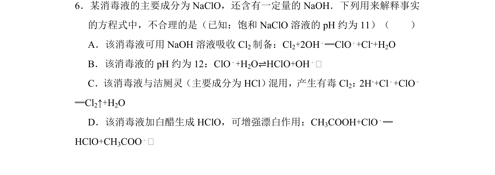
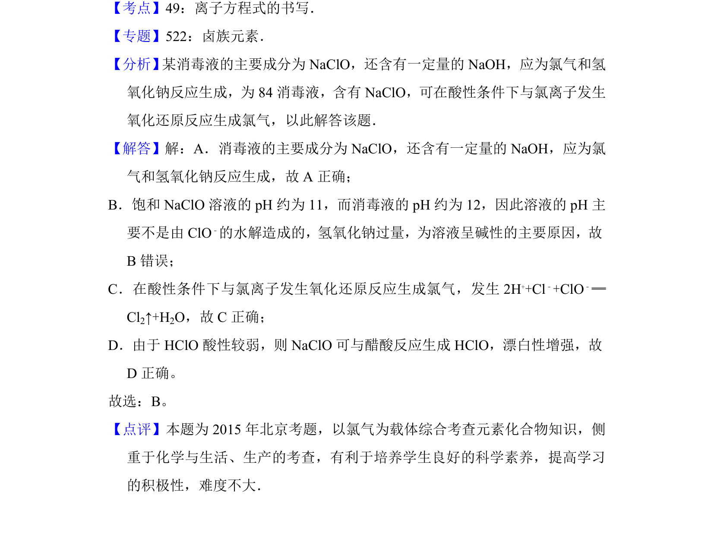

## 题面

## 摘要

该题通过消毒液成分NaClO和NaOH，判断相关离子方程式的正误，涉及氯及其化合物的性质与应用。

## 关联考点

- [[807-离子方程式的书写|离子方程式书写]]
- [[195-卤族元素|卤族元素]]
- [[162-氧化还原反应|氧化还原反应]]
- [[326-水解平衡|水解平衡]]

## 答案与解析

> 📄 原 PDF 第 6 页：`素材/真题/北京/2008-2024·（北京）化学高考真题/2015年高考化学试卷（北京）（解析卷）.pdf`

<!-- 题干文本-start -->
## 题干文本
6．某消毒液的主要成分为NaClO，还含有一定量的NaOH．下列用来解释事实
的方程式中，不合理的是（已知：饱和NaClO溶液的pH约为11）（　　）
A．该消毒液可用NaOH溶液吸收Cl 2制备：Cl2+2OH﹣═ClO﹣+Cl‑+H2O
B．该消毒液的pH约为12：ClO ﹣+H2O⇌HClO+OH﹣￿
C．该消毒液与洁厕灵（主要成分为HCl） 混用，产生有毒Cl2：2H++Cl﹣+ClO﹣
═Cl2↑+H2O
D．该消毒液加白醋生成HClO，可增强漂白作用：CH 3COOH+ClO﹣═
HClO+CH3COO﹣￿
<!-- 题干文本-end -->

<!-- 解析文本-start -->
## 解析文本
【考点】49：离子方程式的书写．菁优网版权所有
【专题】522：卤族元素．
【分析】 某消毒液的主要成分为NaClO，还含有一定量的NaOH，应为氯气和氢
氧化钠反应生成，为84消毒液，含有NaClO，可在酸性条件下与氯离子发生
氧化还原反应生成氯气，以此解答该题．
【解答】解：A．消毒液的主要成分为NaClO，还含有一定量的NaOH，应为氯
气和氢氧化钠反应生成，故A正确；
B．饱和NaClO溶液的pH约为11，而消毒液的pH约为12，因此溶液的pH主
要不是由ClO ﹣的水解造成的，氢氧化钠过量，为溶液呈碱性的主要原因，故
B错误；
C．在酸性条件下与氯离子发生氧化还原反应生成氯气，发生2H ++Cl﹣+ClO﹣═
Cl2↑+H2O，故C正确；
D．由于HClO酸性较弱，则NaClO可与醋酸反应生成HClO，漂白性增强，故
D正确。
故选：B。
【点评】本题为2015年北京考题，以氯气为载体综合考查元素化合物知识，侧
重于化学与生活、生产的考查，有利于培养学生良好的科学素养，提高学习
的积极性，难度不大．
<!-- 解析文本-end -->
