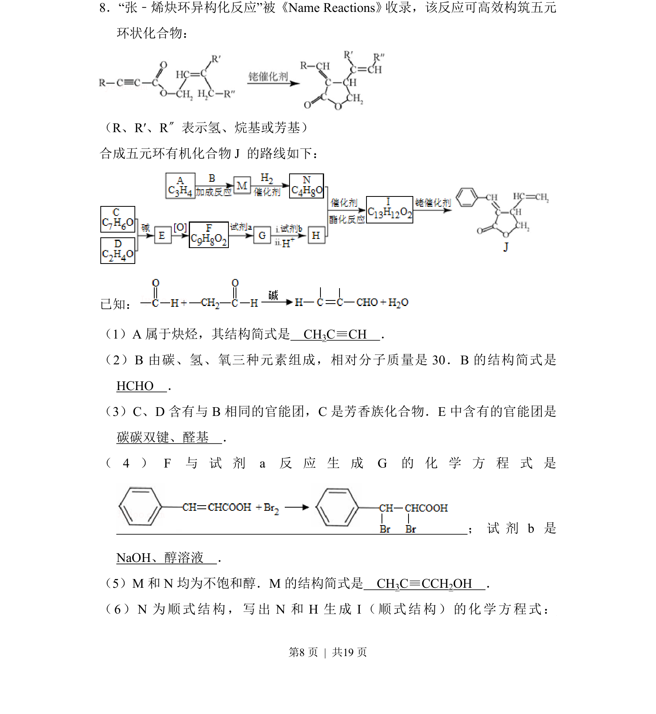
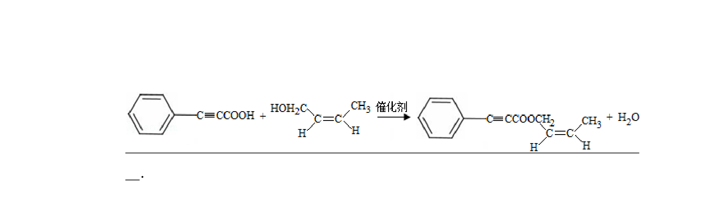
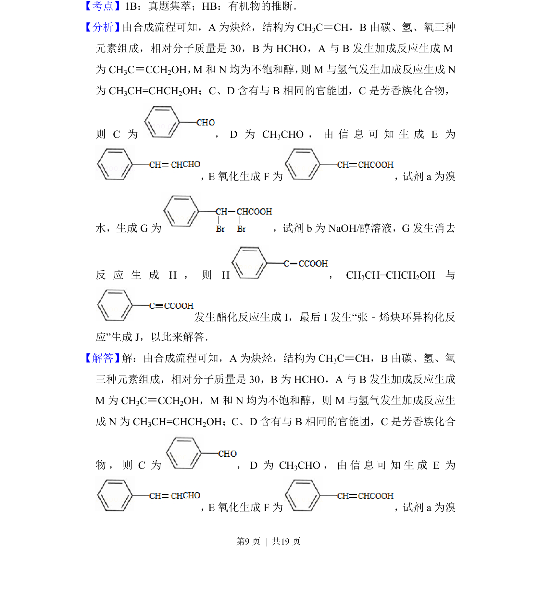
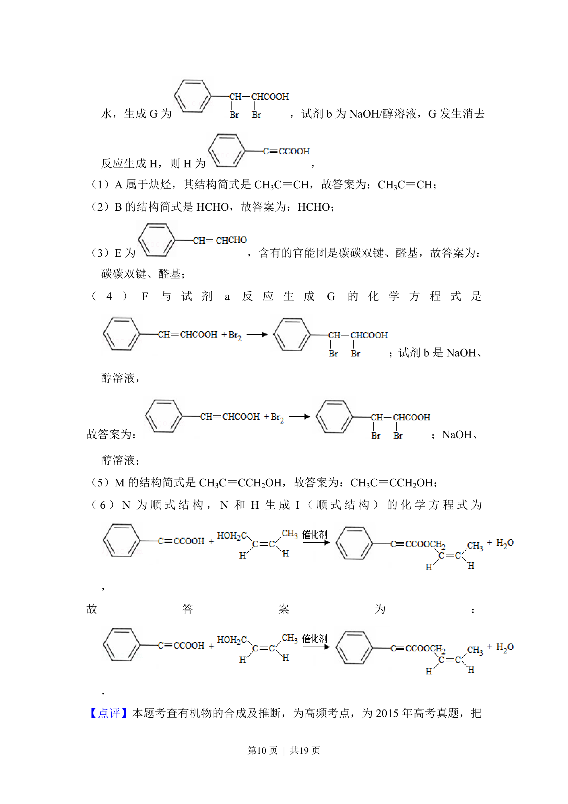
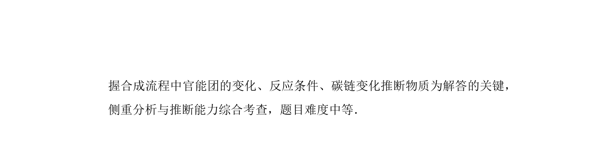

## 题面

## 摘要

有机合成推断，涉及炔烃、醛、醇等官能团转化与反应条件

## 关联考点

- [[709-有机合成推断|有机合成推断]]
- [[886-官能团转化|官能团转化]]
- [[455-顺反异构|顺反异构]]
- [[756-消去反应|消除反应]]

## 答案与解析

> 📄 原 PDF 第 8 页：`素材/真题/北京/2008-2024·（北京）化学高考真题/2015年高考化学试卷（北京）（解析卷）.pdf`
