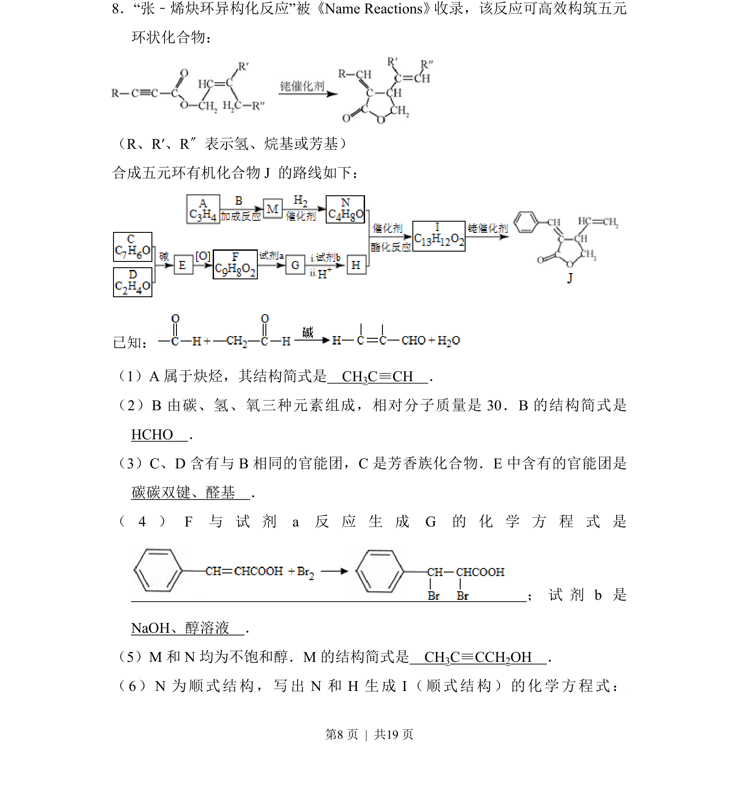
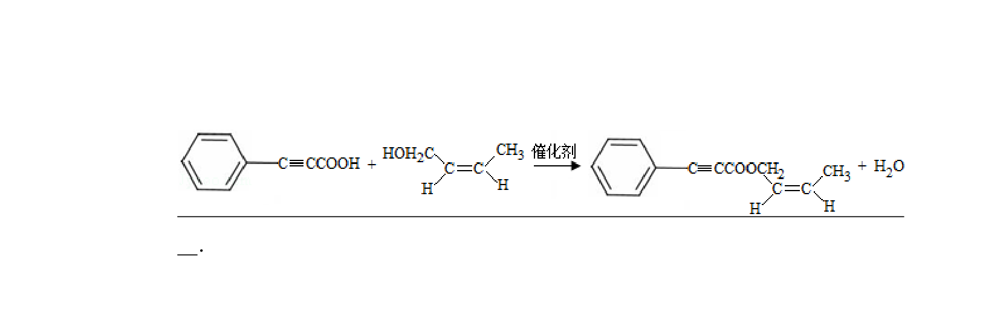
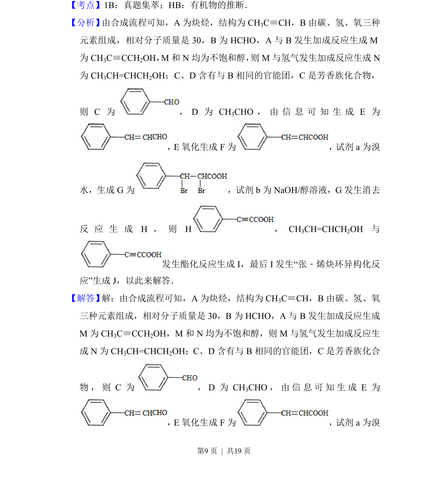
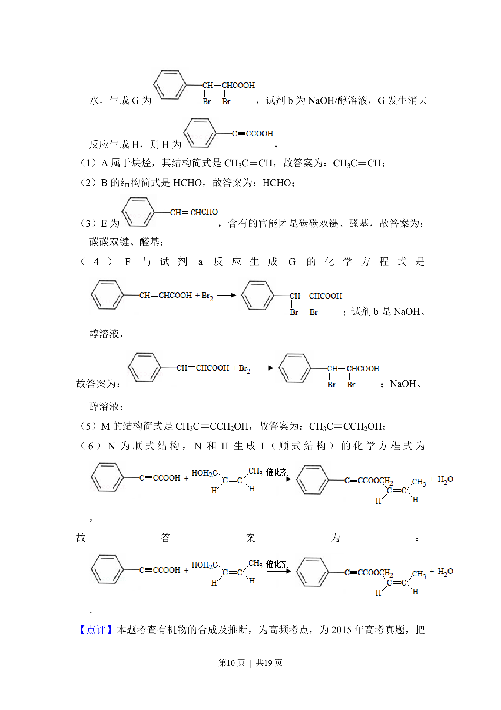
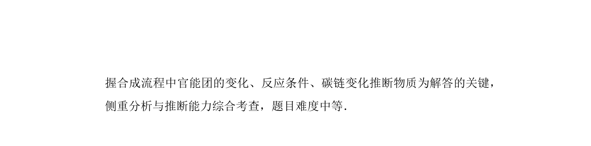

## 题面

## 摘要

有机合成推断，涉及炔烃、醛、醇等官能团转化与反应条件

## 关联考点

- [[709-有机合成推断|有机合成推断]]
- [[886-官能团转化|官能团转化]]
- [[455-顺反异构|顺反异构]]
- [[756-消去反应|消除反应]]

## 答案与解析

> 📄 原 PDF 第 8 页：`素材/真题/北京/2008-2024·（北京）化学高考真题/2015年高考化学试卷（北京）（解析卷）.pdf`

<!-- 题干文本-start -->
## 题干文本
8．“张﹣烯炔环异构化反应”被《Name Reactions》 收录，该反应可高效构筑五元
环状化合物：
（R、R′、R〞表示氢、烷基或芳基）
合成五元环有机化合物J 的路线如下：
已知：
（1）A属于炔烃，其结构简式是　CH 3C≡CH　．
（2）B由碳、氢、氧三种元素组成，相对分子质量是30．B的结构简式是　
HCHO　．
（3）C、D含有与B相同的官能团，C是芳香族化合物．E中含有的官能团是　
碳碳双键、醛基　．
（4）F与 试 剂a反 应 生 成G的 化 学 方 程 式 是 　
　 ； 试 剂b是　
NaOH、醇溶液　．
（5）M和N均为不饱和醇．M的结构简式是　CH 3C≡CCH2OH　．
（6）N为顺式结构，写出N和H生成I（顺式结构）的化学方程式：
<!-- 题干文本-end -->

<!-- 解析文本-start -->
## 解析文本

<!-- 解析文本-end -->
