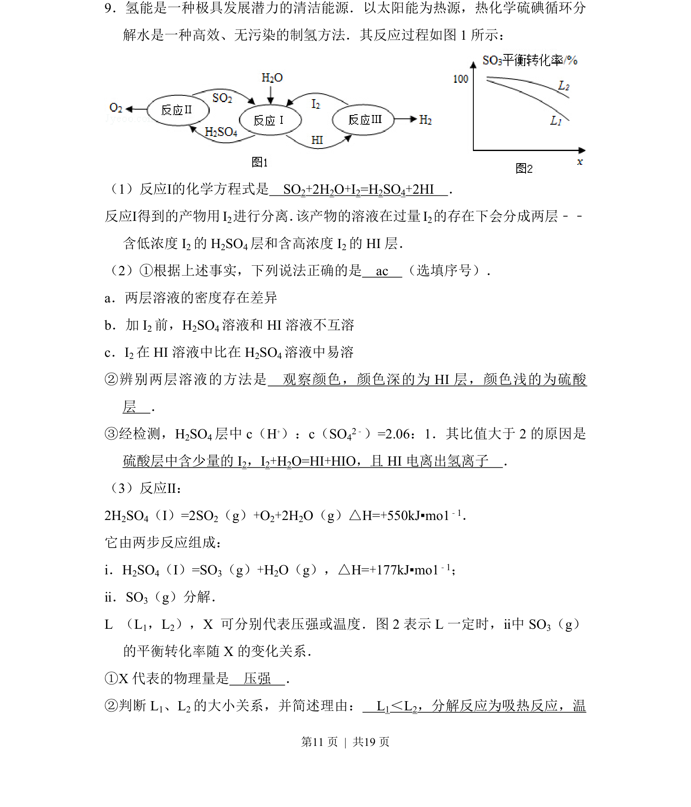
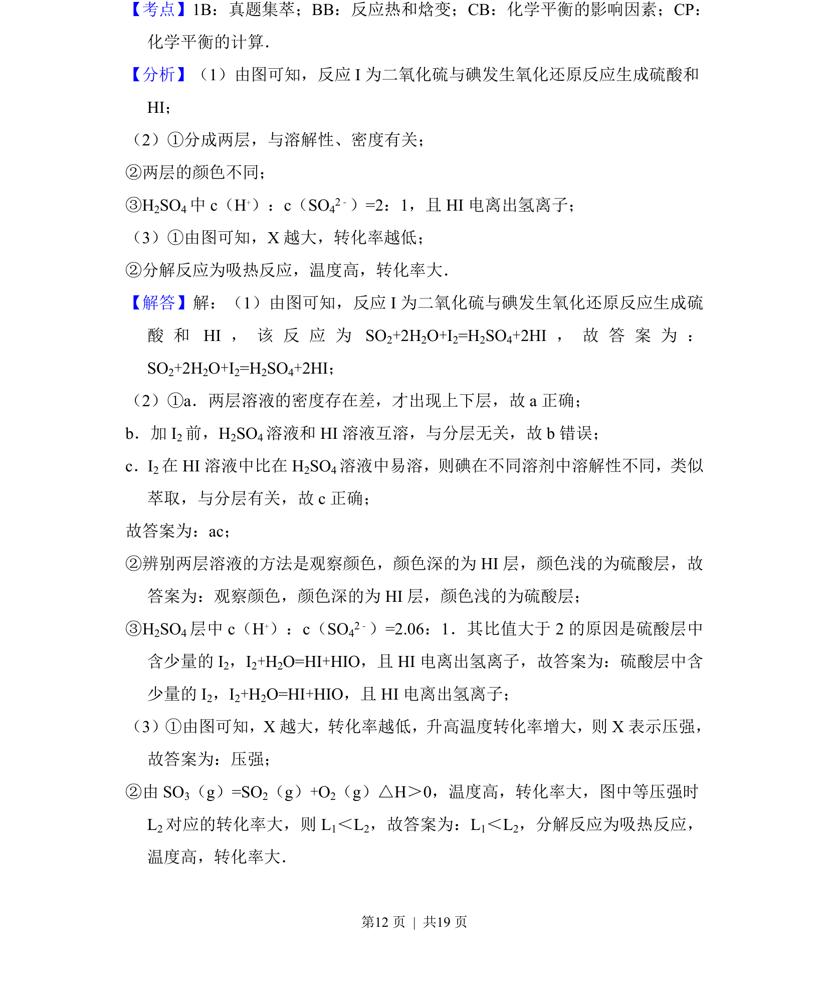
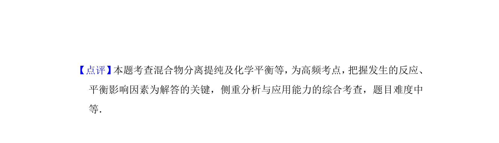

## 题面

## 摘要

硫碘循环制氢的反应、产物分离及SO₃分解平衡转化率影响因素分析

## 关联考点

- [[052-化学方程式|化学方程式]]
- [[萃取分层]]
- [[离子浓度比]]
- [[620-化学平衡移动|化学平衡移动]]
- [[转化率-压强图]]

## 答案与解析

> 📄 原 PDF 第 11 页：`素材/真题/北京/2008-2024·（北京）化学高考真题/2015年高考化学试卷（北京）（解析卷）.pdf`
