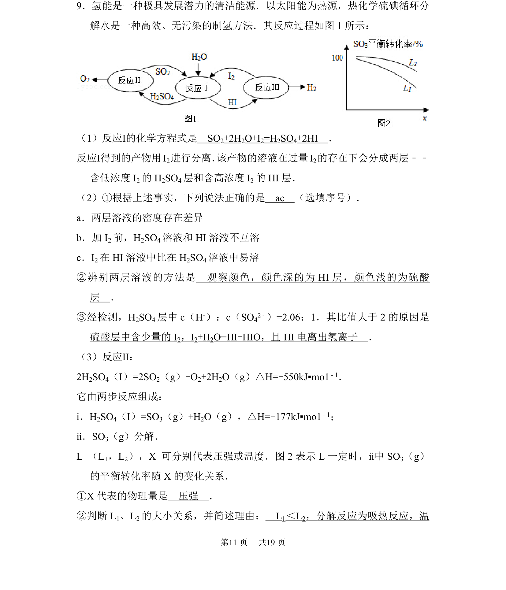
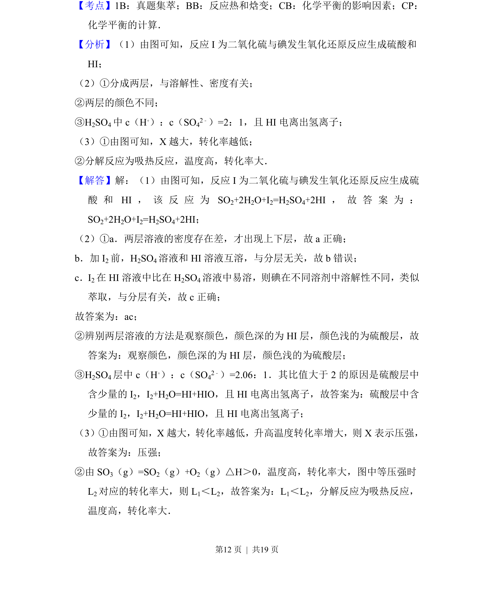
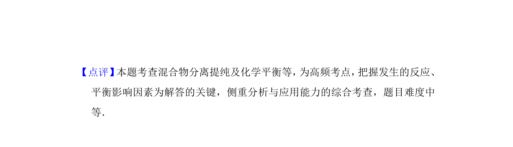

## 题面

## 摘要

硫碘循环制氢的反应、产物分离及SO₃分解平衡转化率影响因素分析

## 关联考点

- [[052-化学方程式|化学方程式]]
- [[萃取分层]]
- [[离子浓度比]]
- [[620-化学平衡移动|化学平衡移动]]
- [[转化率-压强图]]

## 答案与解析

> 📄 原 PDF 第 11 页：`素材/真题/北京/2008-2024·（北京）化学高考真题/2015年高考化学试卷（北京）（解析卷）.pdf`

<!-- 题干文本-start -->
## 题干文本
9．氢能是一种极具发展潜力的清洁能源．以太阳能为热源，热化学硫碘循环分
解水是一种高效、无污染的制氢方法．其反应过程如图1所示：
（1）反应Ⅰ的化学方程式是　SO2+2H2O+I2=H2SO4+2HI　．
反应Ⅰ得到的产物用I 2进行分离． 该产物的溶液在过量I2的存在下会分成两层﹣﹣
含低浓度I 2的H 2SO4层和含高浓度I 2的HI层．
（2）①根据上述事实，下列说法正确的是　ac　（选填序号）．
a．两层溶液的密度存在差异
b．加I 2前，H2SO4溶液和HI溶液不互溶
c．I2在HI溶液中比在H 2SO4溶液中易溶
②辨别两层溶液的方法是　观察颜色，颜色深的为HI层，颜色浅的为硫酸
层　．
③经检测，H2SO4层中c（H +）：c（SO42﹣）=2.06：1．其比值大于2的原因是　
硫酸层中含少量的I 2，I2+H2O=HI+HIO，且HI电离出氢离子　．
（3）反应Ⅱ：
2H2SO4（I）=2SO2（g）+O2+2H2O（g）△H=+550kJ▪mo1﹣1．
它由两步反应组成：
ⅰ．H2SO4（I）=SO3（g）+H2O（g），△H=+177kJ▪mo1﹣1；
ⅱ．SO3（g）分解．
L （L 1，L2），X 可分别代表压强或温度．图2表示L一定时，ⅱ中SO 3（g）
的平衡转化率随X的变化关系．
①X代表的物理量是　压强　．
②判断L 1、L2的大小关系，并简述理由：　L 1＜L2，分解反应为吸热反应，温
<!-- 题干文本-end -->

<!-- 解析文本-start -->
## 解析文本

<!-- 解析文本-end -->
