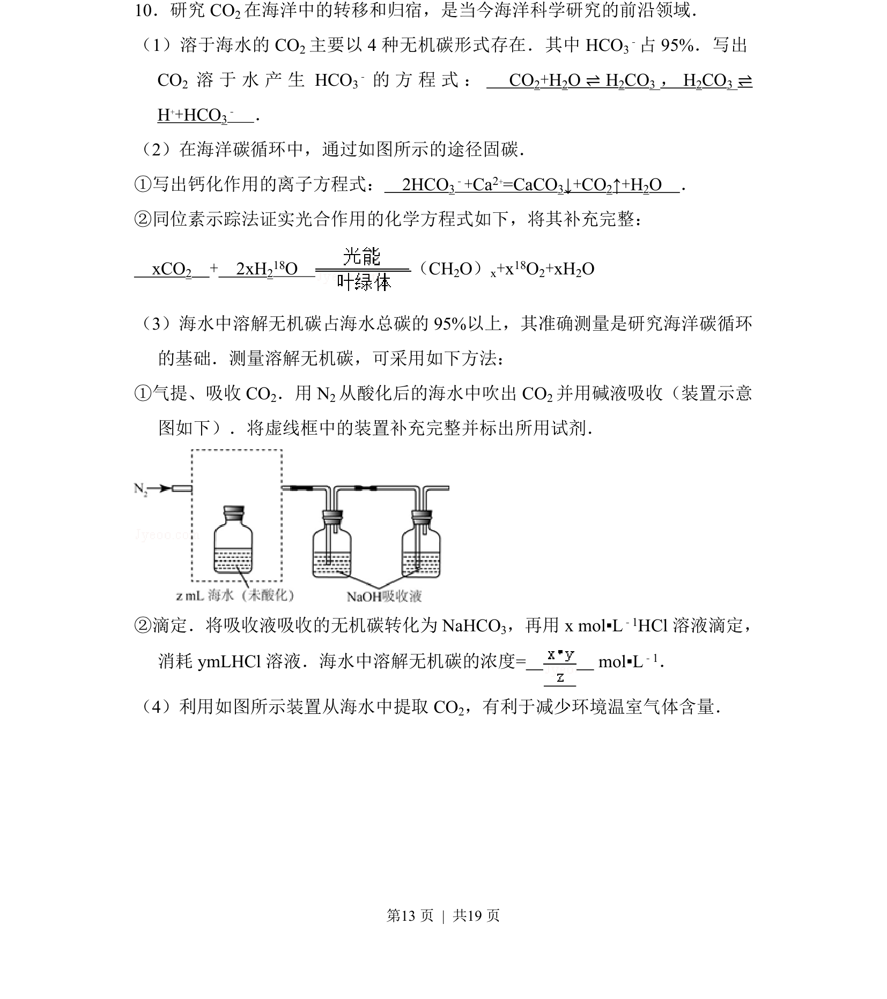
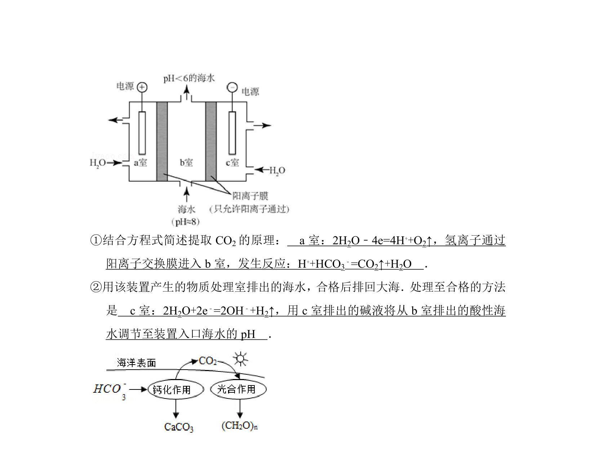
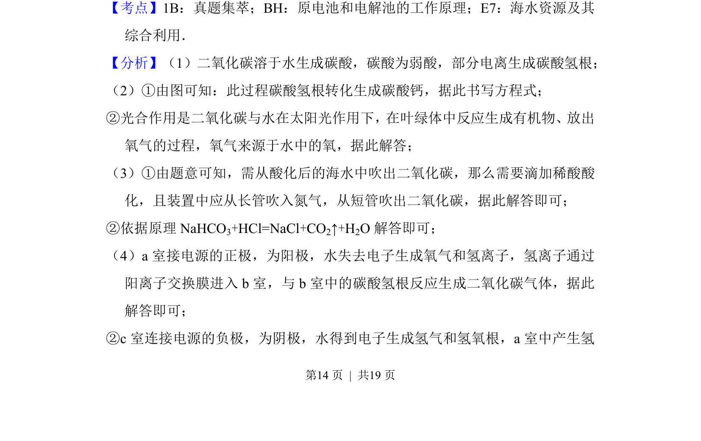
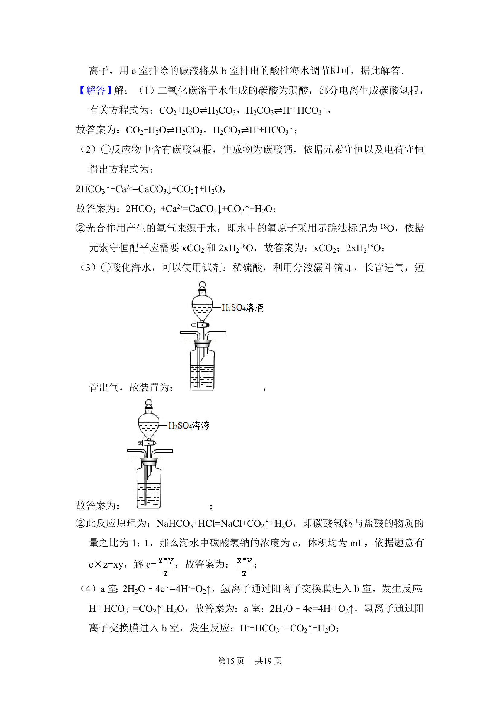
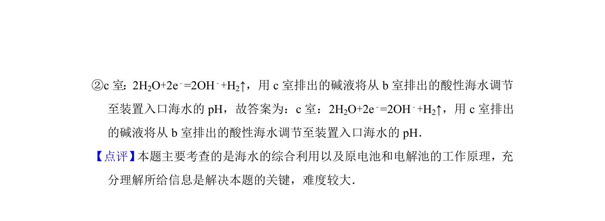

## 题面

## 摘要

考查海洋中CO2的转移与归宿，涉及方程式书写、固碳途径及无机碳浓度测定。

## 关联考点

- [[621-化学方程式书写|化学方程式书写]]
- [[170-离子方程式|离子方程式]]
- [[滴定计算]]
- [[实验装置设计]]

## 答案与解析

> 📄 原 PDF 第 13 页：`素材/真题/北京/2008-2024·（北京）化学高考真题/2015年高考化学试卷（北京）（解析卷）.pdf`
