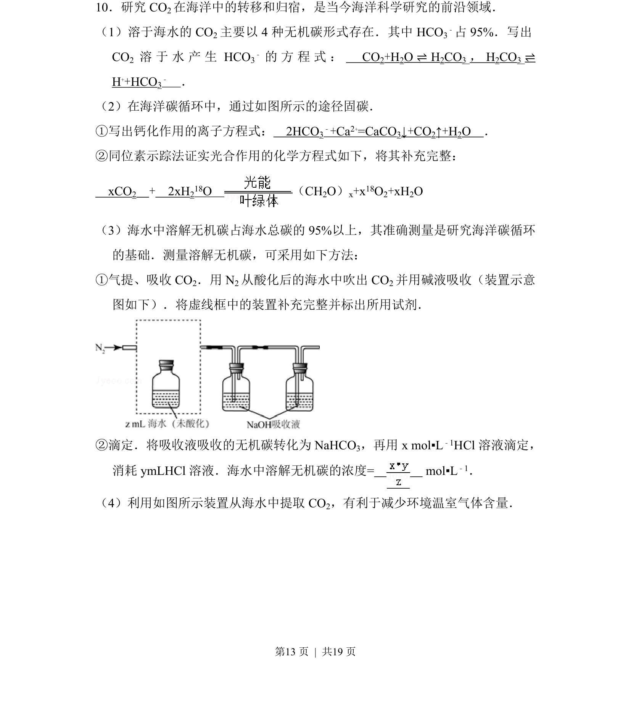
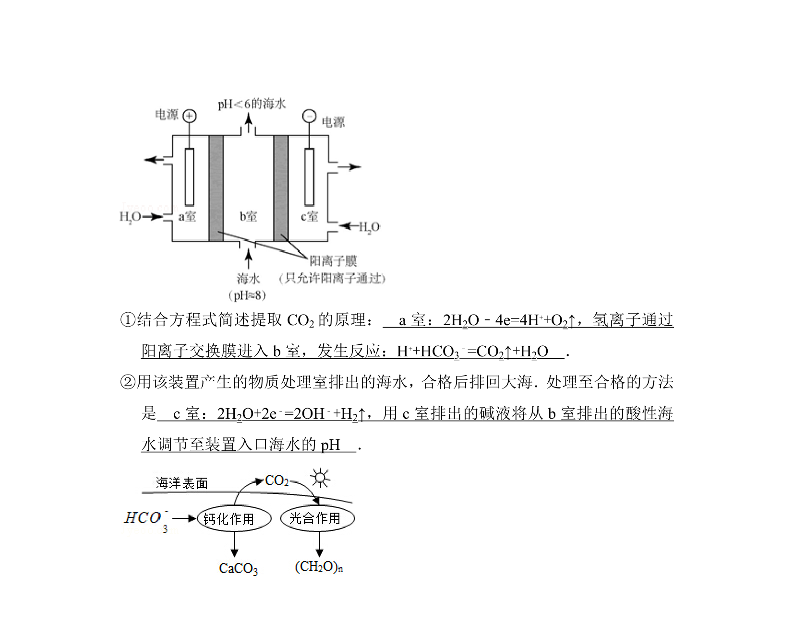
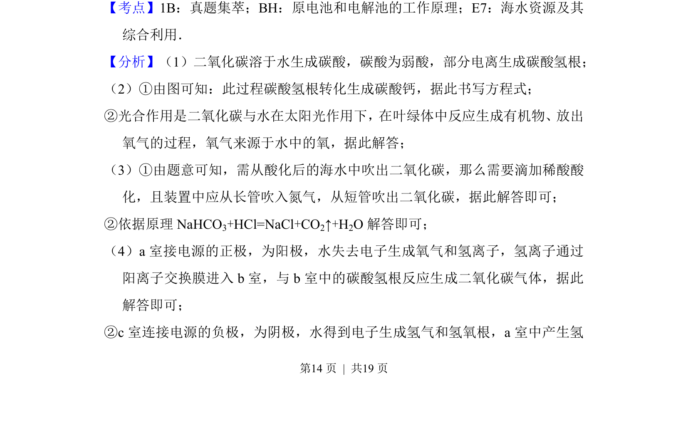
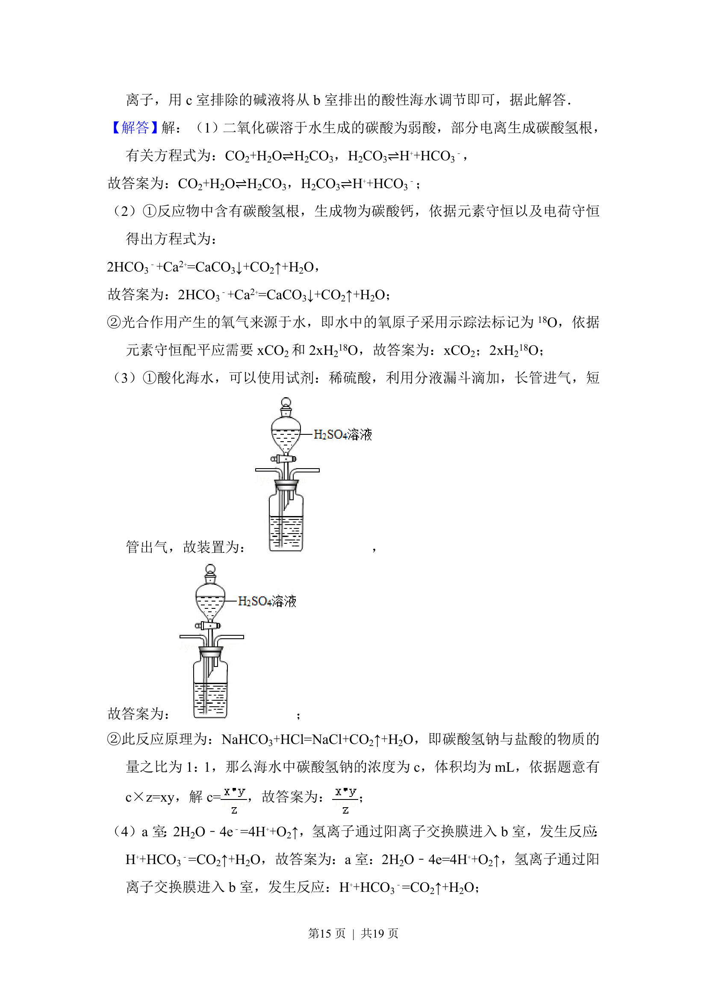
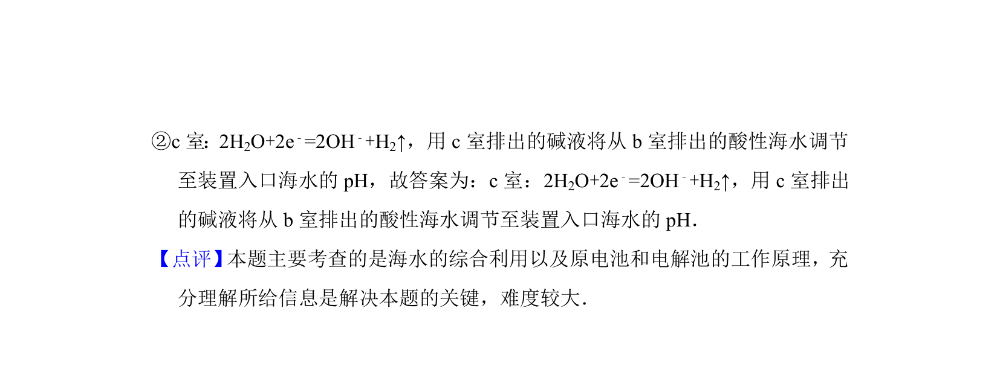

## 题面

## 摘要

考查海洋中CO2的转移与归宿，涉及方程式书写、固碳途径及无机碳浓度测定。

## 关联考点

- [[976-化学方程式的书写|化学方程式书写]]
- [[170-离子方程式|离子方程式]]
- [[滴定计算]]
- [[实验装置设计]]

## 答案与解析

> 📄 原 PDF 第 13 页：`素材/真题/北京/2008-2024·（北京）化学高考真题/2015年高考化学试卷（北京）（解析卷）.pdf`

<!-- 题干文本-start -->
## 题干文本
10．研究CO 2在海洋中的转移和归宿，是当今海洋科学研究的前沿领域．
（1）溶于海水的CO 2主要以4种无机碳形式存在．其中HCO 3
﹣占95%．写出
CO2 溶 于 水 产 生HCO3
﹣ 的 方 程 式 ： 　CO2+H2O⇌H 2CO3 ，H 2CO3 ⇌
H++HCO3
﹣　．
（2）在海洋碳循环中，通过如图所示的途径固碳．
①写出钙化作用的离子方程式：　2HCO3
﹣+Ca2+=CaCO3↓+CO2↑+H2O　．
②同位素示踪法证实光合作用的化学方程式如下，将其补充完整：
　xCO2　+　2xH218O　 （CH2O）x+x18O2+xH2O
（3）海水中溶解无机碳占海水总碳的95%以上，其准确测量是研究海洋碳循环
的基础．测量溶解无机碳，可采用如下方法：
①气提、吸收CO 2．用N 2从酸化后的海水中吹出CO 2并用碱液吸收（装置示意
图如下）．将虚线框中的装置补充完整并标出所用试剂．
②滴定．将吸收液吸收的无机碳转化为NaHCO 3，再用x mol▪L ﹣1HCl溶液滴定，
消耗ymLHCl溶液．海水中溶解无机碳的浓度=　 　 mol▪L﹣1．
（4）利用如图所示装置从海水中提取CO 2，有利于减少环境温室气体含量．
<!-- 题干文本-end -->

<!-- 解析文本-start -->
## 解析文本

<!-- 解析文本-end -->
