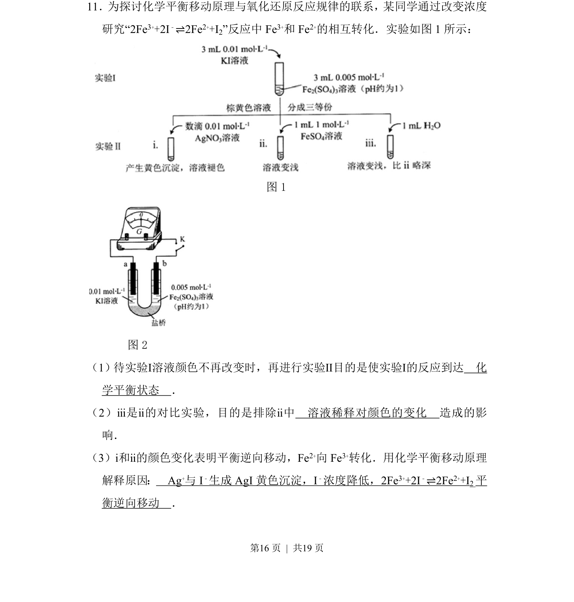
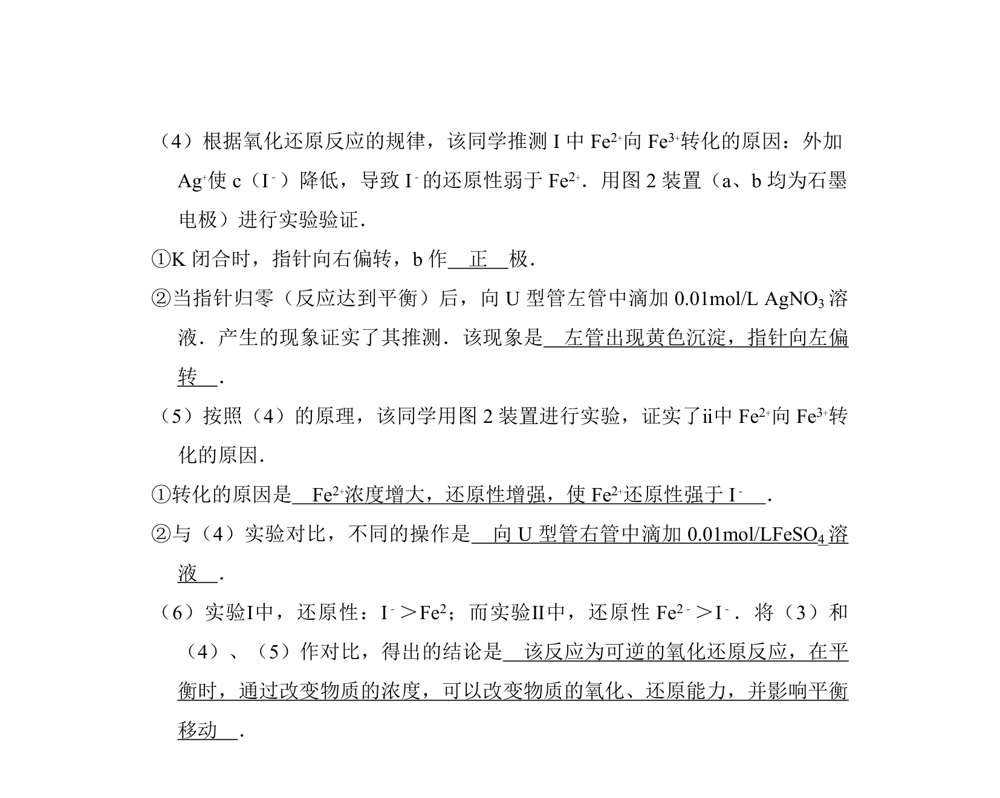
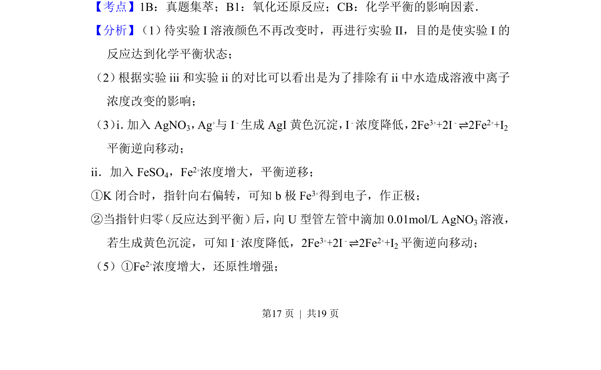
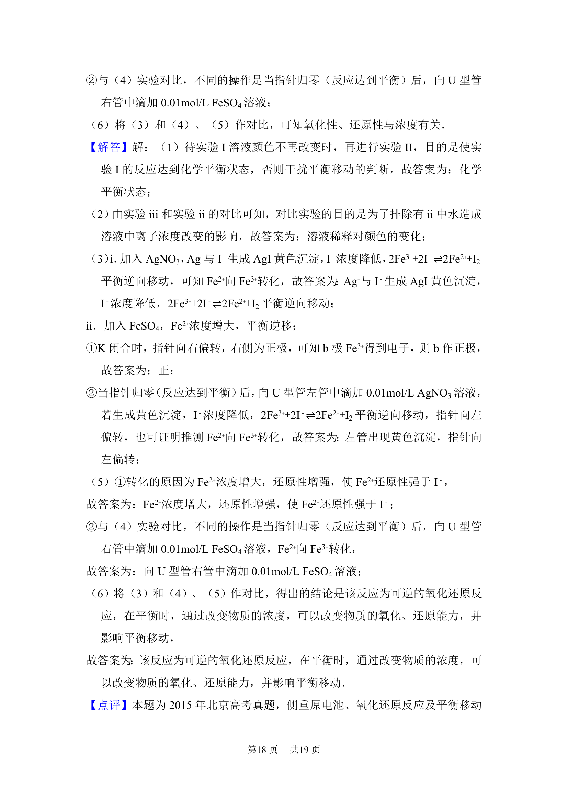
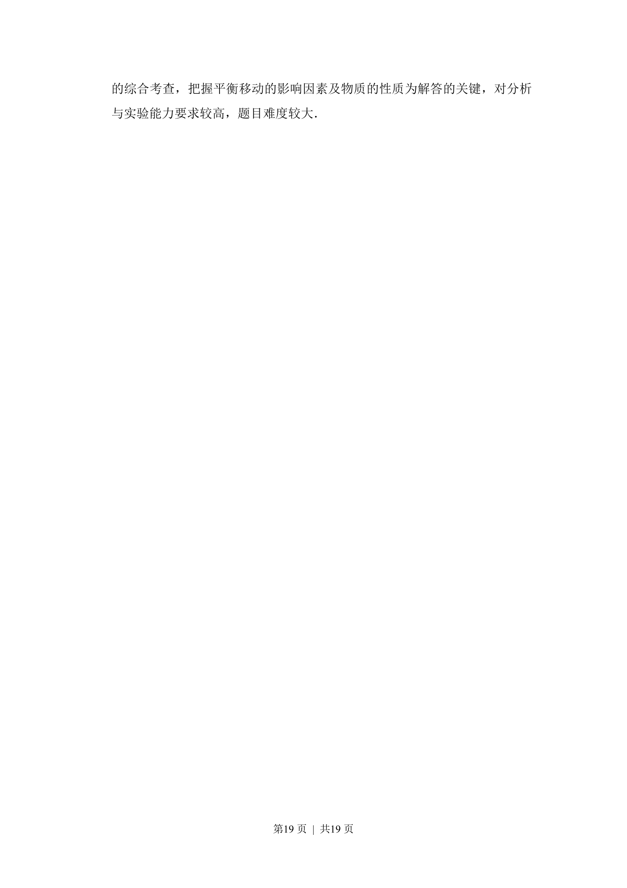

## 题面

## 摘要

通过浓度改变探究Fe3+与I-可逆反应平衡移动及氧化还原规律

## 关联考点

- [[991-化学平衡移动原理|化学平衡移动原理]]
- [[328-沉淀溶解平衡|沉淀溶解平衡]]
- [[对比实验设计]]
- [[162-氧化还原反应|氧化还原反应]]

## 答案与解析

> 📄 原 PDF 第 16 页：`素材/真题/北京/2008-2024·（北京）化学高考真题/2015年高考化学试卷（北京）（解析卷）.pdf`
