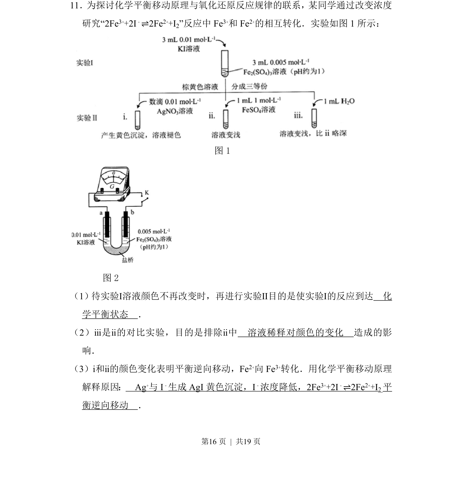
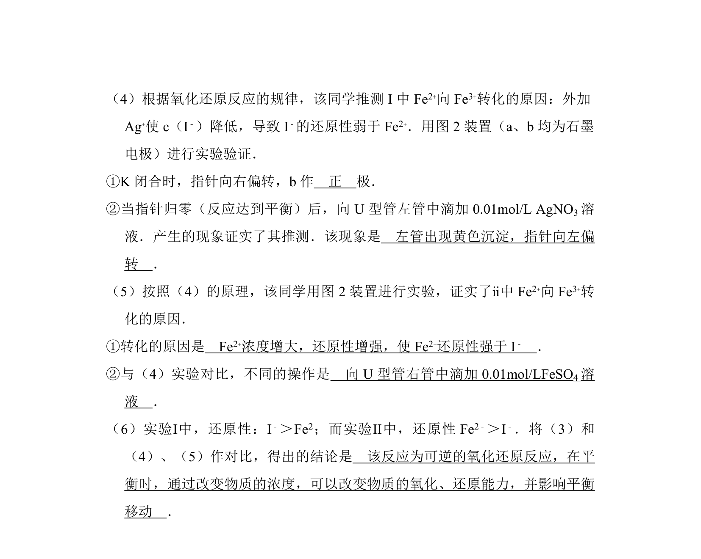
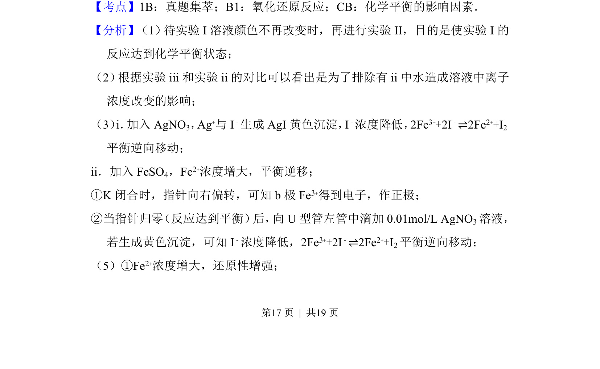
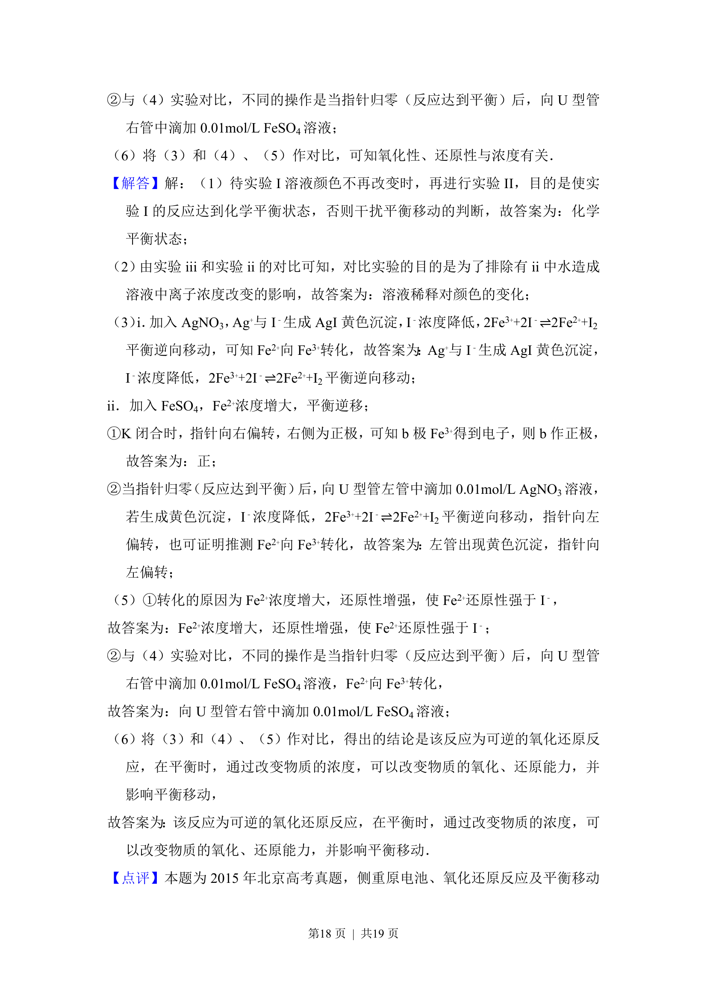
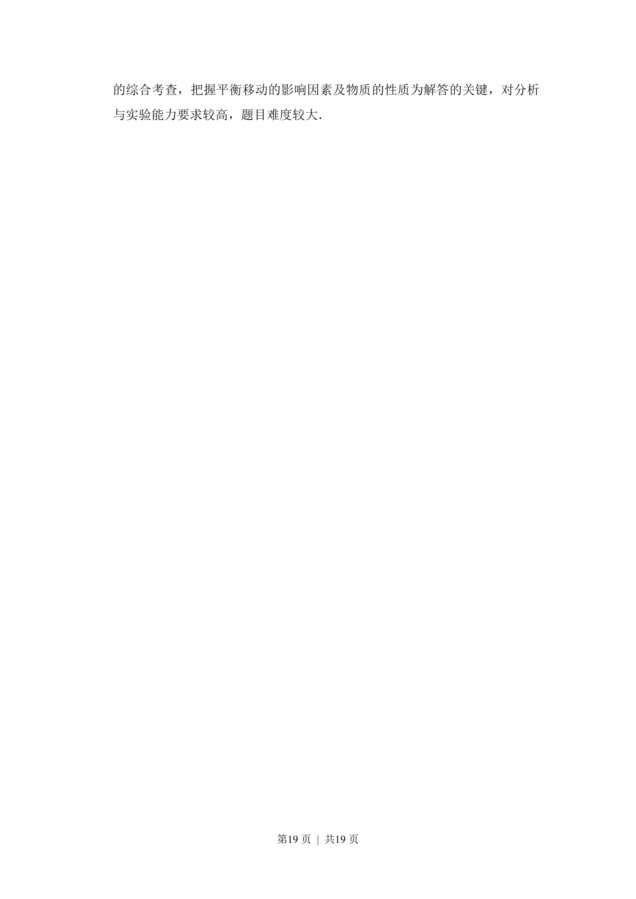

## 题面

## 摘要

通过浓度改变探究Fe3+与I-可逆反应平衡移动及氧化还原规律

## 关联考点

- [[991-化学平衡移动原理|化学平衡移动原理]]
- [[328-沉淀溶解平衡|沉淀溶解平衡]]
- [[对比实验设计]]
- [[162-氧化还原反应|氧化还原反应]]

## 答案与解析

> 📄 原 PDF 第 16 页：`素材/真题/北京/2008-2024·（北京）化学高考真题/2015年高考化学试卷（北京）（解析卷）.pdf`

<!-- 题干文本-start -->
## 题干文本
11．为探讨化学平衡移动原理与氧化还原反应规律的联系，某同学通过改变浓度
研究“2Fe3++2I﹣⇌2Fe2++I2”反应中Fe 3+和Fe 2+的相互转化．实验如图1所示：
                               图1
       图2
（1）待实验Ⅰ溶液颜色不再改变时，再进行实验Ⅱ目的是使实验Ⅰ的反应到达　化
学平衡状态　．
（2）ⅲ是ⅱ的对比实验，目的是排除ⅱ中　溶液稀释对颜色的变化　造成的影
响．
（3）ⅰ和ⅱ的颜色变化表明平衡逆向移动，Fe2+向Fe 3+转化．用化学平衡移动原理
解释原因：　Ag+与I ﹣生成AgI黄色沉淀，I ﹣浓度降低，2Fe3++2I﹣⇌2Fe2++I2平
衡逆向移动　．
<!-- 题干文本-end -->

<!-- 解析文本-start -->
## 解析文本

<!-- 解析文本-end -->
