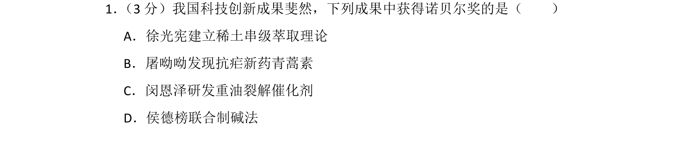
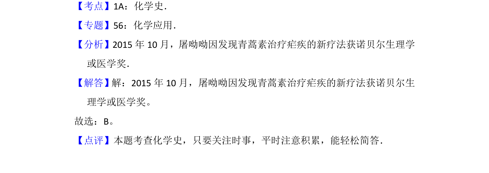

## 题面

## 摘要

考查诺贝尔奖相关化学史，要求识记屠呦呦发现青蒿素获诺贝尔奖的成就。

## 关联考点

- [[化学史]]
- [[诺贝尔奖]]
- [[青蒿素]]

## 答案与解析

> 📄 原 PDF 第 1 页：`素材/真题/北京/2008-2024·（北京）化学高考真题/2016年高考化学试卷（北京）（解析卷）.pdf`

<!-- 题干文本-start -->
## 题干文本
1． （3分）我国科技创新成果斐然，下列成果中获得诺贝尔奖的是（　　）
A．徐光宪建立稀土串级萃取理论
B．屠呦呦发现抗疟新药青蒿素
C．闵恩泽研发重油裂解催化剂
D．侯德榜联合制碱法
<!-- 题干文本-end -->

<!-- 解析文本-start -->
## 解析文本
【考点】1A：化学史．菁优网版权所有
【专题】56：化学应用．
【分析】2015年10月，屠呦呦因发现青蒿素治疗疟疾的新疗法获诺贝尔生理学
或医学奖．
【解答】解：2015年10月，屠呦呦因发现青蒿素治疗疟疾的新疗法获诺贝尔生
理学或医学奖。
故选：B。
【点评】本题考查化学史，只要关注时事，平时注意积累，能轻松简答．
<!-- 解析文本-end -->
