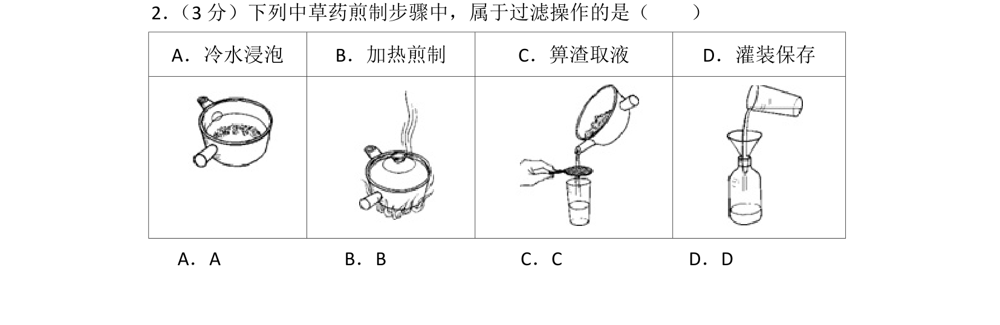
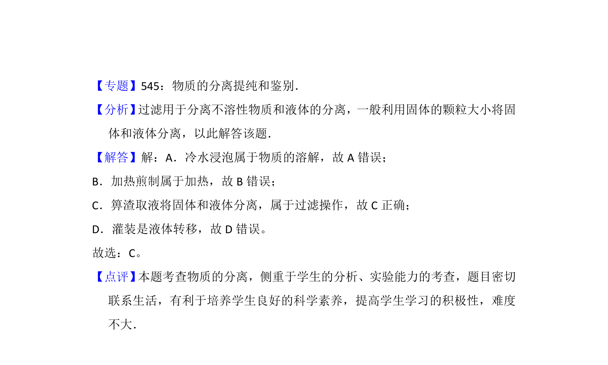

## 题面

## 摘要

中草药煎制步骤中识别过滤操作，即箅渣取液。

## 关联考点

- [[080-过滤|过滤]]
- [[物质的分离]]
- [[基本操作]]

## 答案与解析

> 📄 原 PDF 第 1 页：`素材/真题/北京/2008-2024·（北京）化学高考真题/2016年高考化学试卷（北京）（解析卷）.pdf`

<!-- 题干文本-start -->
## 题干文本
2． （3分）下列中草药煎制步骤中，属于过滤操作的是（　　） 
A．冷水浸泡 B．加热煎制 C．箅渣取液 D．灌装保存
 
 
  
  
A．A B．B C．C D．D
<!-- 题干文本-end -->

<!-- 解析文本-start -->
## 解析文本
【考点】P9：物质的分离、提纯的基本方法选择与应用．菁优网版权所有
<!-- 解析文本-end -->
