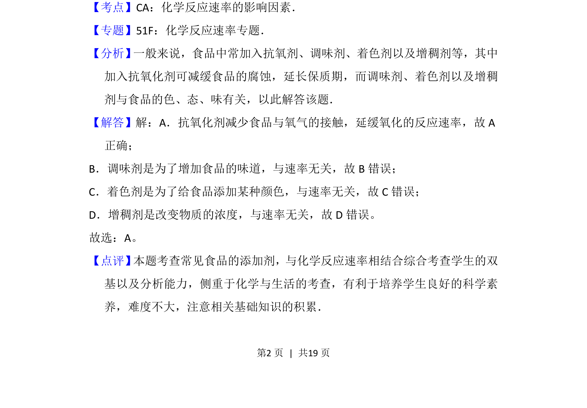

## 题面

## 摘要

该题考查食品添加剂使用目的与化学反应速率的关系。

## 关联考点

- [[974-化学反应速率影响因素|化学反应速率影响因素]]
- [[食品添加剂]]

## 答案与解析

> 📄 原 PDF 第 2 页：`素材/真题/北京/2008-2024·（北京）化学高考真题/2016年高考化学试卷（北京）（解析卷）.pdf`

<!-- 题干文本-start -->
## 题干文本
3． （3分）下列食品添加剂中，其使用目的与反应速率有关的是（　　）
A．抗氧化剂B．调味剂C．着色剂D．增稠剂
<!-- 题干文本-end -->

<!-- 解析文本-start -->
## 解析文本
【考点】CA：化学反应速率的影响因素．菁优网版权所有
【专题】51F：化学反应速率专题．
【分析】 一般来说，食品中常加入抗氧剂、调味剂、着色剂以及增稠剂等，其中
加入抗氧化剂可减缓食品的腐蚀，延长保质期，而调味剂、着色剂以及增稠
剂与食品的色、态、味有关，以此解答该题．
【解答】解：A．抗氧化剂减少食品与氧气的接触，延缓氧化的反应速率，故A
正确；
B．调味剂是为了增加食品的味道，与速率无关，故B错误；
C．着色剂是为了给食品添加某种颜色，与速率无关，故C错误；
D．增稠剂是改变物质的浓度，与速率无关，故D错误。
故选：A。
【点评】 本题考查常见食品的添加剂，与化学反应速率相结合综合考查学生的双
基以及分析能力，侧重于化学与生活的考查，有利于培养学生良好的科学素
养，难度不大，注意相关基础知识的积累．
<!-- 解析文本-end -->
