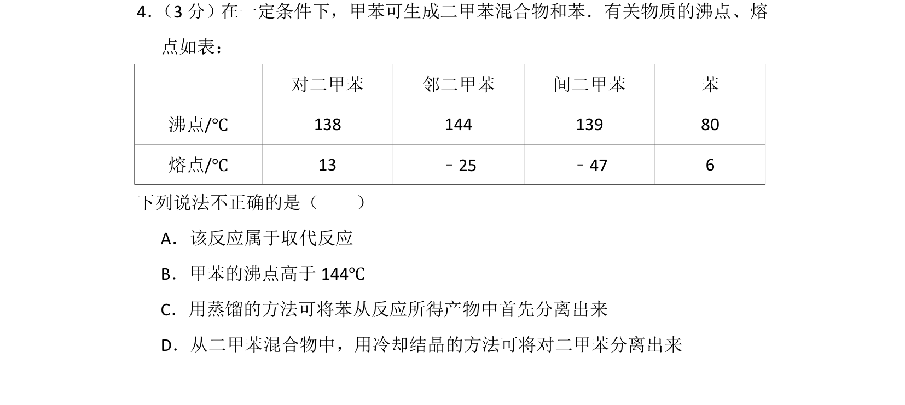
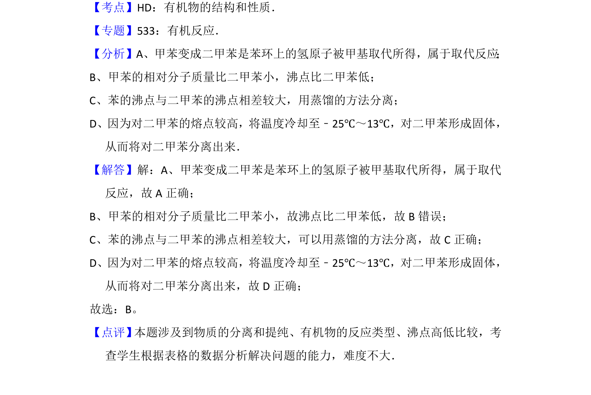

## 题面

## 摘要

本题考查甲苯取代反应、沸点比较及蒸馏、结晶分离方法，基于表格数据分析判断说法正误。

## 关联考点

- [[651-取代反应|取代反应]]
- [[747-沸点比较|沸点比较]]
- [[079-蒸馏|蒸馏]]
- [[结晶分离]]

## 答案与解析

> 📄 原 PDF 第 3 页：`素材/真题/北京/2008-2024·（北京）化学高考真题/2016年高考化学试卷（北京）（解析卷）.pdf`
