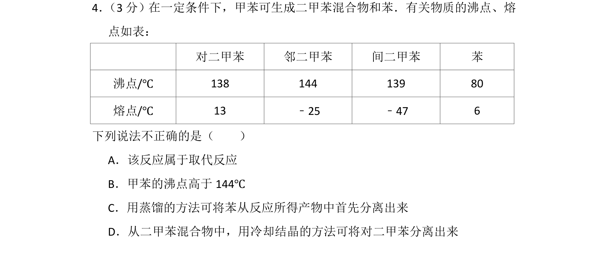
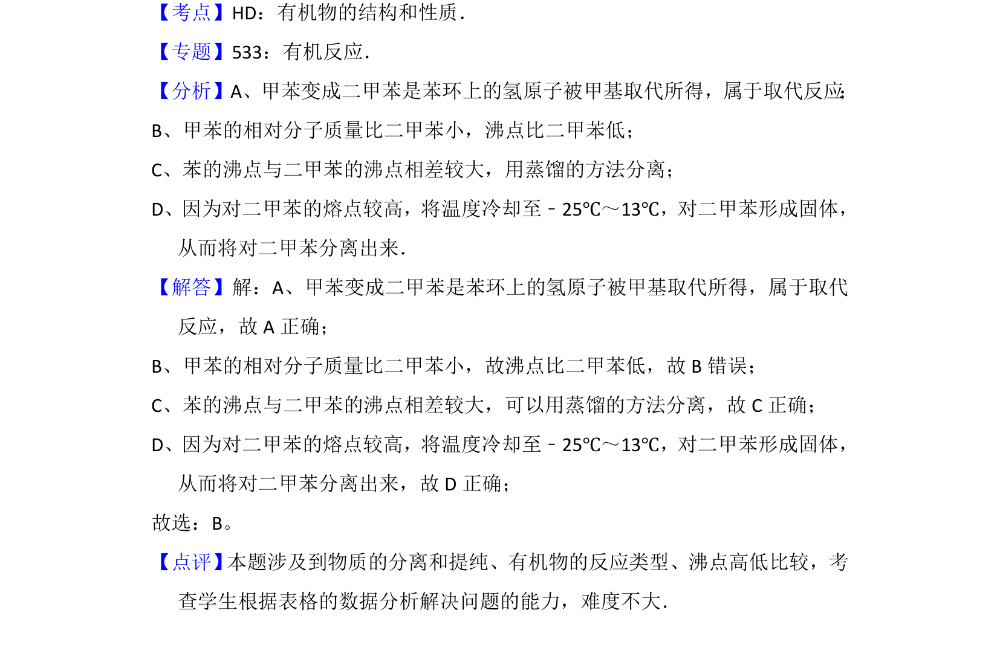

## 题面

## 摘要

本题考查甲苯取代反应、沸点比较及蒸馏、结晶分离方法，基于表格数据分析判断说法正误。

## 关联考点

- [[651-取代反应|取代反应]]
- [[747-沸点比较|沸点比较]]
- [[079-蒸馏|蒸馏]]
- [[结晶分离]]

## 答案与解析

> 📄 原 PDF 第 3 页：`素材/真题/北京/2008-2024·（北京）化学高考真题/2016年高考化学试卷（北京）（解析卷）.pdf`

<!-- 题干文本-start -->
## 题干文本
4． （3分）在一定条件下，甲苯可生成二甲苯混合物和苯．有关物质的沸点、熔
点如表：
 对二甲苯 邻二甲苯 间二甲苯 苯
沸点/℃ 138 144 139 80
熔点/℃ 13 ﹣25 ﹣47 6
下列说法不正确的是（　　）
A．该反应属于取代反应
B．甲苯的沸点高于144℃
C．用蒸馏的方法可将苯从反应所得产物中首先分离出来
D．从二甲苯混合物中，用冷却结晶的方法可将对二甲苯分离出来
<!-- 题干文本-end -->

<!-- 解析文本-start -->
## 解析文本
【考点】HD：有机物的结构和性质．菁优网版权所有
【专题】533：有机反应．
【分析】A、甲苯变成二甲苯是苯环上的氢原子被甲基取代所得，属于取代反应 ；
B、甲苯的相对分子质量比二甲苯小，沸点比二甲苯低；
C、苯的沸点与二甲苯的沸点相差较大，用蒸馏的方法分离；
D、因为对二甲苯的熔点较高，将温度冷却至﹣25℃～13℃，对二甲苯形成固体，
从而将对二甲苯分离出来．
【解答】解：A、甲苯变成二甲苯是苯环上的氢原子被甲基取代所得，属于取代
反应，故A正确；
B、甲苯的相对分子质量比二甲苯小，故沸点比二甲苯低，故B错误；
C、苯的沸点与二甲苯的沸点相差较大，可以用蒸馏的方法分离，故C正确；
D、因为对二甲苯的熔点较高，将温度冷却至﹣25℃～13℃，对二甲苯形成固体，
从而将对二甲苯分离出来，故D正确；
故选：B。
【点评】 本题涉及到物质的分离和提纯、有机物的反应类型、沸点高低比较，考
查学生根据表格的数据分析解决问题的能力，难度不大．
<!-- 解析文本-end -->
