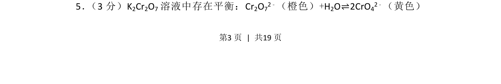
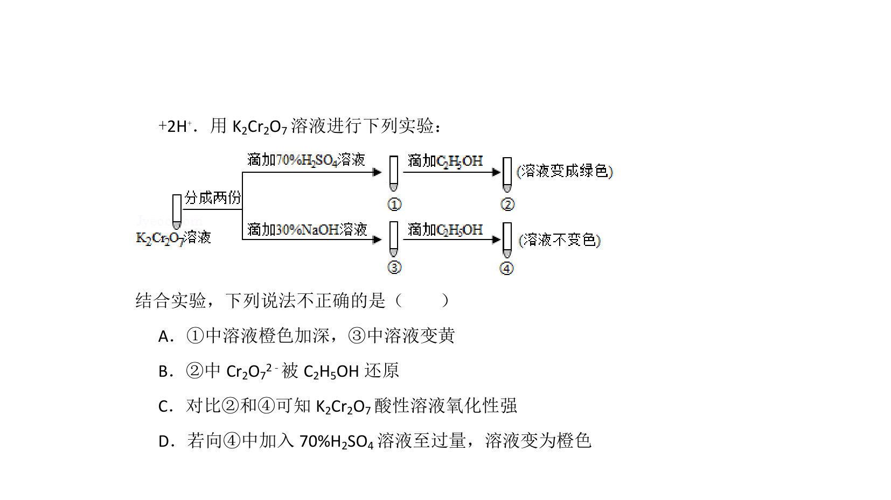
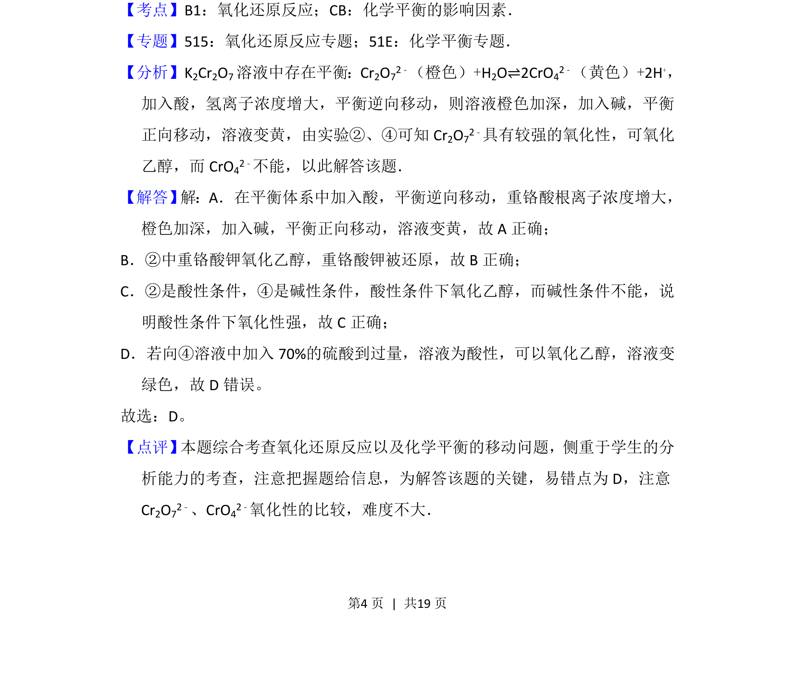

## 题面

## 摘要

重铬酸钾溶液中Cr2O72-与CrO42-的平衡及其颜色变化。

## 关联考点

- [[284-化学平衡|化学平衡]]
- [[349-平衡移动|平衡移动]]
- [[离子转化]]
- [[536-反应颜色变化|颜色反应]]

## 答案与解析

> 📄 原 PDF 第 3 页：`素材/真题/北京/2008-2024·（北京）化学高考真题/2016年高考化学试卷（北京）（解析卷）.pdf`
