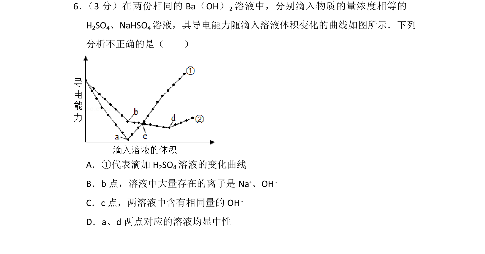
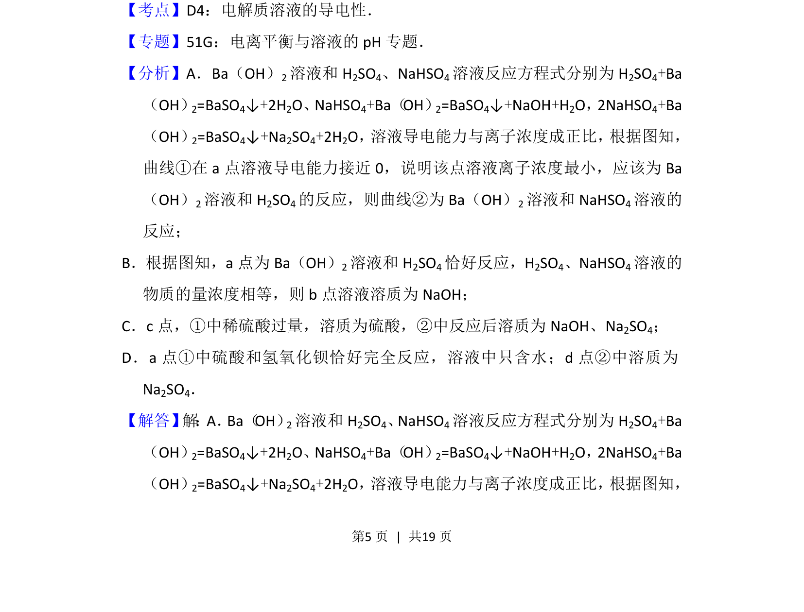
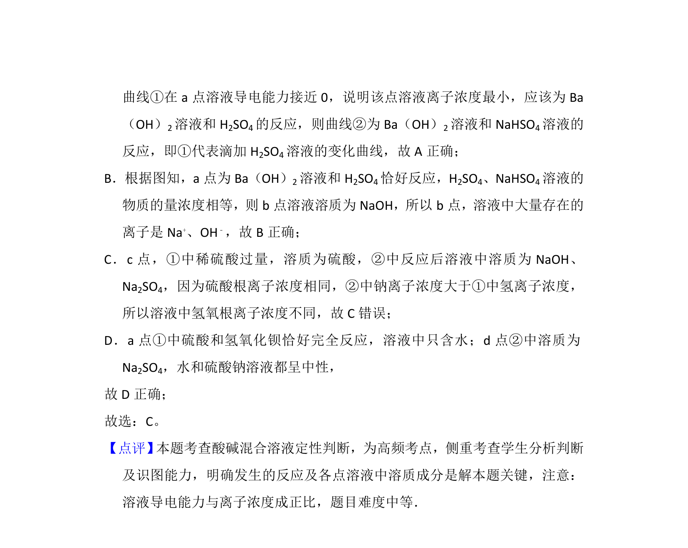

## 题面

## 摘要

Ba(OH)₂与H₂SO₄、NaHSO₄反应时导电能力变化曲线分析

## 关联考点

- [[电解质溶液导电性]]
- [[169-离子反应|离子反应]]
- [[918-化学方程式计算|化学方程式计算]]

## 答案与解析

> 📄 原 PDF 第 5 页：`素材/真题/北京/2008-2024·（北京）化学高考真题/2016年高考化学试卷（北京）（解析卷）.pdf`
