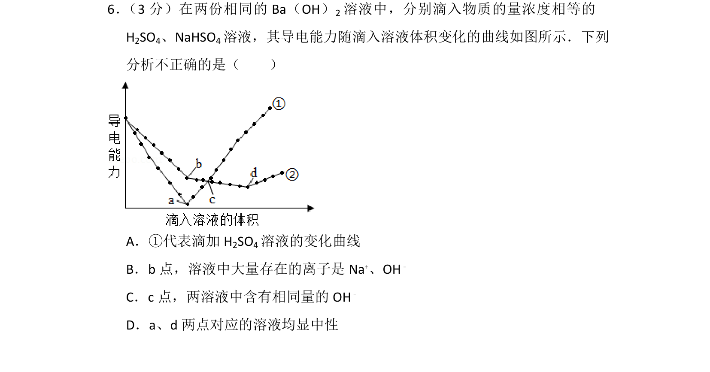
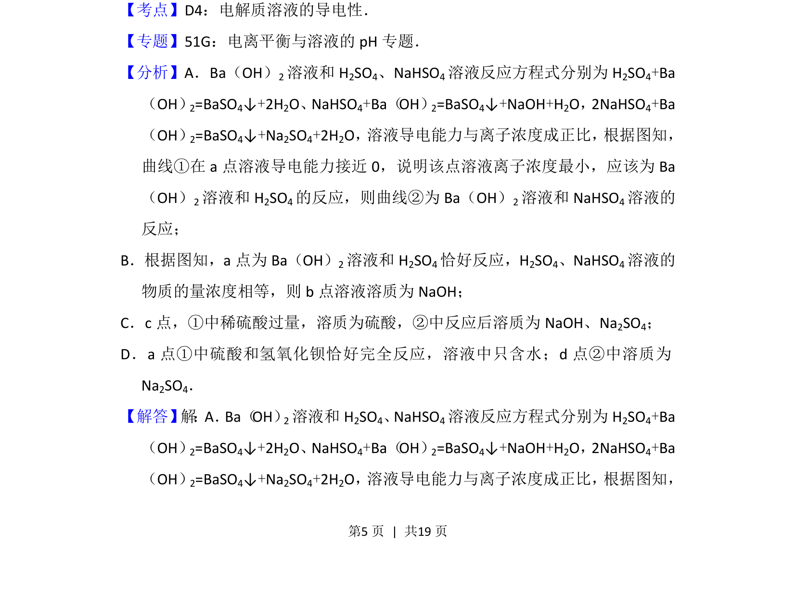
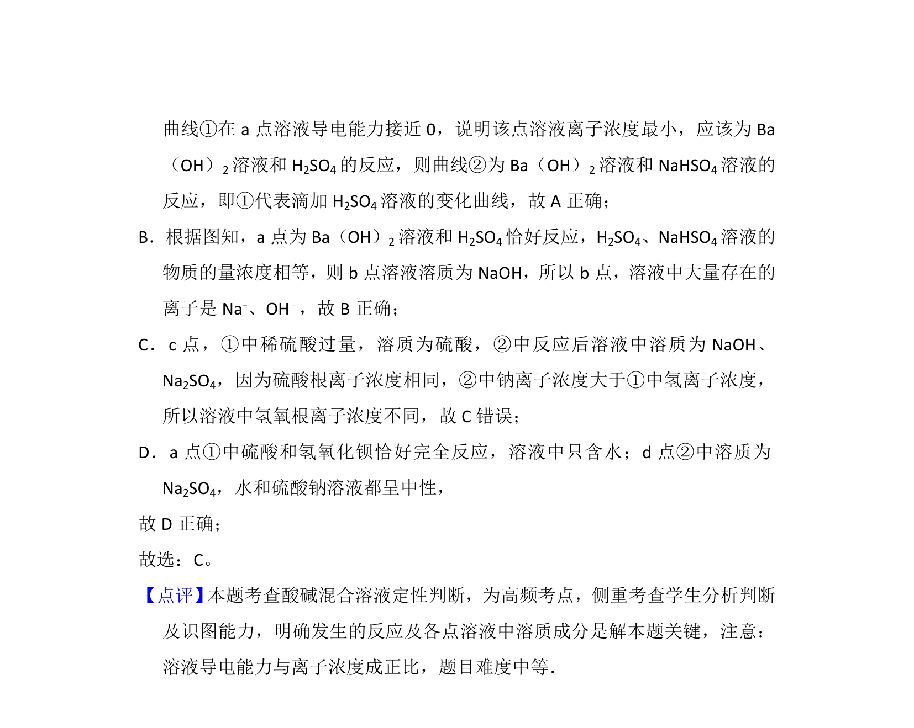

## 题面

## 摘要

Ba(OH)₂与H₂SO₄、NaHSO₄反应时导电能力变化曲线分析

## 关联考点

- [[电解质溶液导电性]]
- [[169-离子反应|离子反应]]
- [[918-化学方程式计算|化学方程式计算]]

## 答案与解析

> 📄 原 PDF 第 5 页：`素材/真题/北京/2008-2024·（北京）化学高考真题/2016年高考化学试卷（北京）（解析卷）.pdf`

<!-- 题干文本-start -->
## 题干文本
6． （3分）在两份相同的Ba（OH） 2溶液中，分别滴入物质的量浓度相等的
H2SO4、NaHSO4溶液，其导电能力随滴入溶液体积变化的曲线如图所示．下列
分析不正确的是（　　）
A．①代表滴加H 2SO4溶液的变化曲线
B．b点，溶液中大量存在的离子是Na +、OH﹣
C．c点，两溶液中含有相同量的OH ﹣
D．a、d两点对应的溶液均显中性
<!-- 题干文本-end -->

<!-- 解析文本-start -->
## 解析文本
【考点】D4：电解质溶液的导电性．菁优网版权所有
【专题】51G：电离平衡与溶液的pH专题．
【分析】A．Ba（OH）2溶液和H 2SO4、NaHSO4溶液反应方程式分别为H 2SO4+Ba
（OH）2=BaSO4↓+2H2O、NaHSO4+Ba（OH）2=BaSO4↓+NaOH+H2O，2NaHSO4+Ba
（OH）2=BaSO4↓+Na2SO4+2H2O， 溶液导电能力与离子浓度成正比， 根据图知，
曲线①在a点溶液导电能力接近0，说明该点溶液离子浓度最小，应该为Ba
（OH）2溶液和H 2SO4的反应，则曲线②为Ba（OH） 2溶液和NaHSO 4溶液的
反应；
B．根据图知，a点为Ba（OH） 2溶液和H 2SO4恰好反应，H2SO4、NaHSO4溶液的
物质的量浓度相等，则b点溶液溶质为NaOH；
C．c点，①中稀硫酸过量，溶质为硫酸，②中反应后溶质为NaOH、Na 2SO4；
D．a点①中硫酸和氢氧化钡恰好完全反应，溶液中只含水；d点②中溶质为
Na2SO4．
【解答】 解 ：A．Ba（OH）2溶液和H 2SO4、NaHSO4溶液反应方程式分别为H 2SO4+Ba
（OH）2=BaSO4↓+2H2O、NaHSO4+Ba（OH）2=BaSO4↓+NaOH+H2O，2NaHSO4+Ba
（OH）2=BaSO4↓+Na2SO4+2H2O， 溶液导电能力与离子浓度成正比， 根据图知，
<!-- 解析文本-end -->
