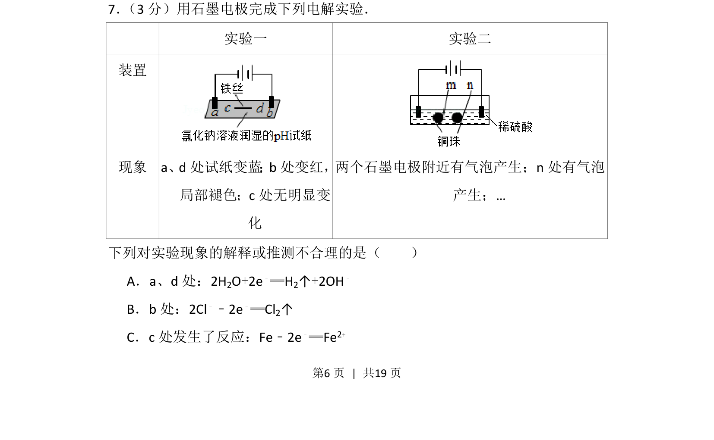
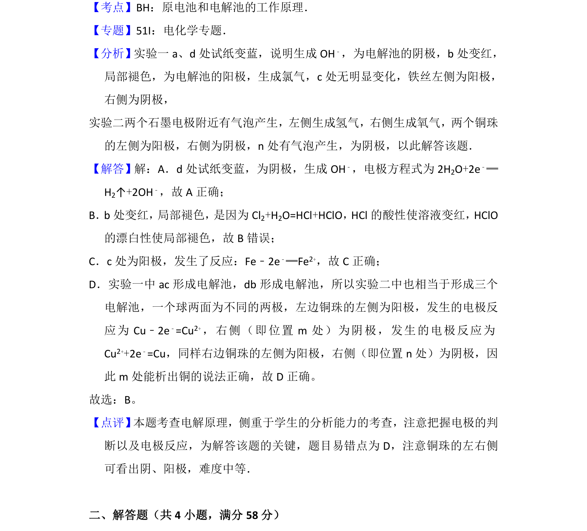

## 题面

## 摘要

通过石墨电极电解实验现象判断电极反应及物质变化

## 关联考点

- [[368-电解池|电解池]]
- [[793-电极反应|电极反应]]
- [[201-氯气性质|氯气性质]]
- [[858-金属腐蚀|金属腐蚀]]

## 答案与解析

> 📄 原 PDF 第 6 页：`素材/真题/北京/2008-2024·（北京）化学高考真题/2016年高考化学试卷（北京）（解析卷）.pdf`
