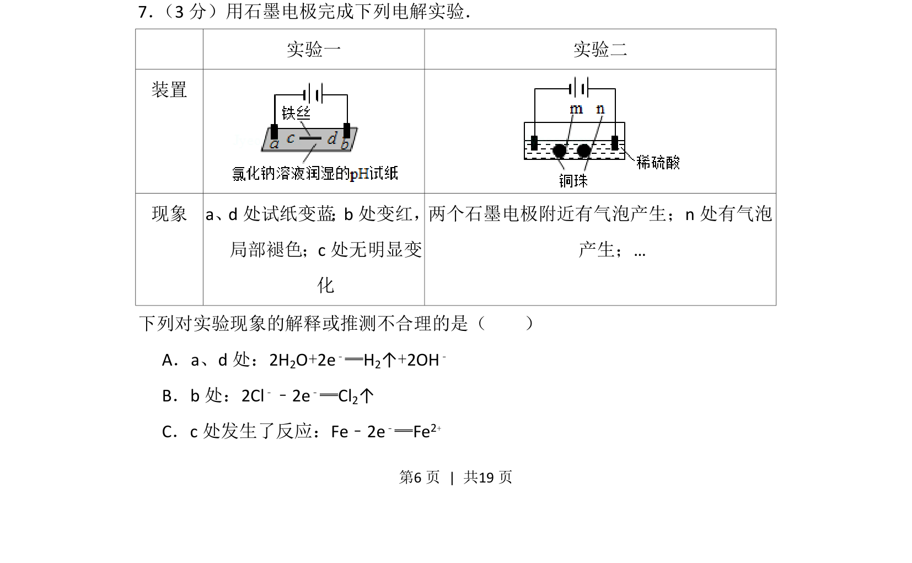
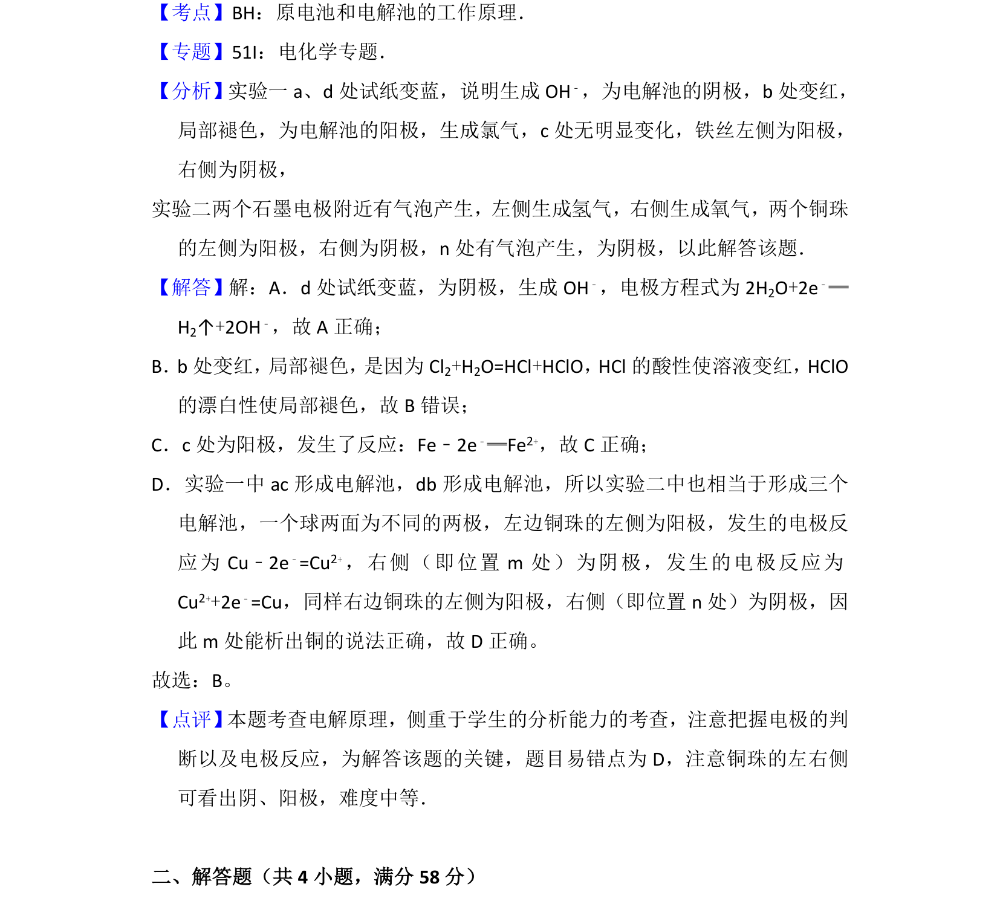

## 题面

## 摘要

通过石墨电极电解实验现象判断电极反应及物质变化

## 关联考点

- [[368-电解池|电解池]]
- [[793-电极反应|电极反应]]
- [[201-氯气性质|氯气性质]]
- [[858-金属腐蚀|金属腐蚀]]

## 答案与解析

> 📄 原 PDF 第 6 页：`素材/真题/北京/2008-2024·（北京）化学高考真题/2016年高考化学试卷（北京）（解析卷）.pdf`

<!-- 题干文本-start -->
## 题干文本
7． （3分）用石墨电极完成下列电解实验．
 实验一 实验二
装置
现象 a、d处试纸变蓝 ；b处变红，
局部褪色；c处无明显变
化
两个石墨电极附近有气泡产生；n处有气泡
产生；…
下列对实验现象的解释或推测不合理的是（　　）
A．a、d处：2H 2O+2e﹣═H2↑+2OH﹣
B．b处：2Cl ﹣﹣2e﹣═Cl2↑
C．c处发生了反应：Fe﹣2e ﹣═Fe2+
<!-- 题干文本-end -->

<!-- 解析文本-start -->
## 解析文本

<!-- 解析文本-end -->
