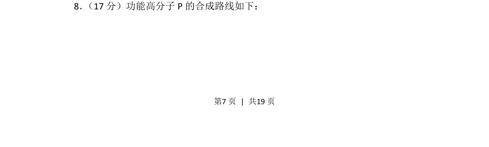
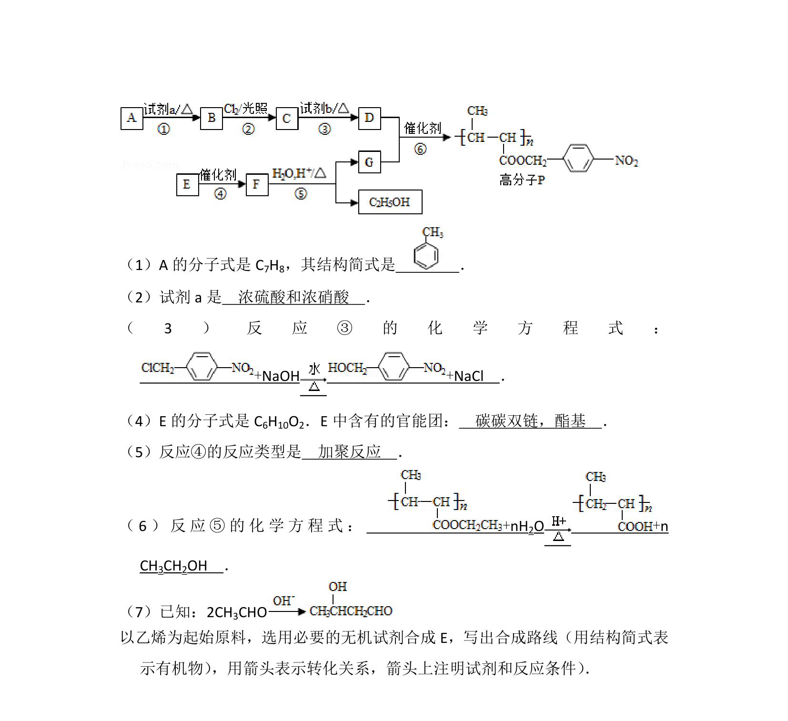
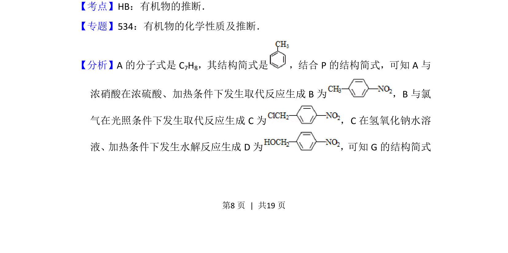
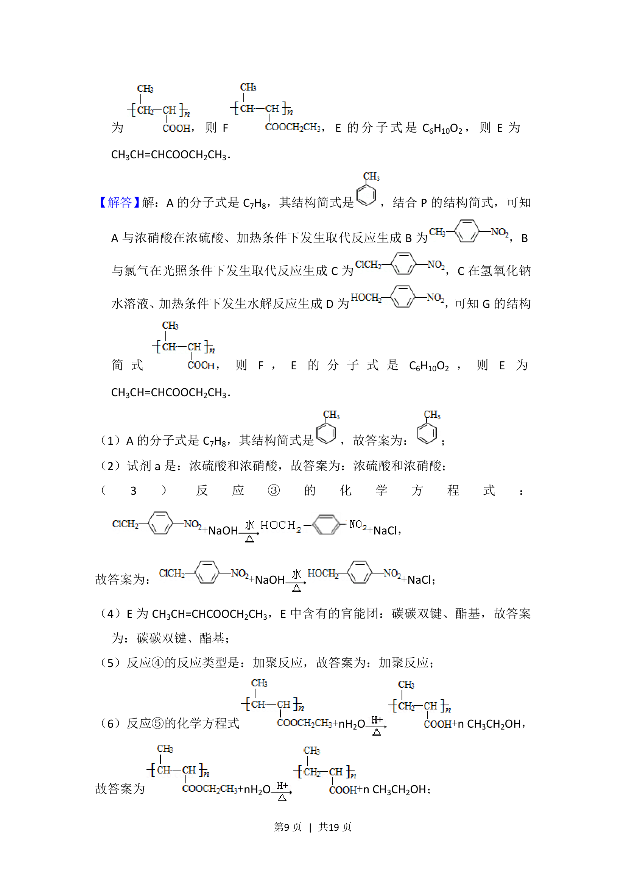
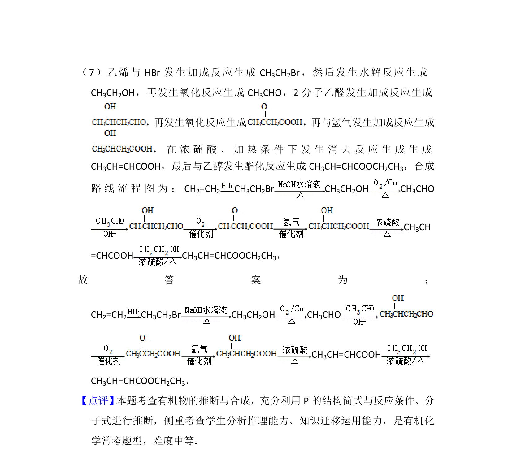

## 题面

## 摘要

考查功能高分子P的合成路线，涉及有机反应推断与中间体结构分析。

## 关联考点

- [[271-化学合成|有机合成]]
- [[886-官能团转化|官能团转化]]
- [[990-高分子合成|高分子合成]]
- [[646-反应类型|反应类型]]

## 答案与解析

> 📄 原 PDF 第 7 页：`素材/真题/北京/2008-2024·（北京）化学高考真题/2016年高考化学试卷（北京）（解析卷）.pdf`
