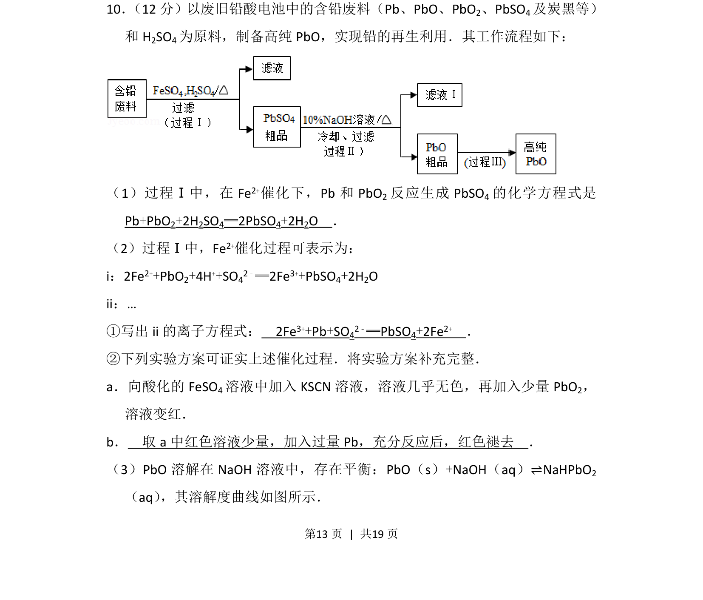
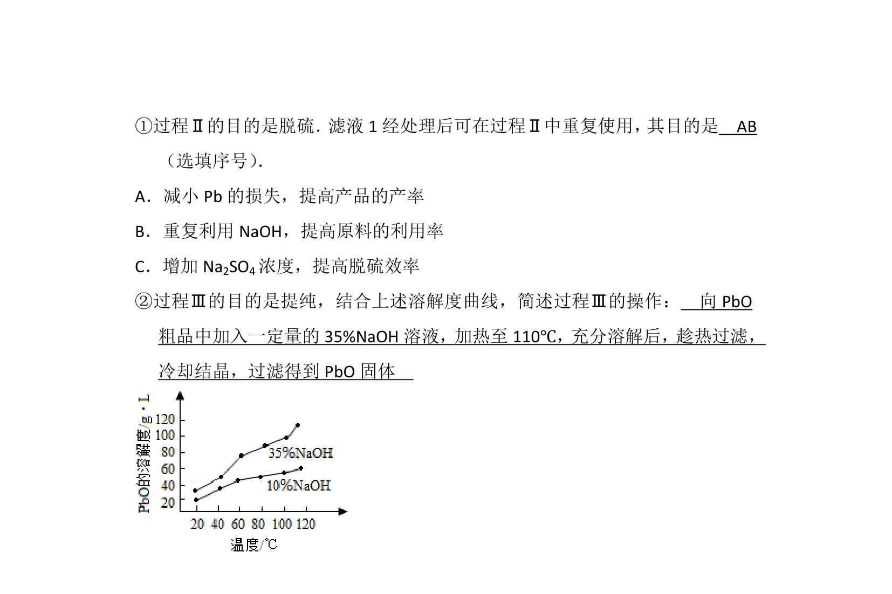
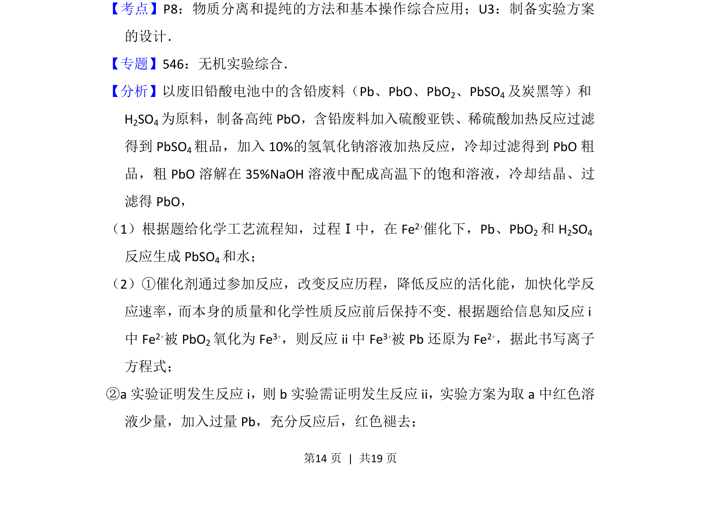
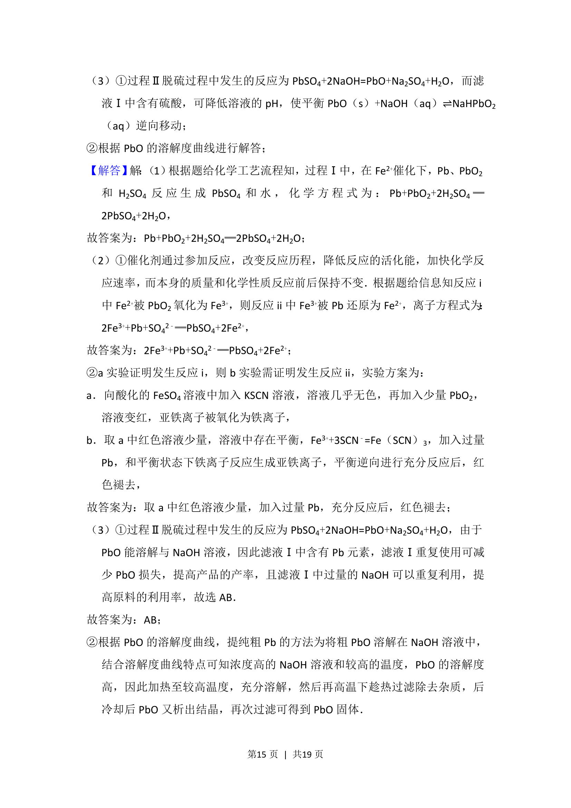
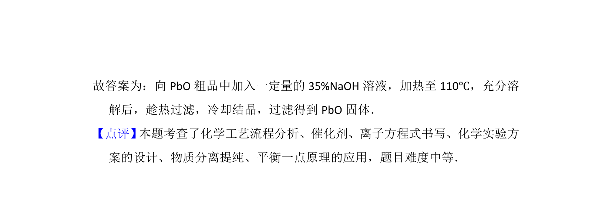

## 题面

## 摘要

该题以废旧铅酸电池回收制备 PbO 的工艺流程为背景，考查反应原理、催化循环和实验方案设计。

## 关联考点

- [[铅及其化合物]]
- [[162-氧化还原反应|氧化还原反应]]
- [[催化剂与催化循环]]
- [[668-实验方案设计|实验方案设计]]

## 答案与解析

> 📄 原 PDF 第 13 页：`素材/真题/北京/2008-2024·（北京）化学高考真题/2016年高考化学试卷（北京）（解析卷）.pdf`
