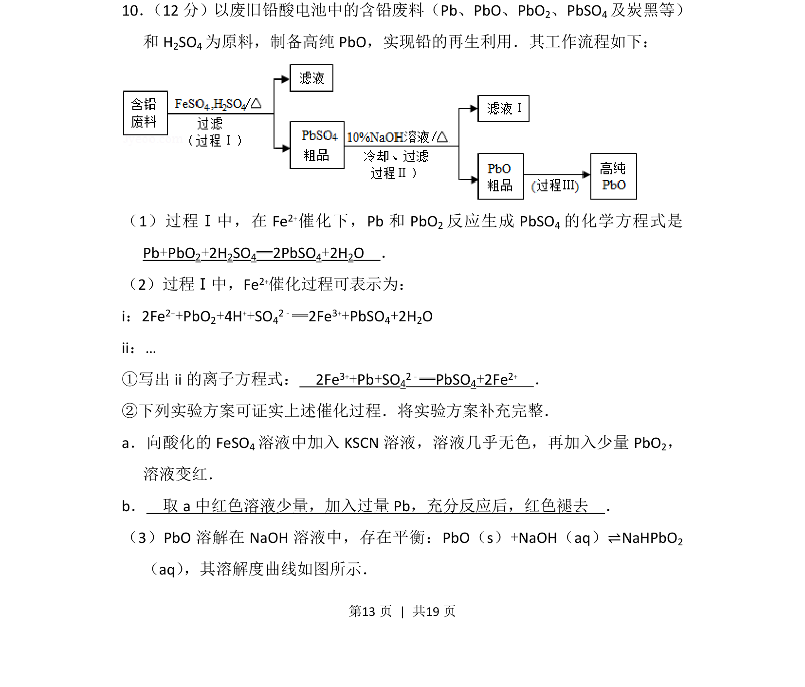
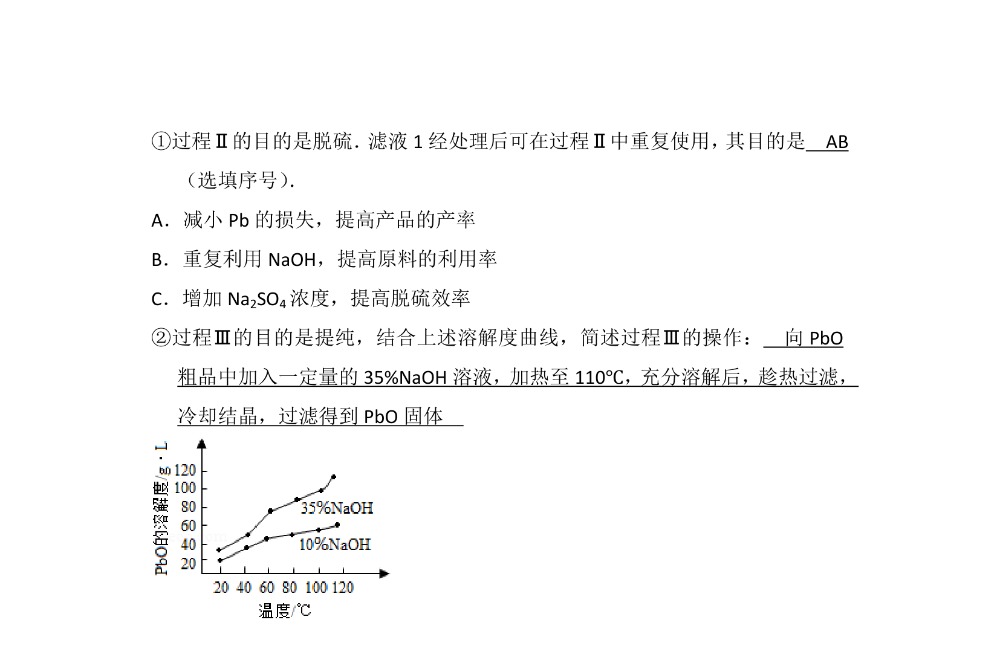
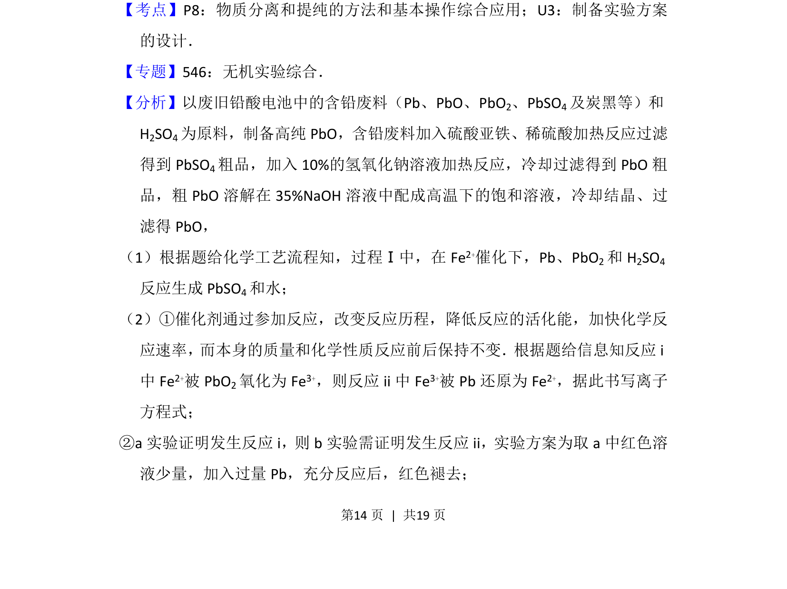
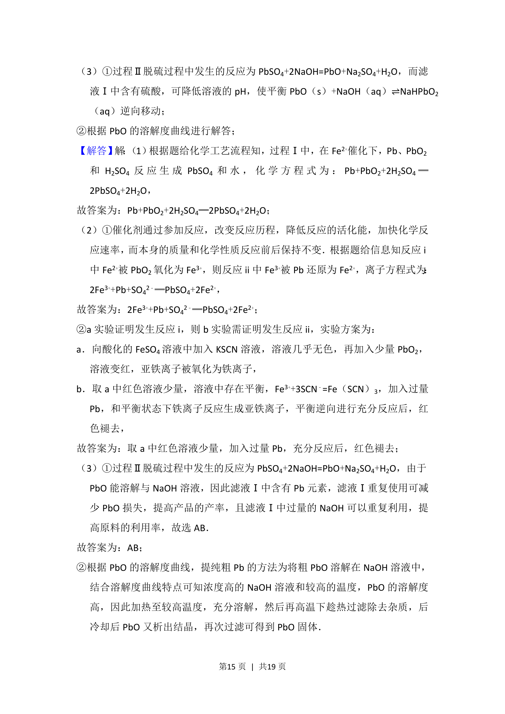
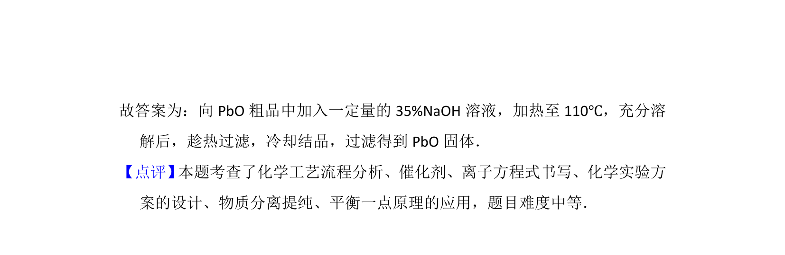

## 题面

## 摘要

该题以废旧铅酸电池回收制备 PbO 的工艺流程为背景，考查反应原理、催化循环和实验方案设计。

## 关联考点

- [[铅及其化合物]]
- [[162-氧化还原反应|氧化还原反应]]
- [[催化剂与催化循环]]
- [[668-实验方案设计|实验方案设计]]

## 答案与解析

> 📄 原 PDF 第 13 页：`素材/真题/北京/2008-2024·（北京）化学高考真题/2016年高考化学试卷（北京）（解析卷）.pdf`

<!-- 题干文本-start -->
## 题干文本
10． （12分）以废旧铅酸电池中的含铅废料（Pb、PbO、PbO2、PbSO4及炭黑等）
和H 2SO4为原料，制备高纯PbO，实现铅的再生利用．其工作流程如下：
（1）过程Ⅰ中，在Fe 2+催化下，Pb和PbO 2反应生成PbSO 4的化学方程式是　
Pb+PbO2+2H2SO4═2PbSO4+2H2O　．
（2）过程Ⅰ中，Fe2+催化过程可表示为：
i：2Fe2++PbO2+4H++SO42﹣═2Fe3++PbSO4+2H2O
ii：…
①写出ii的离子方程式：　2Fe 3++Pb+SO42﹣═PbSO4+2Fe2+　．
②下列实验方案可证实上述催化过程．将实验方案补充完整．
a．向酸化的FeSO 4溶液中加入KSCN溶液，溶液几乎无色，再加入少量PbO 2，
溶液变红．
b．　取a中红色溶液少量，加入过量Pb，充分反应后，红色褪去　．
（3）PbO溶解在NaOH溶液中，存在平衡：PbO（s）+NaOH（aq）⇌NaHPbO 2
（aq） ，其溶解度曲线如图所示．
<!-- 题干文本-end -->

<!-- 解析文本-start -->
## 解析文本

<!-- 解析文本-end -->
