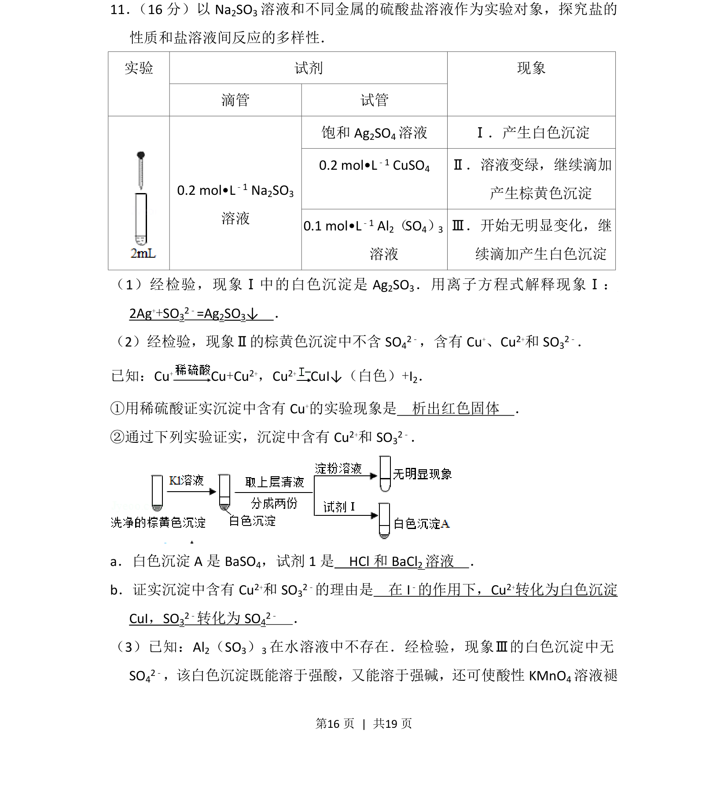
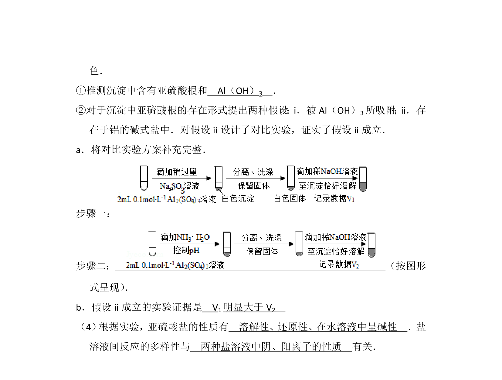
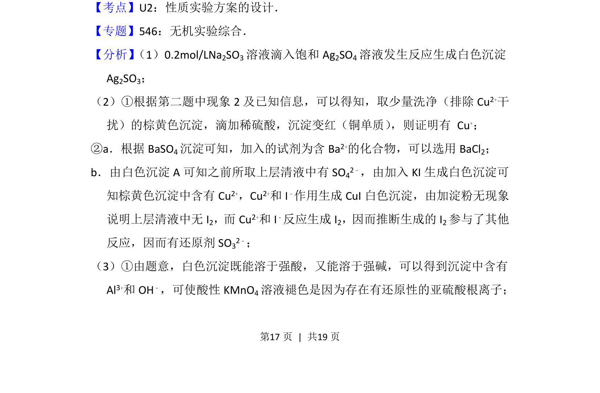
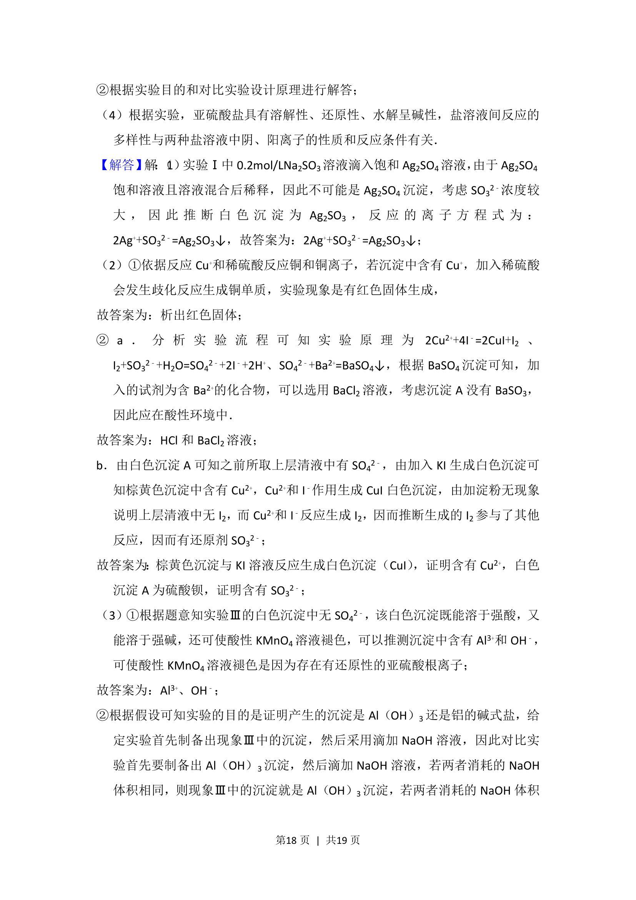
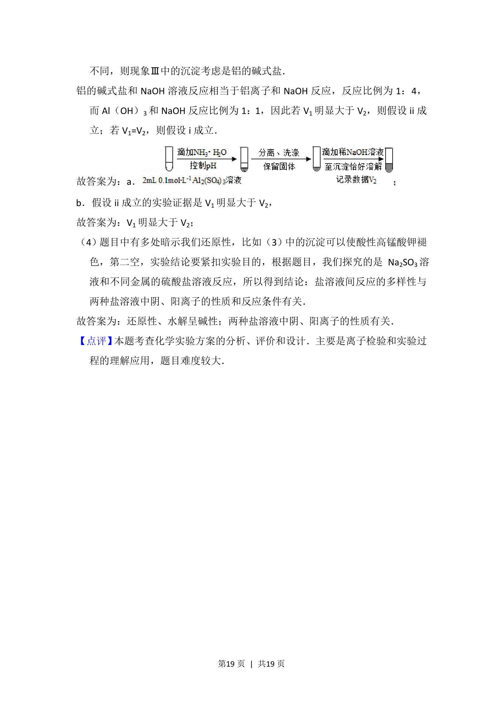

## 题面

## 摘要

探究亚硫酸钠与不同金属硫酸盐溶液反应的多样性，涉及离子方程式书写及沉淀成分检验。

## 关联考点

- [[806-离子方程式书写|离子方程式书写]]
- [[682-常见离子的检验方法|离子检验]]
- [[162-氧化还原反应|氧化还原反应]]
- [[330-沉淀转化|沉淀转化]]

## 答案与解析

> 📄 原 PDF 第 16 页：`素材/真题/北京/2008-2024·（北京）化学高考真题/2016年高考化学试卷（北京）（解析卷）.pdf`
