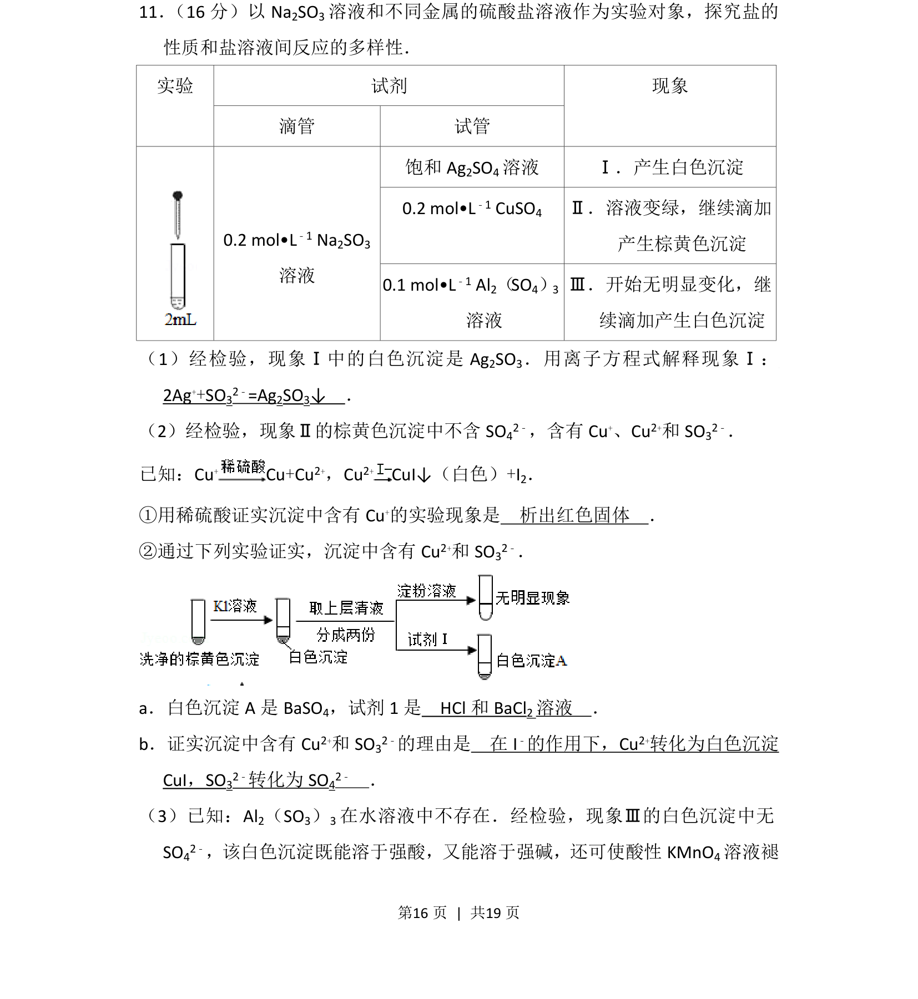
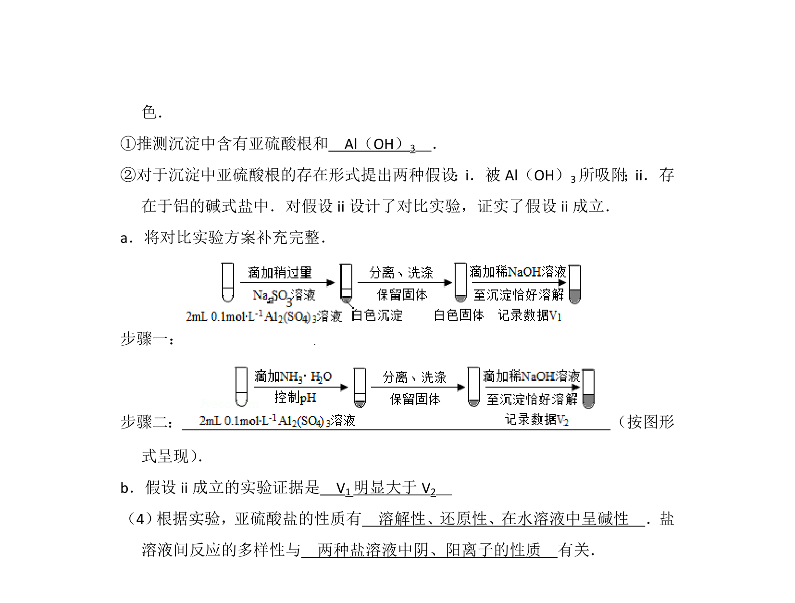
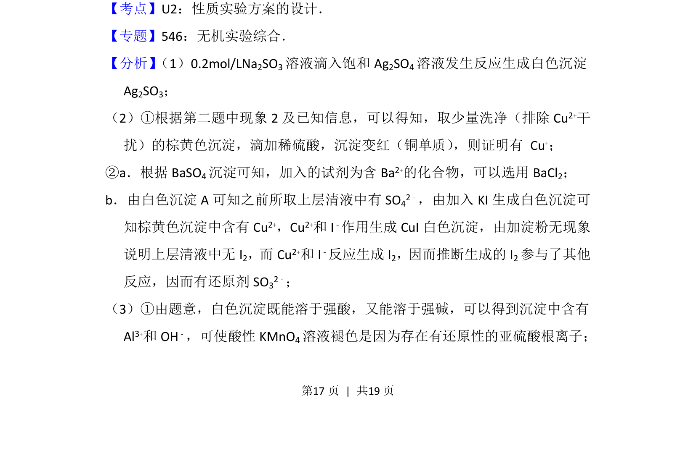
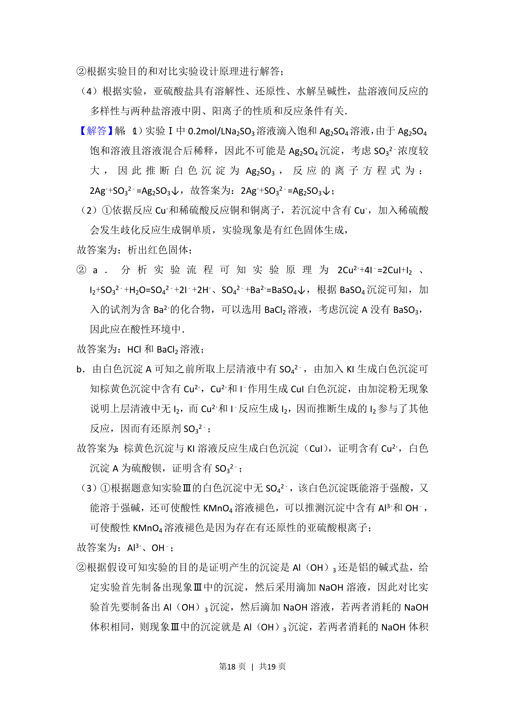
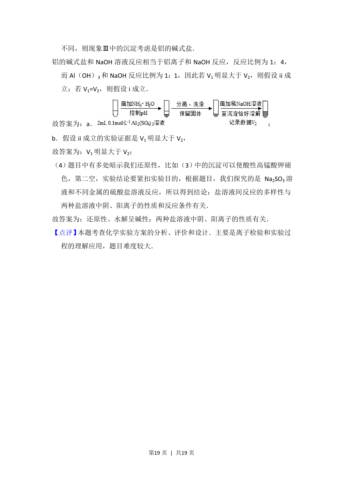

## 题面

## 摘要

探究亚硫酸钠与不同金属硫酸盐溶液反应的多样性，涉及离子方程式书写及沉淀成分检验。

## 关联考点

- [[807-离子方程式的书写|离子方程式书写]]
- [[682-常见离子的检验方法|离子检验]]
- [[162-氧化还原反应|氧化还原反应]]
- [[330-沉淀转化|沉淀转化]]

## 答案与解析

> 📄 原 PDF 第 16 页：`素材/真题/北京/2008-2024·（北京）化学高考真题/2016年高考化学试卷（北京）（解析卷）.pdf`

<!-- 题干文本-start -->
## 题干文本
11． （16分）以Na2SO3溶液和不同金属的硫酸盐溶液作为实验对象，探究盐的
性质和盐溶液间反应的多样性．
试剂实验
滴管 试管
现象
饱和Ag 2SO4溶液 Ⅰ．产生白色沉淀
0.2 mol•L﹣1 CuSO4 Ⅱ．溶液变绿，继续滴加
产生棕黄色沉淀
 
 
0.2 mol•L﹣1 Na2SO3
溶液 0.1 mol•L﹣1 Al2（SO4）3
溶液
Ⅲ．开始无明显变化，继
续滴加产生白色沉淀
（1）经检验，现象Ⅰ中的白色沉淀是Ag 2SO3．用离子方程式解释现象Ⅰ：　
2Ag++SO32﹣=Ag2SO3↓　．
（2）经检验，现象Ⅱ的棕黄色沉淀中不含SO 42﹣，含有Cu +、Cu2+和SO 32﹣．
已知：Cu+ Cu+Cu2+，Cu2+ CuI↓（白色）+I2．
①用稀硫酸证实沉淀中含有Cu +的实验现象是　析出红色固体　．
②通过下列实验证实，沉淀中含有Cu 2+和SO 32﹣．
a．白色沉淀A是BaSO 4，试剂1是　HCl和BaCl 2溶液　．
b．证实沉淀中含有Cu 2+和SO 32﹣的理由是　在I ﹣的作用下，Cu2+转化为白色沉淀
CuI，SO32﹣转化为SO 42﹣　．
（3）已知：Al 2（SO3）3在水溶液中不存在．经检验，现象Ⅲ的白色沉淀中无
SO42﹣，该白色沉淀既能溶于强酸，又能溶于强碱，还可使酸性KMnO4溶液褪
<!-- 题干文本-end -->

<!-- 解析文本-start -->
## 解析文本

<!-- 解析文本-end -->
