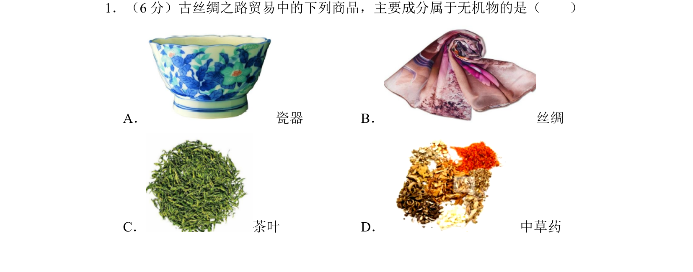
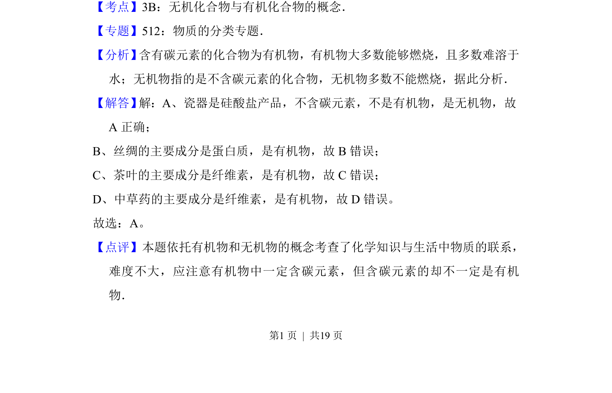

## 题面

## 摘要

本题通过古丝绸之路贸易商品考查无机物与有机物的概念辨析。

## 关联考点

- [[无机化合物与有机化合物的概念]]
- [[164-物质分类|物质的分类]]

## 答案与解析

> 📄 原 PDF 第 1 页：`素材/真题/北京/2008-2024·（北京）化学高考真题/2017年高考化学试卷（北京）（解析卷）.pdf`

<!-- 题干文本-start -->
## 题干文本
1．（6分）古丝绸之路贸易中的下列商品，主要成分属于无机物的是（　　）
A． 瓷器B． 丝绸
C． 茶叶D． 中草药
<!-- 题干文本-end -->

<!-- 解析文本-start -->
## 解析文本
【考点】3B：无机化合物与有机化合物的概念．菁优网版权所有
【专题】512：物质的分类专题．
【分析】 含有碳元素的化合物为有机物，有机物大多数能够燃烧，且多数难溶于
水；无机物指的是不含碳元素的化合物，无机物多数不能燃烧，据此分析．
【解答】 解：A、瓷器是硅酸盐产品，不含碳元素，不是有机物，是无机物，故
A正确；
B、丝绸的主要成分是蛋白质，是有机物，故B错误；
C、茶叶的主要成分是纤维素，是有机物，故C错误；
D、中草药的主要成分是纤维素，是有机物，故D错误。
故选：A。
【点评】本题依托有机物和无机物的概念考查了化学知识与生活中物质的联系，
难度不大，应注意有机物中一定含碳元素，但含碳元素的却不一定是有机
物．
<!-- 解析文本-end -->
