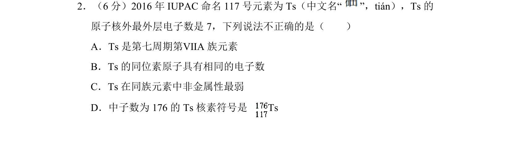
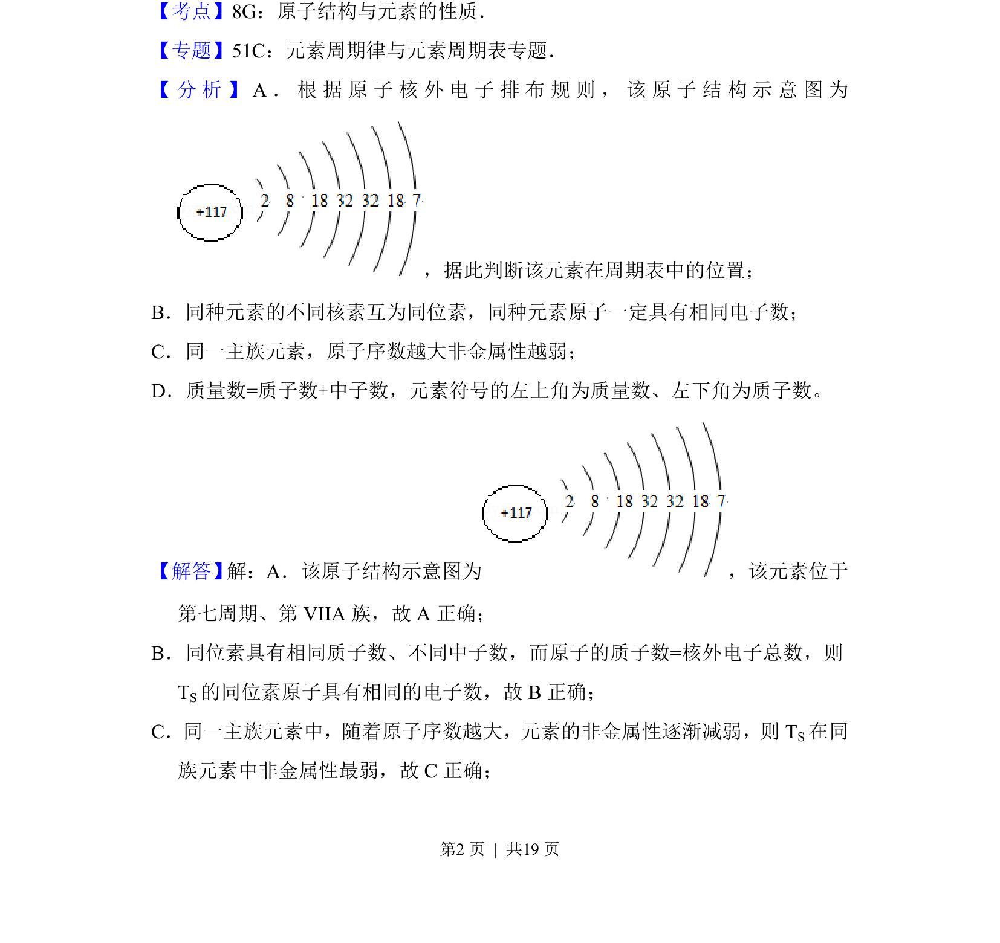
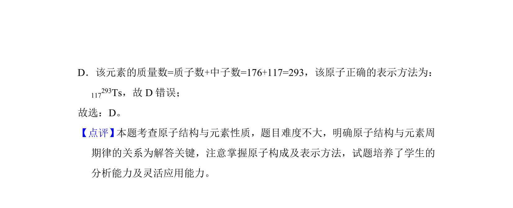

## 题面

## 摘要

考查117号元素Ts的原子结构、元素周期表位置及性质判断

## 关联考点

- [[426-原子结构|原子结构]]
- [[253-元素周期表|元素周期表]]
- [[260-同位素|同位素]]
- [[非金属性递变]]

## 答案与解析

> 📄 原 PDF 第 2 页：`素材/真题/北京/2008-2024·（北京）化学高考真题/2017年高考化学试卷（北京）（解析卷）.pdf`
