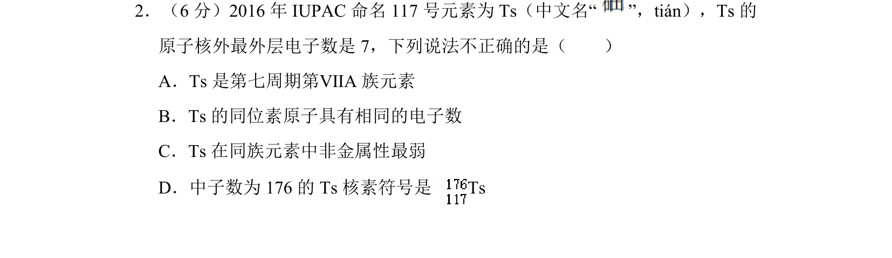
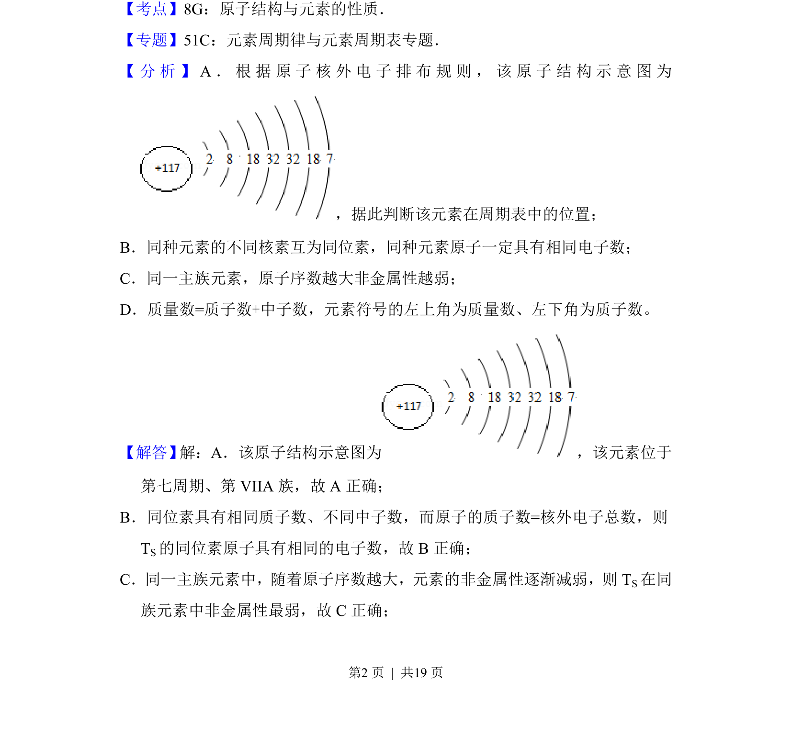
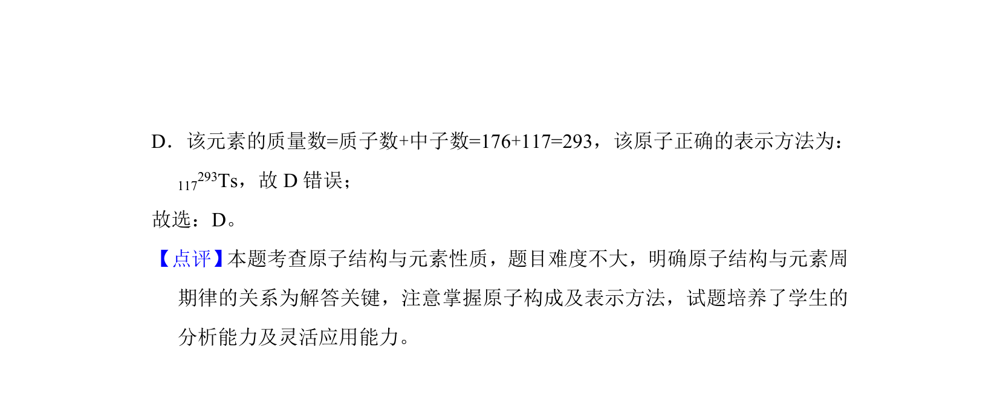

## 题面

## 摘要

考查117号元素Ts的原子结构、元素周期表位置及性质判断

## 关联考点

- [[426-原子结构|原子结构]]
- [[253-元素周期表|元素周期表]]
- [[260-同位素|同位素]]
- [[非金属性递变]]

## 答案与解析

> 📄 原 PDF 第 2 页：`素材/真题/北京/2008-2024·（北京）化学高考真题/2017年高考化学试卷（北京）（解析卷）.pdf`

<!-- 题干文本-start -->
## 题干文本
2．（6分）2016年IUPAC命名117号元素为Ts（中文名“ ”，tián），Ts的
原子核外最外层电子数是7，下列说法不正确的是（　　）
A．Ts是第七周期第ⅦA族元素
B．Ts的同位素原子具有相同的电子数
C．Ts在同族元素中非金属性最弱
D．中子数为176的Ts核素符号是Ts
<!-- 题干文本-end -->

<!-- 解析文本-start -->
## 解析文本
【考点】8G：原子结构与元素的性质．菁优网版权所有
【专题】51C：元素周期律与元素周期表专题．
【 分 析 】A． 根 据 原 子 核 外 电 子 排 布 规 则 ， 该 原 子 结 构 示 意 图 为
，据此判断该元素在周期表中的位置；
B．同种元素的不同核素互为同位素，同种元素原子一定具有相同电子数；
C．同一主族元素，原子序数越大非金属性越弱；
D．质量数=质子数+中子数，元素符号的左上角为质量数、左下角为质子数。
【解答】 解：A．该原子结构示意图为 ，该元素位于
第七周期、第VIIA族，故A正确；
B．同位素具有相同质子数、不同中子数，而原子的质子数=核外电子总数，则
TS的同位素原子具有相同的电子数，故B正确；
C．同一主族元素中，随着原子序数越大，元素的非金属性逐渐减弱，则TS在同
族元素中非金属性最弱，故C正确；
<!-- 解析文本-end -->
