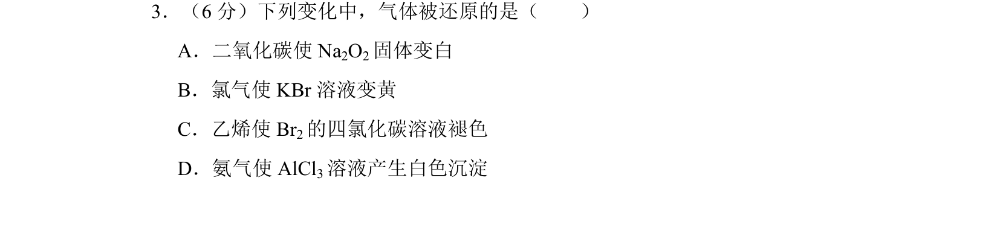
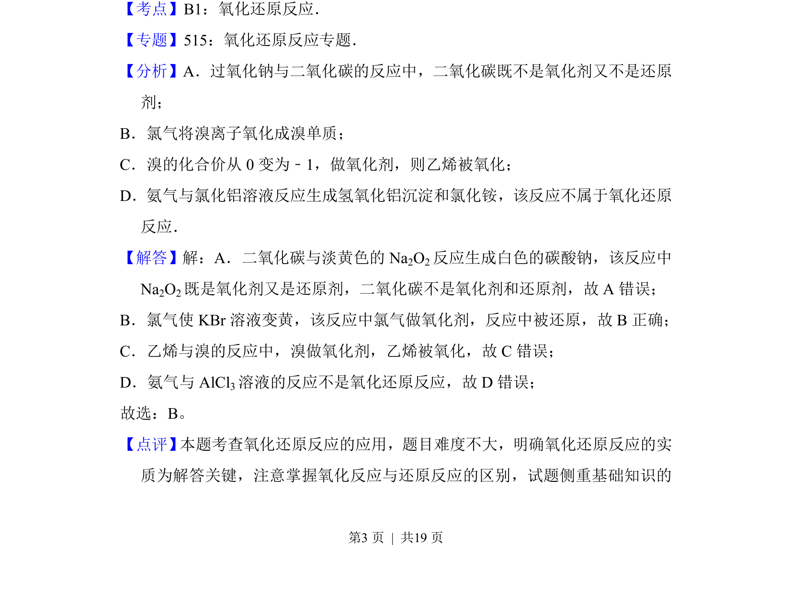

## 题面

## 摘要

考查氧化还原反应中还原反应的定义与应用，判断气体是否被还原。

## 关联考点

- [[162-氧化还原反应|氧化还原反应]]
- [[162-氧化还原反应|还原反应]]

## 答案与解析

> 📄 原 PDF 第 3 页：`素材/真题/北京/2008-2024·（北京）化学高考真题/2017年高考化学试卷（北京）（解析卷）.pdf`

<!-- 题干文本-start -->
## 题干文本
3．（6分）下列变化中，气体被还原的是（　　）
A．二氧化碳使Na 2O2固体变白
B．氯气使KBr溶液变黄
C．乙烯使Br 2的四氯化碳溶液褪色
D．氨气使AlCl 3溶液产生白色沉淀
<!-- 题干文本-end -->

<!-- 解析文本-start -->
## 解析文本
【考点】B1：氧化还原反应．菁优网版权所有
【专题】515：氧化还原反应专题．
【分析】A．过氧化钠与二氧化碳的反应中，二氧化碳既不是氧化剂又不是还原
剂；
B．氯气将溴离子氧化成溴单质；
C．溴的化合价从0变为﹣1，做氧化剂，则乙烯被氧化；
D．氨气与氯化铝溶液反应生成氢氧化铝沉淀和氯化铵，该反应不属于氧化还原
反应．
【解答】解：A．二氧化碳与淡黄色的Na 2O2反应生成白色的碳酸钠，该反应中
Na2O2既是氧化剂又是还原剂，二氧化碳不是氧化剂和还原剂，故A错误；
B．氯气使KBr溶液变黄，该反应中氯气做氧化剂，反应中被还原，故B正确；
C．乙烯与溴的反应中，溴做氧化剂，乙烯被氧化，故C错误；
D．氨气与AlCl 3溶液的反应不是氧化还原反应，故D错误；
故选：B。
【点评】 本题考查氧化还原反应的应用，题目难度不大，明确氧化还原反应的实
质为解答关键，注意掌握氧化反应与还原反应的区别，试题侧重基础知识的
<!-- 解析文本-end -->
