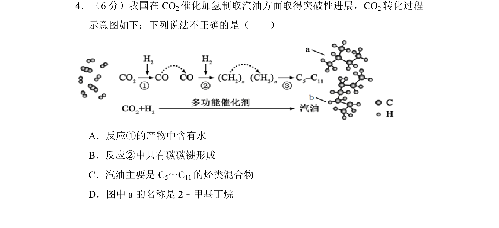
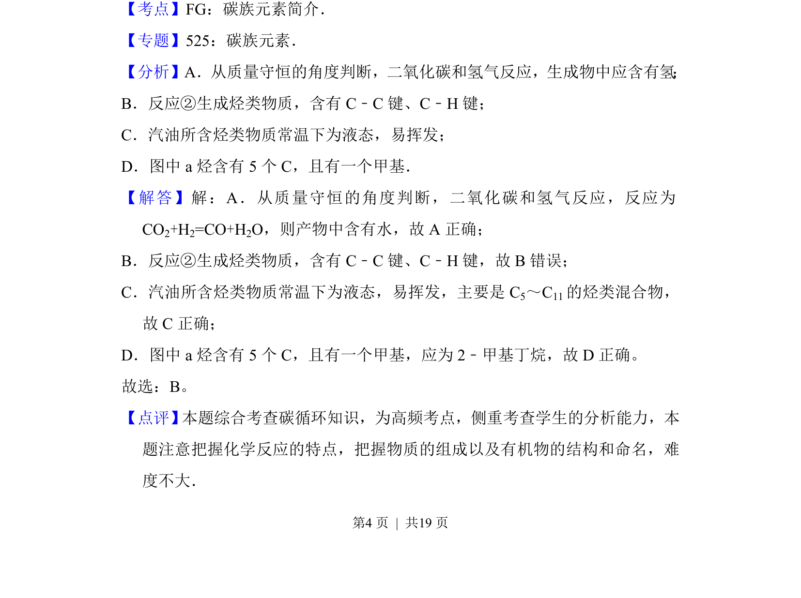

## 题面

## 摘要

考查CO2催化加氢制汽油的转化过程，涉及反应产物、化学键、汽油成分与有机物命名。

## 关联考点

- [[碳族元素]]
- [[058-质量守恒定律|质量守恒]]
- [[452-有机物命名|有机物命名]]
- [[烃类混合物]]

## 答案与解析

> 📄 原 PDF 第 4 页：`素材/真题/北京/2008-2024·（北京）化学高考真题/2017年高考化学试卷（北京）（解析卷）.pdf`

<!-- 题干文本-start -->
## 题干文本
4．（6分）我国在CO 2催化加氢制取汽油方面取得突破性进展，CO 2转化过程
示意图如下：下列说法不正确的是（　　）
A．反应①的产物中含有水
B．反应②中只有碳碳键形成
C．汽油主要是C 5～C11的烃类混合物
D．图中a的名称是2﹣甲基丁烷
<!-- 题干文本-end -->

<!-- 解析文本-start -->
## 解析文本
【考点】FG：碳族元素简介．菁优网版权所有
【专题】525：碳族元素．
【分析】A．从质量守恒的角度判断，二氧化碳和氢气反应，生成物中应含有氢 ；
B．反应②生成烃类物质，含有C﹣C键、C﹣H键；
C．汽油所含烃类物质常温下为液态，易挥发；
D．图中a烃含有5个C，且有一个甲基．
【解答】解：A．从质量守恒的角度判断，二氧化碳和氢气反应，反应为
CO2+H2=CO+H2O，则产物中含有水，故A正确；
B．反应②生成烃类物质，含有C﹣C键、C﹣H键，故B错误；
C．汽油所含烃类物质常温下为液态，易挥发，主要是C 5～C11的烃类混合物，
故C正确；
D．图中a烃含有5个C，且有一个甲基，应为2﹣甲基丁烷，故D正确。
故选：B。
【点评】 本题综合考查碳循环知识，为高频考点，侧重考查学生的分析能力，本
题注意把握化学反应的特点，把握物质的组成以及有机物的结构和命名，难
度不大．
<!-- 解析文本-end -->
