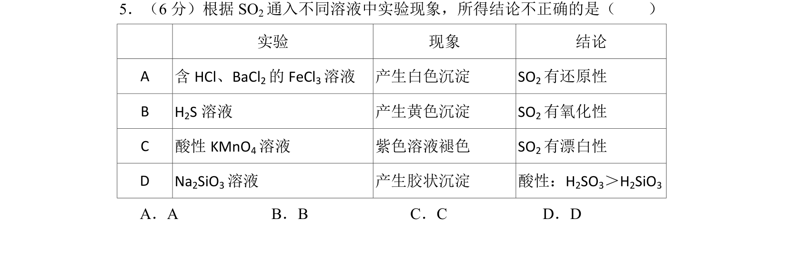
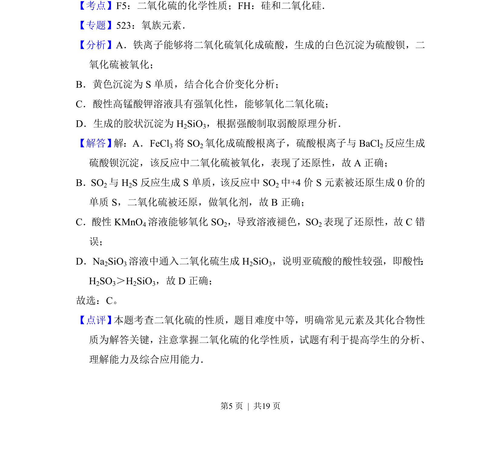

## 题面

## 摘要

评价SO2在不同溶液中的反应现象与结论，考查其氧化性、还原性与酸性比较。

## 关联考点

- [[969-二氧化硫的化学性质|二氧化硫的化学性质]]
- [[162-氧化还原反应|氧化还原反应]]
- [[852-酸性比较|酸性比较]]

## 答案与解析

> 📄 原 PDF 第 5 页：`素材/真题/北京/2008-2024·（北京）化学高考真题/2017年高考化学试卷（北京）（解析卷）.pdf`
