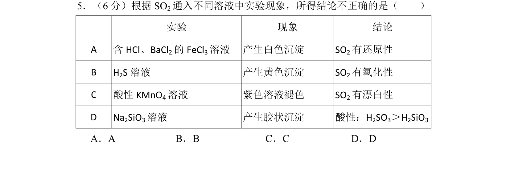
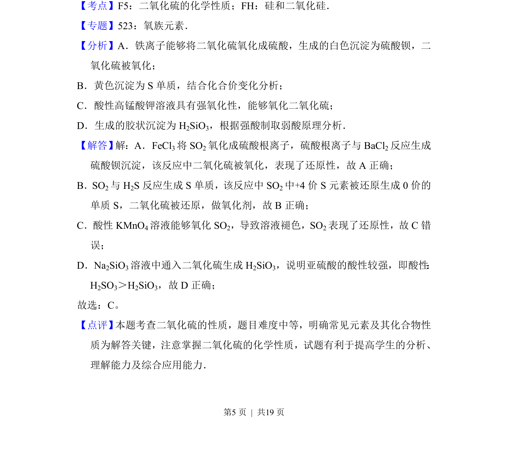

## 题面

## 摘要

评价SO2在不同溶液中的反应现象与结论，考查其氧化性、还原性与酸性比较。

## 关联考点

- [[969-二氧化硫的化学性质|二氧化硫的化学性质]]
- [[162-氧化还原反应|氧化还原反应]]
- [[852-酸性比较|酸性比较]]

## 答案与解析

> 📄 原 PDF 第 5 页：`素材/真题/北京/2008-2024·（北京）化学高考真题/2017年高考化学试卷（北京）（解析卷）.pdf`

<!-- 题干文本-start -->
## 题干文本
5．（6分）根据SO 2通入不同溶液中实验现象，所得结论不正确的是（　　）
实验 现象 结论
A 含HCl、BaCl 2的FeCl 3溶液 产生白色沉淀 SO2有还原性
B H2S溶液 产生黄色沉淀 SO2有氧化性
C 酸性KMnO 4溶液 紫色溶液褪色 SO2有漂白性
D Na2SiO3溶液 产生胶状沉淀 酸性：H2SO3＞H2SiO3
A．A B．B C．C D．D
<!-- 题干文本-end -->

<!-- 解析文本-start -->
## 解析文本
【考点】F5：二氧化硫的化学性质；FH：硅和二氧化硅．菁优网版权所有
【专题】523：氧族元素．
【分析】A．铁离子能够将二氧化硫氧化成硫酸，生成的白色沉淀为硫酸钡，二
氧化硫被氧化；
B．黄色沉淀为S单质，结合化合价变化分析；
C．酸性高锰酸钾溶液具有强氧化性，能够氧化二氧化硫；
D．生成的胶状沉淀为H 2SiO3，根据强酸制取弱酸原理分析．
【解答】 解：A．FeCl3将SO 2氧化成硫酸根离子，硫酸根离子与BaCl 2反应生成
硫酸钡沉淀，该反应中二氧化硫被氧化，表现了还原性，故A正确；
B．SO2与H 2S反应生成S单质，该反应中SO 2中+4价S元素被还原生成0价的
单质S，二氧化硫被还原，做氧化剂，故B正确；
C．酸性KMnO 4溶液能够氧化SO 2，导致溶液褪色，SO2表现了还原性，故C错
误；
D．Na2SiO3溶液中通入二氧化硫生成H 2SiO3，说明亚硫酸的酸性较强，即酸性 ：
H2SO3＞H2SiO3，故D正确；
故选：C。
【点评】 本题考查二氧化硫的性质，题目难度中等，明确常见元素及其化合物性
质为解答关键，注意掌握二氧化硫的化学性质，试题有利于提高学生的分析、
理解能力及综合应用能力．
<!-- 解析文本-end -->
