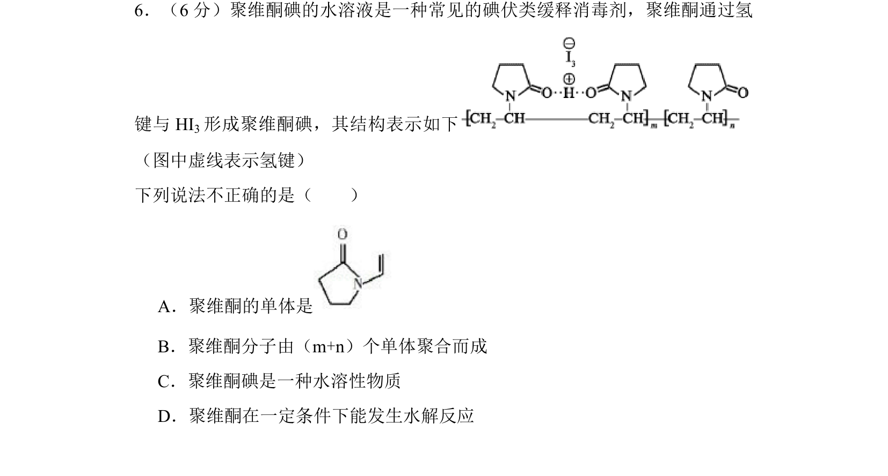
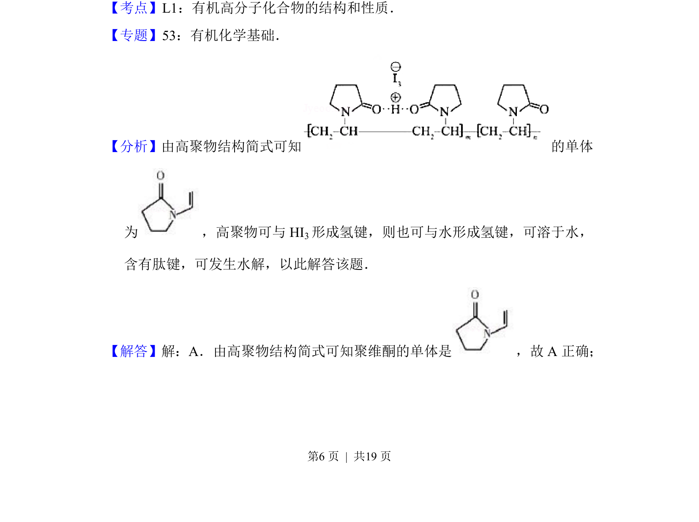
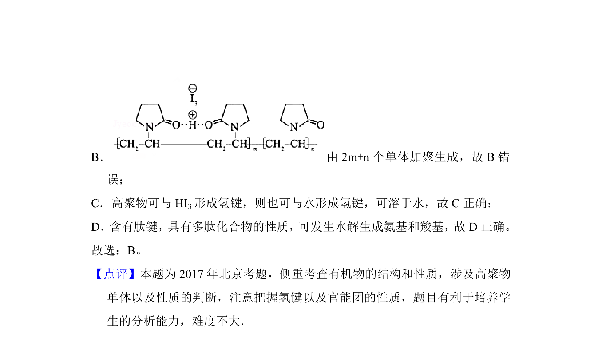

## 题面

## 摘要

考查聚维酮碘高分子的结构、单体、聚合度、水溶性及水解性质。

## 关联考点

- [[有机高分子化合物结构]]
- [[单体判断]]
- [[435-氢键|氢键]]
- [[742-水解反应|水解反应]]

## 答案与解析

> 📄 原 PDF 第 6 页：`素材/真题/北京/2008-2024·（北京）化学高考真题/2017年高考化学试卷（北京）（解析卷）.pdf`
