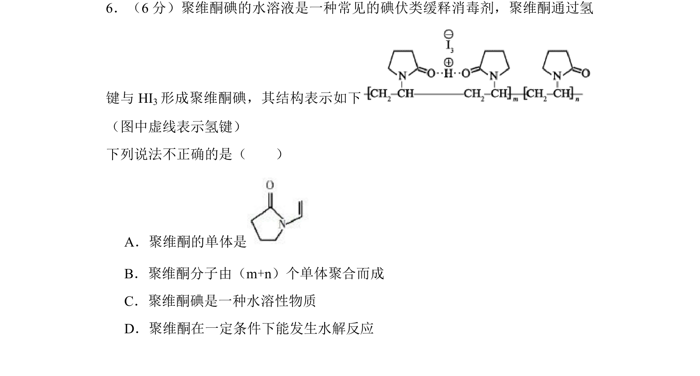
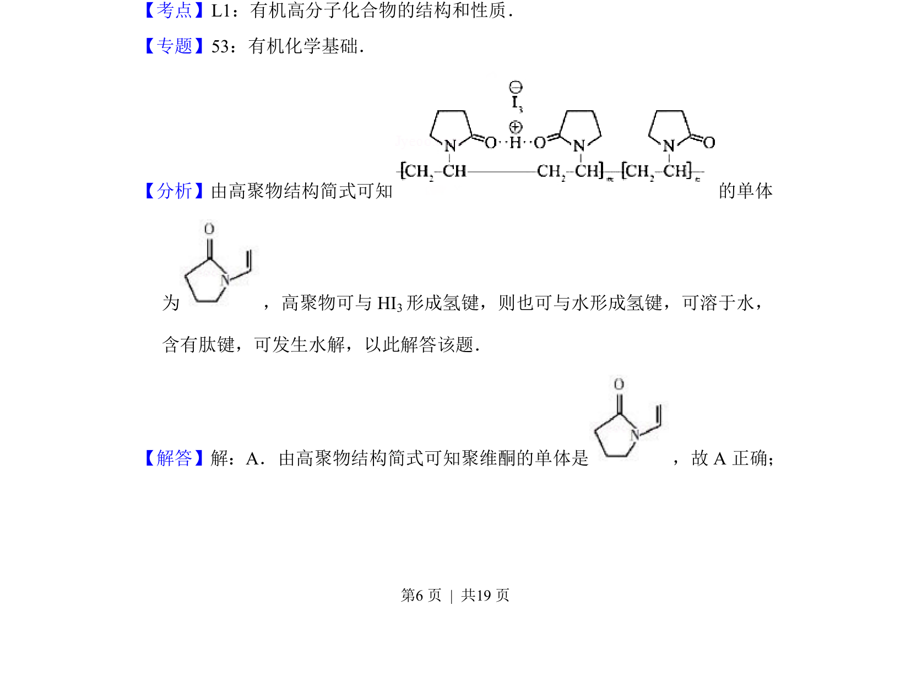
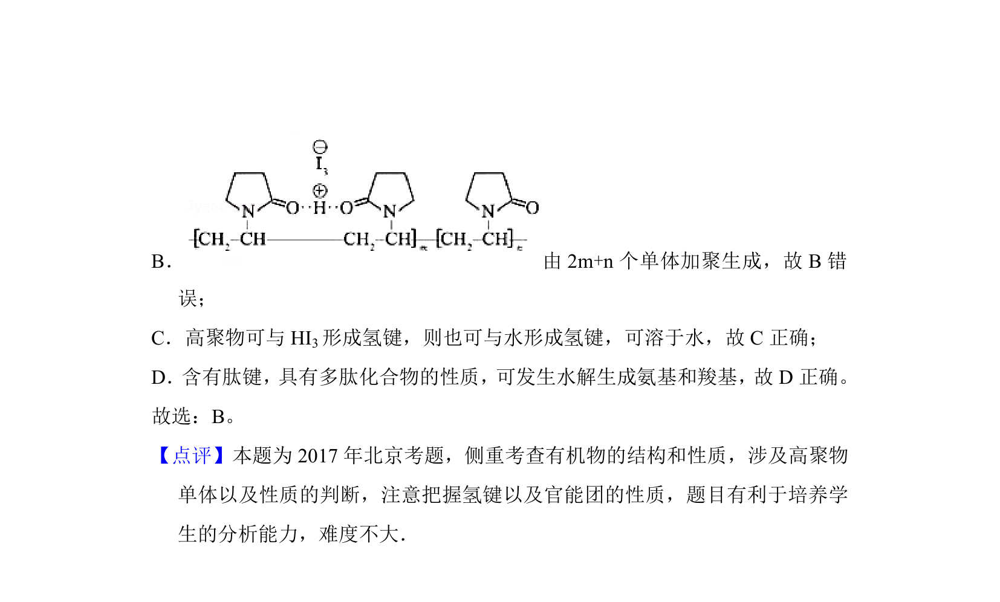

## 题面

## 摘要

考查聚维酮碘高分子的结构、单体、聚合度、水溶性及水解性质。

## 关联考点

- [[有机高分子化合物结构]]
- [[单体判断]]
- [[435-氢键|氢键]]
- [[742-水解反应|水解反应]]

## 答案与解析

> 📄 原 PDF 第 6 页：`素材/真题/北京/2008-2024·（北京）化学高考真题/2017年高考化学试卷（北京）（解析卷）.pdf`

<!-- 题干文本-start -->
## 题干文本
6．（6分）聚维酮碘的水溶液是一种常见的碘伏类缓释消毒剂，聚维酮通过氢
键与HI 3形成聚维酮碘，其结构表示如下
（图中虚线表示氢键）
下列说法不正确的是（　　）
A．聚维酮的单体是
B．聚维酮分子由（m+n）个单体聚合而成
C．聚维酮碘是一种水溶性物质
D．聚维酮在一定条件下能发生水解反应
<!-- 题干文本-end -->

<!-- 解析文本-start -->
## 解析文本
【考点】L1：有机高分子化合物的结构和性质．菁优网版权所有
【专题】53：有机化学基础．
【分析】由高聚物结构简式可知 的单体
为 ，高聚物可与HI 3形成氢键，则也可与水形成氢键，可溶于水，
含有肽键，可发生水解，以此解答该题．
【解答】解：A．由高聚物结构简式可知聚维酮的单体是 ，故A正确；
<!-- 解析文本-end -->
