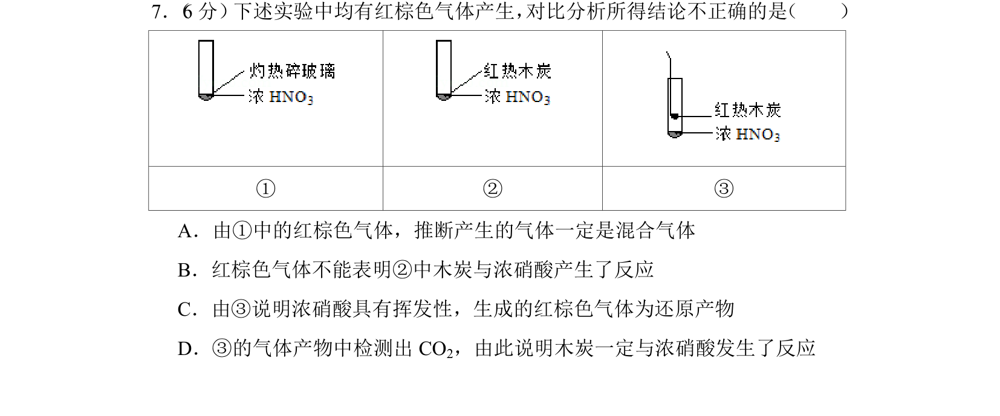
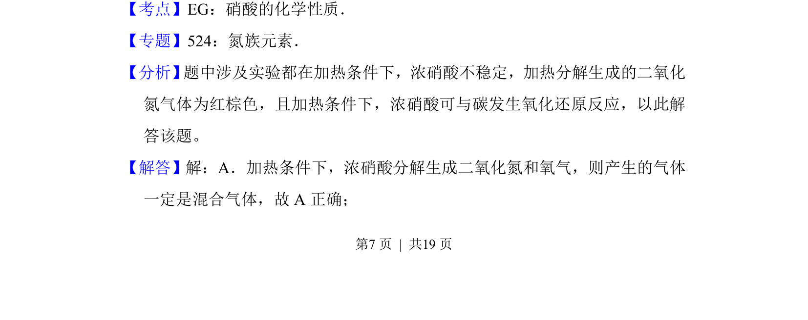
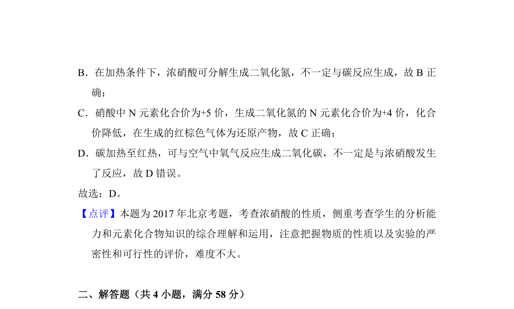

## 题面

## 摘要

考查浓硝酸受热分解及与木炭反应的实验现象分析与结论推断

## 关联考点

- [[982-硝酸的化学性质|硝酸的化学性质]]
- [[浓硝酸分解]]
- [[162-氧化还原反应|氧化还原反应]]
- [[产物推断]]

## 答案与解析

> 📄 原 PDF 第 7 页：`素材/真题/北京/2008-2024·（北京）化学高考真题/2017年高考化学试卷（北京）（解析卷）.pdf`
