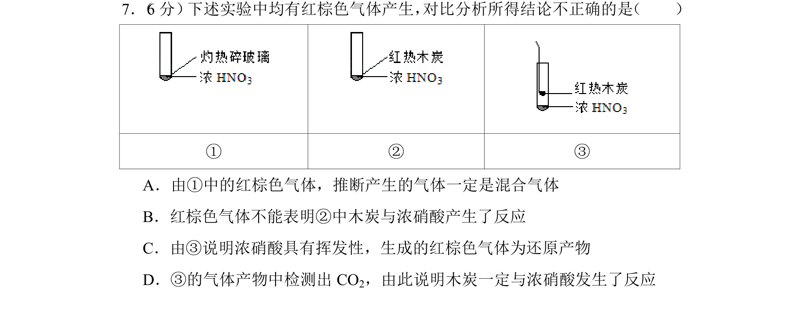
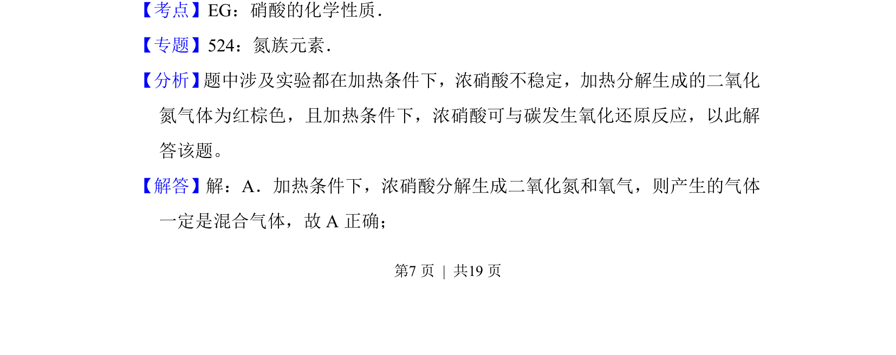
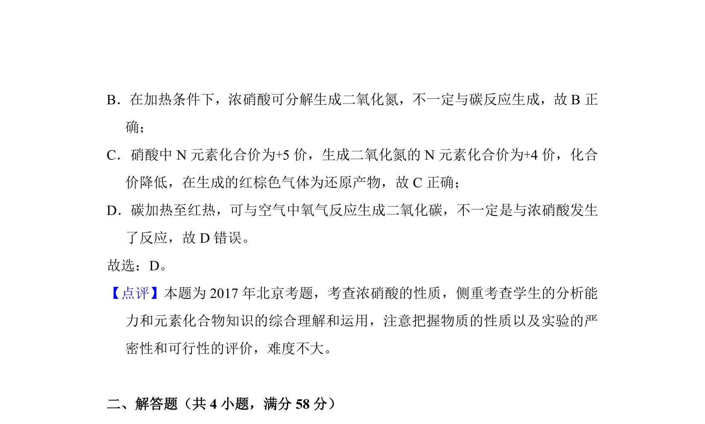

## 题面

## 摘要

考查浓硝酸受热分解及与木炭反应的实验现象分析与结论推断

## 关联考点

- [[982-硝酸的化学性质|硝酸的化学性质]]
- [[浓硝酸分解]]
- [[162-氧化还原反应|氧化还原反应]]
- [[产物推断]]

## 答案与解析

> 📄 原 PDF 第 7 页：`素材/真题/北京/2008-2024·（北京）化学高考真题/2017年高考化学试卷（北京）（解析卷）.pdf`

<!-- 题干文本-start -->
## 题干文本
7． （6分） 下述实验中均有红棕色气体产生， 对比分析所得结论不正确的是 （　　）
① ② ③
A．由①中的红棕色气体，推断产生的气体一定是混合气体
B．红棕色气体不能表明②中木炭与浓硝酸产生了反应
C．由③说明浓硝酸具有挥发性，生成的红棕色气体为还原产物
D．③的气体产物中检测出CO 2，由此说明木炭一定与浓硝酸发生了反应
<!-- 题干文本-end -->

<!-- 解析文本-start -->
## 解析文本
【考点】EG：硝酸的化学性质．菁优网版权所有
【专题】524：氮族元素．
【分析】 题中涉及实验都在加热条件下，浓硝酸不稳定，加热分解生成的二氧化
氮气体为红棕色，且加热条件下，浓硝酸可与碳发生氧化还原反应，以此解
答该题。
【解答】解：A．加热条件下，浓硝酸分解生成二氧化氮和氧气，则产生的气体
一定是混合气体，故A正确；
<!-- 解析文本-end -->
