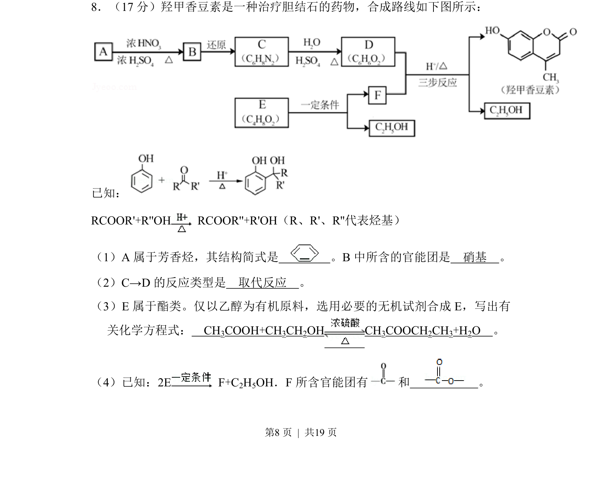
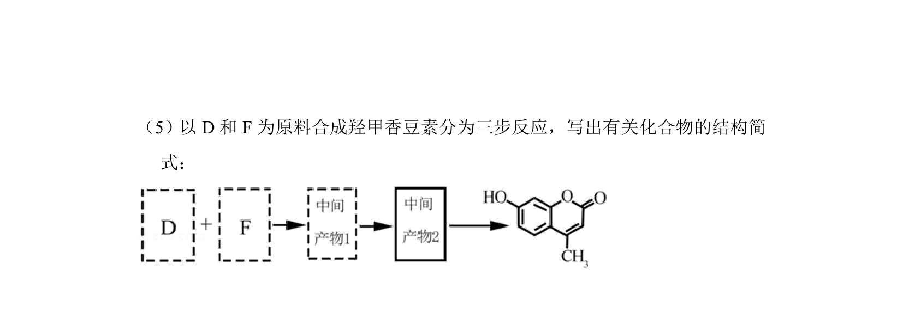
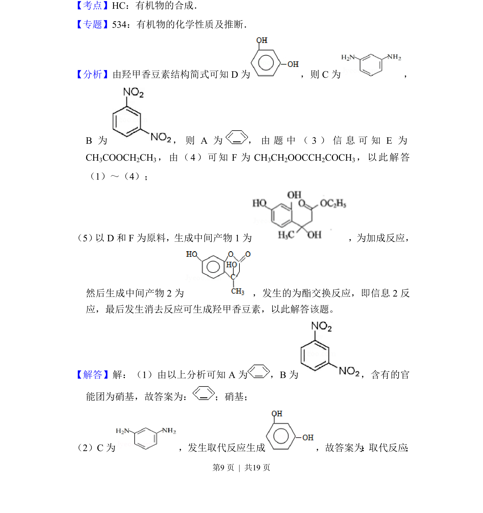
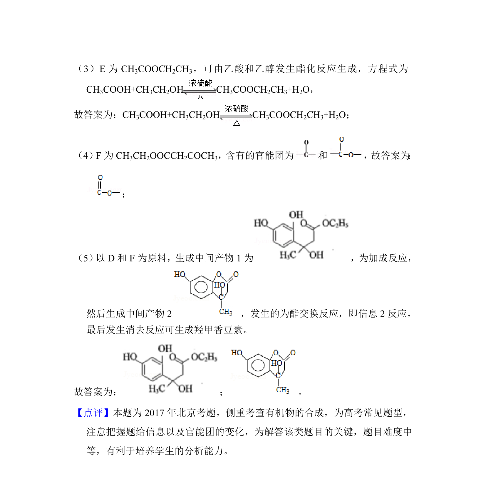

## 题面

## 摘要

有机合成路线推断，考查芳香烃结构、官能团识别、反应类型及酯化反应方程式书写。

## 关联考点

- [[492-芳香烃|芳香烃]]
- [[448-官能团|官能团]]
- [[651-取代反应|取代反应]]
- [[250-酯化反应|酯化反应]]
- [[545-有机推断|有机推断]]

## 答案与解析

> 📄 原 PDF 第 8 页：`素材/真题/北京/2008-2024·（北京）化学高考真题/2017年高考化学试卷（北京）（解析卷）.pdf`
