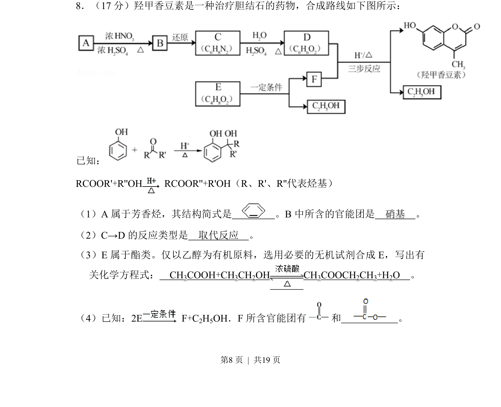
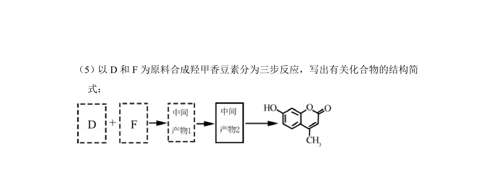
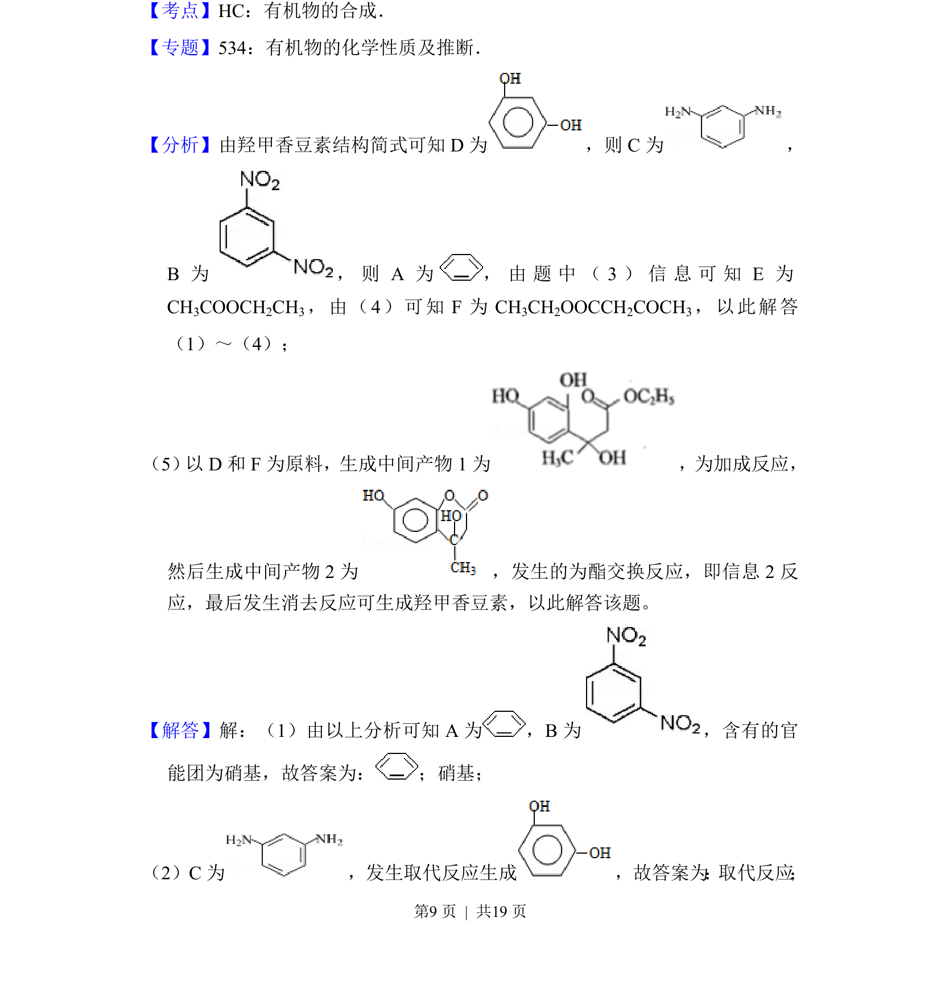
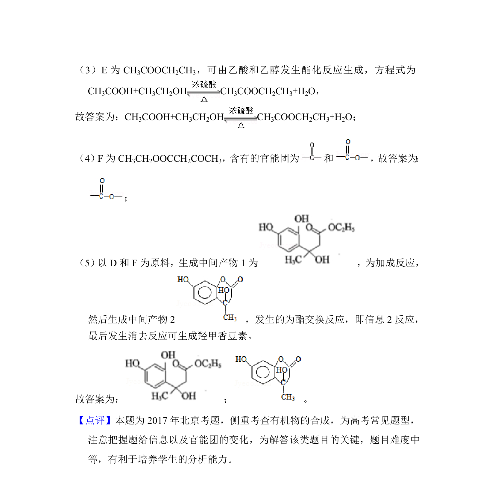

## 题面

## 摘要

有机合成路线推断，考查芳香烃结构、官能团识别、反应类型及酯化反应方程式书写。

## 关联考点

- [[492-芳香烃|芳香烃]]
- [[448-官能团|官能团]]
- [[651-取代反应|取代反应]]
- [[250-酯化反应|酯化反应]]
- [[545-有机推断|有机推断]]

## 答案与解析

> 📄 原 PDF 第 8 页：`素材/真题/北京/2008-2024·（北京）化学高考真题/2017年高考化学试卷（北京）（解析卷）.pdf`

<!-- 题干文本-start -->
## 题干文本
8．（17分）羟甲香豆素是一种治疗胆结石的药物，合成路线如下图所示：
已知：
RCOOR'+R''OH  RCOOR''+R'OH（R、R'、R''代表烃基）
（1）A属于芳香烃，其结构简式是　 　。B中所含的官能团是　硝基　。
（2）C→D的反应类型是　取代反应　。
（3）E属于酯类。仅以乙醇为有机原料，选用必要的无机试剂合成E，写出有
关化学方程式：　CH3COOH+CH3CH2OH CH3COOCH2CH3+H2O　。
（4）已知：2E  F+C 2H5OH．F所含官能团有 和　 　。
<!-- 题干文本-end -->

<!-- 解析文本-start -->
## 解析文本

<!-- 解析文本-end -->
